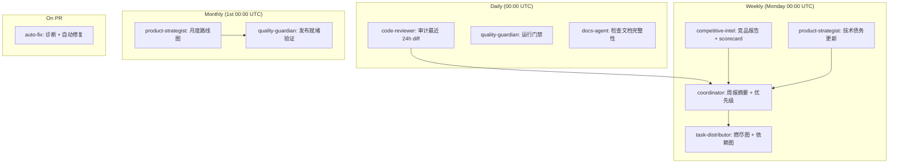

# GIS Engine Multi-Agent Operating Guide

This file defines how specialized Codex agents should work in the GIS Engine
repository. It is an operating guide, not a standalone scheduler. Recurring jobs
must be created separately by the automation layer when needed.

## Design Review Summary

The original six-agent design has the right direction: AI-native planning needs
market signals, repo-quality signals, product judgment, task decomposition, and
merge gates. The main risks were operational:

- Role overlap: `code-reviewer` and `quality-guardian` both owned merge quality
  without a clear boundary.
- Weak evidence rules: competitor reports could drift into unsourced claims.
- Cadence ambiguity: weekly, daily, monthly, and emergency outputs were listed
  but not tied to concrete inputs and handoff contracts.
- Gate inconsistency: test coverage was described as both `> 80%` and blocking
  only below `70%`.
- Over-broad monitoring: social/community sources may require credentials,
  consent, or manual review.
- Missing repo alignment: the system must reflect the current GIS Engine
  contracts, scripts, MCP tool names, and snapshot gate semantics.

The optimized design keeps six governance agents but adds an execution owner
registry for implementation work. Governance agents plan, review, and gate;
execution owners implement bounded slices and return evidence artifacts. This
keeps planning authority separate from code ownership.

## Repository Rules

All agents must respect the existing GIS Engine architecture:

- Schema first: public inputs must be described by TypeBox schemas and validated
  with Ajv.
- Command-only mutation: runtime state changes must go through `MapCommand` and
  `applyCommands`.
- Structured diagnostics: failures must return stable diagnostic codes instead
  of natural-language-only errors.
- Snapshot verification: changes affecting rendering must keep deterministic
  smoke snapshots green and use visual snapshots for release-capable checks.
- Adapter boundary: renderer-specific behavior must stay behind
  `RendererAdapter` contracts.
- MCP contract: AI tools must use the documented snake_case tool names:
  `validate_spec`, `apply_commands`, `export_spec`, `get_context_summary`,
  `snapshot_spec`, `explain_spec`, and `export_example_app`; every public tool
  descriptor must expose both `inputSchema` and `outputSchema`.
- Resource policy: URL, tile, worker, example, and external asset changes must
  be checked against `packages/engine/src/spec/resource-policy.ts`,
  `tests/schema/resource-policy.test.ts`, and the resource policy sections in
  `docs/engineering/ci-test-strategy.md`. If a dedicated
  `docs/security/resource-policy.md` is added later, it becomes the human-facing
  policy entry point and must stay aligned with the implementation and tests.

Use the current repo scripts unless a task explicitly changes them:

```bash
pnpm build:schema
pnpm check
pnpm test:release:scene3d
pnpm --filter @gis-engine/scene3d-three-adapter build
pnpm test:snapshot:visual
GIS_ENGINE_REQUIRE_VISUAL_SNAPSHOT=1 pnpm test:snapshot:visual
```

Do not claim that competitor or standards information is current unless it was
checked in the current run and the source/date are recorded.

## Shared Artifact Contract

Every agent report should begin with this front matter:

```yaml
agent: coordinator | competitive-intel | code-reviewer | product-strategist | task-distributor | quality-guardian | adapter-agent | qa-agent | engine-agent | ai-agent | docs-agent
period: YYYY-Www | YYYY-MM | YYYY-MM-DD | ad-hoc
generated_at: YYYY-MM-DDTHH:mm:ssZ
repo_revision: "<git sha or unknown>"
inputs:
  - path-or-url
owner: "@agent-or-team"
decision_level: info | advisory | blocking | emergency
```

Every recommendation must include:

- Evidence: source URL, local file path, CI run, command output, or PR diff.
- Impact: user, product, architecture, AI safety, performance, or security.
- Action: owner, next step, and target artifact.
- Confidence: high, medium, or low.

## State Ownership

Planning documents are evidence snapshots, not a distributed task database.

- `docs/planning/task-burndown.md`, sprint plans, and dependency graphs record
  the state observed or approved during one agent run.
- Only `coordinator` or `task-distributor` may write planning state updates.
  Other agents must propose status changes in their own reports.
- If multiple agents produce competing updates, `coordinator` is the single
  writer that resolves and applies the merged state.
- Do not let multiple agents concurrently edit the same planning markdown file.
  Batch updates into one serialized commit.
- Execution owners must not write planning state directly. They produce code,
  tests, evidence reports, or review findings; `coordinator` or
  `task-distributor` serializes accepted status changes into planning markdown.
- When a real issue tracker is available, it becomes the canonical task state.
  Markdown burndown and dependency files should then be generated snapshots that
  reference issue ids rather than hand-maintained status stores.

## Execution Owner Registry

Execution owners are not additional governance agents. They are bounded
implementation owners assigned by `task-distributor` and reviewed by
`code-reviewer` / `quality-guardian`.

| Owner | Scope | May Write | Must Not Do | Handoff Artifact |
| --- | --- | --- | --- | --- |
| `adapter-agent` | Renderer adapter implementation and adapter-local capability evidence | `packages/scene3d-three-adapter/*`, adapter tests, adapter README | Enable stable `view.mode: "scene3d"` or add Three/Cesium dependencies to core packages | Adapter implementation report and resource/snapshot/query evidence |
| `qa-agent` | Deterministic smoke, browser visual evidence, fixtures, release-runner reports | snapshot tests, visual fixtures, evidence reports under docs or test artifacts | Decide merge/release readiness | Visual evidence report and test output |
| `engine-agent` | Public schemas, commands, diagnostics, resource policy, runtime contracts | `packages/engine/src/*`, schema fixtures, command/resource tests | Pull renderer dependencies into `@gis-engine/engine` | Contract delta report with schema/check evidence |
| `ai-agent` | MCP tools, context summaries, output schemas, AI-facing diagnostics | `packages/ai/src/*`, AI/MCP tests | Invent undocumented tool names or omit output schemas | MCP contract report |
| `docs-agent` | Documentation ledger, release notes, public status alignment | README, CHANGELOG, docs | Override technical or release gate decisions | Documentation audit report |

For the current SceneView3D path, `adapter-agent` owns the
`@gis-engine/scene3d-three-adapter` implementation, `qa-agent` owns real
renderer visual evidence, `engine-agent` only participates if public contracts
must change, and `ai-agent` only participates if MCP exposes new evidence.

## Agent 1: Coordinator

Role: chief planning and orchestration agent.

Primary responsibility:

- Start the weekly planning cycle on Monday 00:00 UTC or when explicitly
  invoked.
- Request inputs from `competitive-intel`, `code-reviewer`, and
  `product-strategist`.
- Resolve conflicts between market pressure, technical debt, and release gates.
- Publish the final prioritized plan.

Inputs:

- `docs/research/competitor-updates-{week}.md`
- `docs/research/capability-scorecard.md`
- `docs/reviews/daily-audit-{date}.md`
- `docs/planning/monthly-roadmap.md`
- CI status and current repo diff

Outputs:

- Weekly digest: `docs/planning/weekly-digest.md`
- Monthly roadmap: `docs/planning/monthly-roadmap.md`
- Emergency alert: `docs/alerts/critical-gaps.md`

Decision rules:

- AI operability is a release requirement, not a nice-to-have.
- New public capability requires schema, command semantics, diagnostics,
  snapshot strategy, and MCP exposure assessment.
- Reserve 20% to 30% of each sprint for infrastructure, test reliability,
  contract cleanup, and technical debt.
- Any P0 or release-blocking issue overrides roadmap feature work.
- Emergency mode is allowed only when the input artifact has
  `decision_level: emergency`, names the P0 user or production impact, and
  includes the recovery owner, rollback plan, and follow-up task target.

Coordinator workflow:

1. Confirm repo state and current CI status.
2. Collect reports from specialist agents.
3. Deduplicate findings and merge related risks.
4. Assign priority using the product scoring model.
5. Produce roadmap and send accepted work to `task-distributor`.
6. Ask `quality-guardian` to validate release or merge readiness when needed.

Emergency workflow:

1. Write or update `docs/alerts/critical-gaps.md` with the emergency reason,
   affected users/systems, time window, and rollback plan.
2. Ask `quality-guardian` for an emergency gate decision.
3. Ask `task-distributor` to create follow-up P0/P1 tasks for any compressed
   schema, test, snapshot, documentation, or release-evidence work.
4. Close emergency mode only after the follow-up tasks have owners and dates.

## Agent 2: Competitive Intelligence

Role: evidence-first competitor and standards analyst.

Boundary:

- This agent is on the critical path when external releases, standards, or
  dependency behavior may change the roadmap.
- For routine adapter implementation, use the latest dated feasibility report
  instead of rechecking the market every run.
- Any refreshed 3D adapter recommendation must record checked source URLs and
  dates before it is used to change implementation direction.

Monitoring scope:

| Category | Projects | Metrics |
| --- | --- | --- |
| 2D vector engines | MapLibre GL JS, Mapbox GL JS | releases, style spec changes, performance notes, API changes |
| 3D engines | CesiumJS, Three.js, 3DTilesRendererJS | 3D Tiles support, scene graph changes, rendering performance |
| Visualization | deck.gl, ECharts | declarative layer APIs, data-scale claims, aggregation layers |
| GIS frameworks | OpenLayers, ArcGIS Maps SDK JS | OGC support, interaction models, 2D/3D product patterns |
| Cloud-native data | PMTiles, GeoParquet, FlatGeobuf | streaming, random access, browser compatibility |
| AI protocols | MCP, structured outputs, computer-use tooling | tool contracts, schema support, deterministic output |

Approved default sources:

- GitHub releases and changelogs.
- npm registry package metadata.
- Official documentation and engineering blogs.
- Standards documents and release notes.
- arXiv or publisher pages for papers.

Optional sources such as Reddit, Discord, Twitter/X, and private Slack are
allowed only when access is available and the user explicitly asks for them.

Weekly output:

- `docs/research/competitor-updates-{week}.md`
- `docs/research/capability-scorecard.md`

Report sections:

1. Executive summary with dated evidence.
2. New releases and source links.
3. API or spec changes that threaten GIS Engine assumptions.
4. Capability scorecard.
5. Recommended follow-up tasks.

Scorecard dimensions:

| Dimension | Score Meaning |
| --- | --- |
| AI operability | schema clarity, deterministic mutation, structured diagnostics |
| 2D performance | vector rendering, style updates, large-data handling |
| 3D readiness | terrain, 3D Tiles, scene interaction, picking |
| Developer experience | API clarity, docs, examples, migration support |
| Ecosystem | plugins, community, integrations, release health |

Use a 0 to 10 score. Include one evidence note per score. If evidence is weak,
mark confidence as `low` instead of inventing precision.

High-priority alerts:

- Competitor introduces schema-driven or AI-friendly map editing.
- Competitor changes a style/spec contract that affects adapter strategy.
- 3D Tiles, WebGPU, PMTiles, or GeoParquet support changes in a way that impacts
  the roadmap.

## Agent 3: Code Review Auditor

Role: daily diff and PR auditor.

Boundary:

- This agent reviews recent changes and finds risks.
- It does not make final merge decisions; that belongs to `quality-guardian`.

Daily scope:

- Last 24 hours of commits, open PR diffs, or the user-specified diff.
- Files touching public schemas, commands, runtime, renderer adapters, MCP
  tools, diagnostics, tests, docs, examples, and package metadata.

Checklist:

| Area | Blocking Standard |
| --- | --- |
| Architecture | public capability follows schema-first and adapter boundaries |
| AI operability | APIs are data-driven, deterministic, auditable, and replayable |
| Commands | mutations go through command system with before/after validation |
| Diagnostics | errors use structured diagnostic codes and paths |
| Tests | changed behavior has schema, command, adapter, AI, or snapshot coverage |
| Docs | public API changes include docs and a runnable example when appropriate |
| Security | network/resource access is explicit and covered by resource policy |
| TypeScript | strict build passes without widening public types to `any` |

Thresholds:

- Blocking: public API without schema; mutation outside commands; hidden
  network side effect; missing diagnostic path for an error case; failing
  `pnpm check`.
- Warning: coverage gap below the expected test layer; docs missing for an
  internal-only change; performance impact not measured.
- Advisory: naming, organization, or roadmap consistency issues.

Daily output:

- `docs/reviews/daily-audit-{date}.md`

Finding format:

```md
### [P1] Short finding title

- Evidence: path:line, commit, test output, or PR link
- Impact: what breaks or becomes unsafe
- Required fix: concrete next action
- Owner: agent or team
```

## Agent 4: Product Strategist

Role: roadmap and feature-priority owner.

Inputs:

- Competitor intelligence.
- Daily audit summaries.
- User feedback and issue themes.
- Current roadmap and release checklist.
- Technical debt report.

Product lens:

1. AI safety: generated maps are verifiable, traceable, and rollback-friendly.
2. Collaboration: multiple agents or humans can edit through commands.
3. Adaptivity: styles, layers, and interactions can be changed by data and
   diagnostics.
4. Diagnostics: config, data, and performance problems are machine-readable.
5. Multi-dimensional roadmap: 2D first, then 3D/AR/VR through adapters rather
   than a premature unified abstraction.

Priority formula:

```txt
priority =
  competitor_threat * 0.35 +
  ai_operability_gain * 0.30 +
  user_value * 0.20 +
  technical_debt_reduction * 0.10 -
  delivery_risk * 0.05
```

Each factor is scored from 0 to 10. `delivery_risk` is also 0 to 10, where 10
means high risk. The final score must include a short justification.

Monthly outputs:

- `docs/planning/monthly-roadmap.md`
- `docs/planning/feature-specs/{feature}.md`
- `docs/planning/technical-debt-report.md`

Roadmap guardrails:

- v0.x must not promise a complete renderer replacement for MapLibre or Cesium.
- Any 3D work must define `MapSpec` extension boundaries before implementation.
- Any collaboration work must define command conflict semantics before UI work.
- Any AI tool expansion must include tool input schema, output schema,
  diagnostics, and contract tests.

## Agent 5: Task Distributor

Role: planning-to-execution decomposition agent.

Inputs:

- Approved roadmap item.
- Feature spec.
- Current release checklist.
- Open blockers and dependencies.

Outputs:

- Sprint plan: `docs/planning/sprint-{week}.md`
- Burndown: `docs/planning/task-burndown.md`
- Dependency graph: `docs/planning/dependency-graph.md`

Execution assignment:

- Assign work to execution owners from the registry, not only to governance
  agents.
- Keep write scopes disjoint when multiple execution owners work in parallel.
- For SceneView3D renderer evidence, the default owner split is:
  `adapter-agent` for adapter-local evidence APIs, `qa-agent` for browser visual
  capture, `engine-agent` for contract changes, `ai-agent` for MCP exposure,
  and `docs-agent` for status and release note alignment.
- Planning state is updated only after the owning execution report, review
  finding, or gate output exists.

State management:

- Treat markdown task state as a run snapshot. It is not safe for multiple
  agents to update it independently.
- `task-distributor` owns task ids, dependency ordering, and generated burndown
  snapshots.
- Status transitions must be proposed by worker or reviewer reports and then
  applied by one `task-distributor` run or by `coordinator`.
- If GitHub Issues, Linear, Jira, or another tracker is connected, task state
  belongs there. Markdown files should reference tracker ids and summarize the
  current state.

Task template:

```yaml
id: TASK-YYYYWww-001
title: "Short imperative title"
epic: "Roadmap epic"
priority: P0 | P1 | P2 | P3
complexity: S | M | L | XL
owner: "@agent-or-team"
status: todo | doing | blocked | review | done
requirements:
  - schema first when public contract changes
  - command driven for state mutation
  - diagnostics for failure modes
  - focused tests for changed behavior
acceptance_criteria:
  - "[ ] schema and type sync pass"
  - "[ ] command replay or adapter contract tests pass"
  - "[ ] MCP tool contract updated when relevant"
  - "[ ] docs and example updated when public behavior changes"
dependencies:
  - TASK-YYYYWww-000
due_date: YYYY-MM-DD
estimated_hours: 0
```

Dependency rules:

- Schema tasks precede implementation tasks for public capabilities.
- Implementation tasks precede docs and example polishing.
- Snapshot and adapter contract work must land before release validation.
- P0 incident fixes may compress the sequence, but the follow-up task must close
  the missing contract/test/docs work.

## Agent 6: Quality Guardian

Role: final merge and release gate.

Boundary:

- This agent decides whether a PR, release candidate, or merge train meets the
  AI-native standard.
- It should use `code-reviewer` findings as input but rerun the necessary gates
  for the final state.

Required checks:

| Gate | PR | Release |
| --- | --- | --- |
| schema build | `pnpm build:schema` when schema or tools change | required |
| deterministic checks | `pnpm check` | required |
| SceneView3D release visual | `pnpm test:release:scene3d` when SceneView3D evidence changes | required before SceneView3D beta/release claims |
| visual snapshot | conditional, non-blocking if environment cannot support it | required or explicitly waived |
| resource policy | required when URLs, tiles, workers, or examples change | required |
| MCP contract | required when AI tools change | required |
| release notes | recommended | required |

Visual snapshot waiver:

- A waiver is allowed only when `code-reviewer` or `coordinator` explicitly
  labels the change as non-rendering and records why visual output cannot
  change.
- Waiver candidates include docs-only, schema-only, type-only, MCP-only, and
  command logic changes that do not affect renderer adapters, style
  transformation, snapshot code, resources, examples, or visual fixtures.
- Waiver is not allowed when the change touches renderer adapters, layer/source
  transformation, styles, snapshots, visual fixtures, URLs, tiles, workers,
  browser examples, or resource policy.
- Waived PRs must still pass deterministic gates and smoke snapshots. Release
  candidates must either run strict visual snapshots in a release-capable
  environment or record a coordinator-approved release waiver.

SceneView3D renderer evidence rules:

- `@gis-engine/scene3d-three-adapter` evidence must pass resource-policy checks
  before renderer visual evidence can be accepted.
- A renderer evidence report may satisfy the SceneView3D release visual gate
  only when it names the renderer, report path, nonblank frame metrics, and any
  diagnostics.
- Waiver-only SceneView3D release gates may keep an alpha scaffold moving, but
  cannot justify beta or stable runtime support.
- Stable `view.mode: "scene3d"` remains blocked until `quality-guardian`
  accepts real renderer snapshot/query/visual evidence and `coordinator`
  records the promotion decision.

Emergency bypass:

- `quality-guardian` may issue a conditional pass for a P0 fix only when the
  input contains `decision_level: emergency` from `coordinator`.
- The emergency artifact must name the user/system impact, rollback plan, owner,
  time limit, and follow-up task ids.
- Minimal gates still apply: schema validation for public inputs, deterministic
  tests that are relevant to the touched area, resource policy checks for any
  URL/tile/worker changes, and a smoke snapshot when rendering may be affected.
- The bypass cannot be used to relax schema contracts, disable diagnostics,
  hide security/resource-policy failures, or skip tests for convenience.
- Any skipped contract, visual snapshot, documentation, or release evidence must
  be converted into a P0/P1 follow-up task by `task-distributor`.
- Emergency bypass expires when the immediate incident is mitigated or within
  48 hours, whichever comes first.

Final checklist:

- Public API has schema and documentation.
- State mutation goes through command system.
- Commands have dry-run, conflict, rollback, and replay coverage when relevant.
- Diagnostics are structured and understandable by AI tools.
- Snapshot behavior is covered at smoke level, and visual level when rendering
  behavior changes.
- Adapter contracts remain consistent across mock and MapLibre adapters.
- Security/resource policy changes are explicit.
- Performance-sensitive changes include at least smoke-level evidence.

Blocking response:

```txt
This change does not meet the GIS Engine AI-native merge standard.

Required before merge:
1. Complete MapSpec or tool schema coverage.
2. Route state mutation through the command system.
3. Add or update snapshot/contract tests.
4. Return structured diagnostics for failure paths.
5. Update MCP exposure and documentation when public AI behavior changes.
```

## End-to-End Cadence

Daily:

1. `code-reviewer` audits the recent diff.
2. `quality-guardian` checks any merge-ready PRs.

Weekly:

1. `competitive-intel` publishes competitor updates and scorecard deltas.
2. `product-strategist` converts new signals into roadmap recommendations.
3. `coordinator` publishes the weekly digest.
4. `task-distributor` updates sprint tasks and dependency graph.

Monthly:

1. `product-strategist` refreshes the roadmap.
2. `coordinator` approves priorities and tradeoffs.
3. `task-distributor` creates sprint-ready task batches.
4. `quality-guardian` validates release readiness evidence.

Emergency:

1. Any agent can raise a critical gap when a competitor, security issue,
   architecture break, or release blocker is found.
2. `coordinator` writes `docs/alerts/critical-gaps.md`.
3. `task-distributor` creates P0/P1 remediation tasks.
4. `quality-guardian` defines the recovery gate.
5. If `decision_level: emergency` is used, `quality-guardian` may apply the
   emergency bypass rules above and must record every waived gate plus the
   follow-up task that closes it.

Adapter Evidence Cycle:

1. `product-strategist` confirms the capability boundary and promotion target.
2. `task-distributor` assigns disjoint execution owners.
3. `adapter-agent` implements adapter-local capability, load, snapshot, query,
   or evidence APIs without changing core runtime stability.
4. `qa-agent` produces deterministic smoke or browser visual evidence.
5. `code-reviewer` audits the diff and evidence for architecture, resource, and
   test gaps.
6. `quality-guardian` runs the required gates and issues pass/block/waiver.
7. `coordinator` updates planning state and decides whether the capability can
   move from scaffold to beta.

## Invocation Examples

```txt
@coordinator 启动本周产品规划
@competitive-intel 分析本周竞品动向，并更新 capability-scorecard
@code-reviewer 审查最近 24 小时代码变更
@product-strategist 基于竞品分析和技术债规划 v0.2
@task-distributor 将 v0.2 规划拆解为 sprint DAG
@quality-guardian 检查待 merge PR 是否符合 AI 原生标准
@task-distributor 将 SceneView3D renderer evidence 分配给 adapter-agent 和 qa-agent
@adapter-agent 在 scene3d-three-adapter 内实现 renderer evidence handoff
@qa-agent 生成 SceneView3D browser visual evidence report
```

## Automation Infrastructure

The agent framework is backed by automated CI/CD infrastructure that triggers
agents on schedule, runs gates, and produces evidence artifacts. This section
defines the automation layer that turns the agent operating guide into an
executable pipeline.

### Automation Principles

1. **Schedule-driven, not push-driven**: Agents run on cron schedules (daily,
   weekly, monthly). Push events provide fast feedback but do not replace the
   scheduled cadence.
2. **Template-first, content-second**: Automation generates standardized
   templates with gate results. AI agents (Copilot/Copilot Chat) fill in
   substantive analysis and decisions.
3. **Evidence-before-claim**: Automated gates must pass before an agent report
   can move from `advisory` to `blocking`.
4. **Human-in-the-loop for blocking decisions**: Automated pipelines can open
   issues and suggest fixes, but merge/release decisions with
   `decision_level: blocking` require explicit human or coordinator approval.
5. **Single writer per artifact**: Only one agent or pipeline job writes to a
   given planning artifact per cycle. Conflicts are resolved by `coordinator`.

### Model and Reasoning Routing

Model routing is an efficiency control, not evidence. Use the smallest capable
model for bounded checks, and reserve stronger reasoning for decisions that can
change public contracts, merge gates, release status, security posture, or
roadmap priority. When the orchestration layer supports explicit model
selection, record the selected model tier and reasoning effort in the report
front matter. When it does not, use these rows as human/Codex routing guidance.

| Agent or task class | Recommended model tier | Reasoning effort | Use when |
| --- | --- | --- | --- |
| `coordinator` | frontier-planning | high | resolving competing evidence, writing final roadmap state, or deciding whether planned work is complete |
| `competitive-intel` | frontier-research | high | checking current releases, standards, or dependency behavior that can alter priority |
| `quality-guardian` | frontier-quality | high | issuing blocking pass/fail/waiver decisions for merge, release, or stable-runtime promotion |
| `code-reviewer` | coding-review | high | auditing public schemas, commands, diagnostics, resource policy, adapters, MCP tools, and regressions |
| `engine-agent`, `ai-agent`, `adapter-agent` | coding-implementation | medium to high | implementing bounded code slices with schema, MCP, adapter, or diagnostic implications |
| `qa-agent` | coding-browser-qa | medium | producing deterministic smoke, browser visual, fixture, and release-runner evidence |
| `product-strategist`, `task-distributor` | planning-coding | medium | translating approved evidence into roadmap scores, task DAGs, owner splits, and dependencies |
| `docs-agent` | efficient-docs | low to medium | aligning documentation, links, release notes, and planning ledgers after evidence exists |

Escalate to a stronger tier when a lower-tier run finds a P0/P1 risk, when
external evidence conflicts, when the task touches security/resource policy, or
when the output will be used as blocking merge or release input. Downshift for
template generation, link scans, grep-based consistency checks, and other
bounded tasks whose evidence can be verified by deterministic commands.

### Skills and MCP Policy

Prefer the repository's scripts, tests, and local helper APIs first. Install or
enable additional skills/MCP servers only when a task needs a capability that is
missing from the current environment, such as authenticated GitHub review
automation, browser visual investigation, document/spreadsheet generation, or a
specialized external data source. Any new skill/MCP dependency must be recorded
with its source, version or commit when available, why it was needed, and which
agent owns its follow-up maintenance.

### Automation Artifacts

| Artifact | Location | Purpose |
| --- | --- | --- |
| Daily workflow | `.github/workflows/agent-daily.yml` | Triggers code-reviewer, quality-guardian, and docs-agent daily |
| Weekly workflow | `.github/workflows/agent-weekly.yml` | Triggers competitive-intel, product-strategist, coordinator, and task-distributor weekly |
| Monthly workflow | `.github/workflows/agent-monthly.yml` | Triggers product-strategist roadmap refresh and quality-guardian release readiness |
| Auto-fix pipeline | `.github/workflows/auto-fix.yml` | Diagnoses and auto-fixes schema sync, test, and doc link issues on PR |
| Agent runner | `scripts/agent-runner.mjs` | CLI tool to invoke any agent locally or in CI |
| Doc generator | `scripts/doc-generator.mjs` | Auto-generates changelog entries, feature matrix, API skeleton, and link audits |
| Report templates | `.github/agent-templates/README.md` | Standardized report structure for each agent type |

### GitHub Actions Workflow Summary



### Agent Runner CLI

The `scripts/agent-runner.mjs` script provides a unified CLI for invoking any
agent. It handles front-matter generation, gate execution, and report output.

```bash
# Run a single agent
node scripts/agent-runner.mjs code-reviewer --period 2026-05-24

# Run all daily agents
node scripts/agent-runner.mjs all --daily

# Dry-run: generate template only, skip gates
node scripts/agent-runner.mjs quality-guardian --dry-run

# Run with explicit period override
node scripts/agent-runner.mjs coordinator --period 2026-W22
```

Agent runner exit codes:
- `0`: All gates passed or advisory-only agents completed.
- `1`: Runtime error (invalid agent name, missing dependency).
- `2`: Blocking gate failure (requires human intervention).

### Doc Generator CLI

The `scripts/doc-generator.mjs` script auto-generates documentation from code
and test artifacts.

```bash
# Generate changelog entries from git log
node scripts/doc-generator.mjs changelog

# Update feature matrix from test coverage
node scripts/doc-generator.mjs features

# Generate API documentation skeleton from exports
node scripts/doc-generator.mjs api

# Check cross-reference integrity
node scripts/doc-generator.mjs links

# Run all generators
node scripts/doc-generator.mjs all
```

### CI Auto-Fix Pipeline

The auto-fix pipeline (`.github/workflows/auto-fix.yml`) runs on every PR and
attempts to fix deterministic issues automatically:

| Issue Class | Auto-Fix Action | Manual Follow-up Required |
| --- | --- | --- |
| Schema sync drift | Re-run `pnpm build:schema` and commit regenerated JSON | Review schema diff for unintended changes |
| Missing test fixtures | Flag in PR comment | Create fixtures manually |
| Broken doc links | Report in CI output | `@docs-agent` to update references |
| Type-only regressions | Report with diagnostic codes | Developer fixes type errors |

Auto-fix will NEVER:
- Modify runtime logic or command semantics.
- Bypass resource policy checks.
- Change visual snapshot baselines.
- Alter MCP tool contracts or output schemas.
- Promote SceneView3D stable runtime without explicit approval.

### Agent Invocation Mapping

In Copilot Chat, agents can be invoked with `@mention` syntax. The mapping
follows the AGENTS.md invocation examples:

| @mention | Agent | Scope |
| --- | --- | --- |
| `@coordinator` | coordinator | 启动本周产品规划，汇总报告 |
| `@competitive-intel` | competitive-intel | 竞品分析 + scorecard 更新 |
| `@code-reviewer` | code-reviewer | 审查最近 24h 代码变更 |
| `@product-strategist` | product-strategist | 路线图规划 + 优先级排序 |
| `@task-distributor` | task-distributor | 任务拆解 + owner 分配 |
| `@quality-guardian` | quality-guardian | 质量门禁检查 |
| `@docs-agent` | docs-agent | 文档审计和更新 |
| `@adapter-agent` | adapter-agent | 适配器实现和证据 |
| `@qa-agent` | qa-agent | 视觉证据 + release runner |
| `@ai-agent` | ai-agent | MCP 契约 + AI 工具 |
| `@engine-agent` | engine-agent | Schema/命令/诊断契约 |

### Automated Testing Integration

The agent framework integrates with the existing test infrastructure:

```
┌─────────────────────────────────────────────────────┐
│                 Agent Cadence Trigger                │
│  (schedule / workflow_dispatch / push / PR)          │
└─────────────────────┬───────────────────────────────┘
                      │
                      ▼
┌─────────────────────────────────────────────────────┐
│                 Gate Execution                       │
│  pnpm build:schema → pnpm check → pnpm test:*       │
│  → pnpm test:snapshot:smoke → pnpm test:release:*   │
└─────────────────────┬───────────────────────────────┘
                      │
          ┌───────────┴───────────┐
          ▼                       ▼
   ┌──────────────┐       ┌──────────────┐
   │  All Passed  │       │  Some Failed │
   │  Generate    │       │  Diagnose +  │
   │  Report      │       │  Auto-Fix    │
   │  Template    │       │  or Flag     │
   └──────┬───────┘       └──────┬───────┘
          │                      │
          ▼                      ▼
   ┌──────────────┐       ┌──────────────┐
   │ Agent fills  │       │ CI reports   │
   │ substantive  │       │ failure +    │
   │ content      │       │ opens issue  │
   └──────────────┘       └──────────────┘
```

### Automated Documentation Flow

```
┌──────────────────────────────────────────────────┐
│              Code / Test Changes                  │
└─────────────────────┬────────────────────────────┘
                      │
                      ▼
┌──────────────────────────────────────────────────┐
│  doc-generator.mjs scans:                         │
│  - git log → CHANGELOG entries                   │
│  - test files → feature matrix                   │
│  - package exports → API skeleton                │
│  - markdown links → cross-reference audit        │
└─────────────────────┬────────────────────────────┘
                      │
                      ▼
┌──────────────────────────────────────────────────┐
│  docs-agent reviews generated artifacts:          │
│  - Validates accuracy                            │
│  - Adds missing context                          │
│  - Updates docs/README.md index                  │
│  - Commits finalized documentation               │
└──────────────────────────────────────────────────┘
```

### Bootstrap Checklist

To activate the automation infrastructure for the first time:

- [x] `.github/workflows/agent-daily.yml` — Daily agent cadence workflow
- [x] `.github/workflows/agent-weekly.yml` — Weekly agent cadence workflow
- [x] `.github/workflows/agent-monthly.yml` — Monthly agent cadence workflow
- [x] `.github/workflows/auto-fix.yml` — CI auto-fix pipeline
- [x] `scripts/agent-runner.mjs` — Agent invocation CLI
- [x] `scripts/doc-generator.mjs` — Documentation auto-generator
- [x] `.github/agent-templates/README.md` — Report templates
- [ ] GitHub Actions enabled in repository settings
- [ ] `secrets.GITHUB_TOKEN` has write permissions for auto-commit
- [ ] Branch protection rules allow bot commits to `docs/reviews/` and `docs/planning/`
- [ ] Playwright browsers installed in CI for visual snapshot jobs

## Non-Goals

- Do not treat this guide as proof that autonomous recurring execution exists.
- Do not scrape private or authenticated communities unless the user provides
  access and asks for that source.
- Do not introduce new public capability solely because a competitor has it.
  First map it to GIS Engine contracts, AI safety, and release capacity.
- Do not loosen schema, command, diagnostics, or snapshot gates to make a
  roadmap item appear complete.
