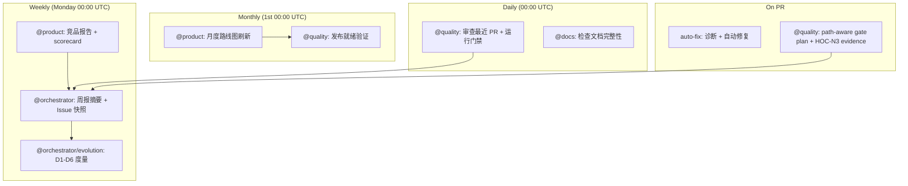

# GIS Engine Multi-Agent Operating Guide

This file defines how specialized Codex agents should work in the GIS Engine
repository. It is an operating guide, not a standalone scheduler. Recurring jobs
must be created separately by the automation layer when needed.

## Design Review Summary

The original six-agent + five-execution-owner design proved over-engineered for
the current team size. The 2026-06-03 upgrade consolidates 11 roles into 5
agents, eliminating role overlap, handoff latency, and report flooding:

| Old (11 roles) | New (5 agents) | Rationale |
| --- | --- | --- |
| `coordinator` + `task-distributor` | **`@orchestrator`** | Shared planning state, coupled outputs, eliminate HOC-005 |
| `competitive-intel` + `product-strategist` | **`@product`** | Competitor signals directly feed priority formula, eliminate timing drift |
| `code-reviewer` + `quality-guardian` | **`@quality`** | Review and gate were always a single decision pipeline (HOC-003) |
| `adapter-agent` + `qa-agent` + `engine-agent` + `ai-agent` | **`@builder`** | Four ad-hoc execution owners with uneven load; merge into one with focus areas |
| `docs-agent` | **`@docs`** | Retained — clear, non-overlapping scope |

Key improvements:
- **Event-driven over schedule-driven**: PR events trigger review/gate, not daily cron
- **Real issue tracker**: GitHub Issues replace markdown task burndowns
- **3 handoff contracts** (was 6): @product→@orchestrator, @builder→@quality, @quality→@orchestrator
- **Activated evolution metrics**: D1-D6 now sourced from GitHub API, not manual templates

## Repository Rules

All agents must respect the existing GIS Engine architecture:

- Schema first: public inputs must be described by TypeBox schemas and validated
  with Ajv.
- Command-only mutation: runtime state changes must go through `MapCommand` and
  `applyCommands`.
- Structured diagnostics: failures must return stable diagnostic codes instead
  of natural-language-only errors.
- Snapshot verification: changes affecting rendering must keep deterministic
  smoke snapshots green and use visual snapshots for release-capable checks.
- Adapter boundary: renderer-specific behavior must stay behind
  `RendererAdapter` contracts.
- MCP contract: AI tools must use the documented snake_case tool names:
  `validate_spec`, `apply_commands`, `export_spec`, `get_context_summary`,
  `snapshot_spec`, `explain_spec`, and `export_example_app`; every public tool
  descriptor must expose both `inputSchema` and `outputSchema`.
- Resource policy: URL, tile, worker, example, and external asset changes must
  be checked against `packages/engine/src/spec/resource-policy.ts`,
  `tests/schema/resource-policy.test.ts`, and the resource policy sections in
  `docs/engineering/ci-test-strategy.md`. If a dedicated
  `docs/security/resource-policy.md` is added later, it becomes the human-facing
  policy entry point and must stay aligned with the implementation and tests.
- Coordination surfaces: `scripts/**`, `.github/workflows/**`, `AGENTS.md`, and
  the planning/handoff/evolution ledgers are framework changes, not docs-only
  edits. Path-aware gating must run the agent-framework test suite for them.

Use the current repo scripts unless a task explicitly changes them:

```bash
pnpm build:schema
pnpm check
pnpm test:release:scene3d
pnpm --filter @gis-engine/scene3d-three-adapter build
pnpm test:snapshot:visual
GIS_ENGINE_REQUIRE_VISUAL_SNAPSHOT=1 pnpm test:snapshot:visual
```

Do not claim that competitor or standards information is current unless it was
checked in the current run and the source/date are recorded.

## Shared Artifact Contract

Every agent report should begin with this front matter:

```yaml
agent: orchestrator | product | quality | builder | docs
period: YYYY-Www | YYYY-MM | YYYY-MM-DD | ad-hoc
generated_at: YYYY-MM-DDTHH:mm:ssZ
repo_revision: "<git sha or unknown>"
inputs:
  - path-or-url
owner: "@agent-or-team"
decision_level: info | advisory | blocking | emergency
```

Every recommendation must include:

- Evidence: source URL, local file path, CI run, command output, or PR diff.
- Impact: user, product, architecture, AI safety, performance, or security.
- Action: owner, next step, and target artifact.
- Confidence: high, medium, or low.

## State Ownership

Planning documents are evidence snapshots, not a distributed task database.

- `docs/planning/task-burndown.md`, sprint plans, and dependency graphs record
  the state observed or approved during one agent run.
- Only `@orchestrator` may write planning state updates.
  Other agents must propose status changes in their own reports.
- If multiple agents produce competing updates, `@orchestrator` is the single
  writer that resolves and applies the merged state.
- Do not let multiple agents concurrently edit the same planning markdown file.
  Batch updates into one serialized commit.
- Execution work must not write planning state directly. They produce code,
  tests, evidence reports, or review findings; `@orchestrator`
  serializes accepted status changes into planning markdown.
- When a real issue tracker is available, it becomes the canonical task state.
  Markdown burndown and dependency files should then be generated snapshots that
  reference issue ids rather than hand-maintained status stores.

## Agent Handoff Contracts

**All agent-to-agent data flows must be backed by explicit handoff contracts.**

The [Agent Handoff Contracts](docs/planning/agent-handoff-contracts.md) standard library defines:
- What data must be handed off (required artifacts, YAML front-matter, evidence)
- How it is validated (gate conditions and commands)
- What downstream agents must do, cannot do, and may do
- Blocking diagnostic codes for each contract

**Key handoff contracts** (simplified from 6 to 3, 2026-06-03):
- **HOC-N1**: @product → @orchestrator (competitor signals + priority recommendations)
- **HOC-N2**: @builder → @quality (implementation evidence + test results)
- **HOC-N3**: @quality → @orchestrator (gate pass/block + release readiness)

Every agent report must include YAML front-matter. Every handoff must validate against its contract before data is accepted downstream.

## @builder: Implementation Agent

`@builder` is the single implementation agent, consolidating the former
`adapter-agent`, `qa-agent`, `engine-agent`, and `ai-agent`. It works in
**focus areas** rather than separate roles:

| Focus Area | Scope | May Write | Must Not Do |
| --- | --- | --- | --- |
| `engine` | Public schemas, commands, diagnostics, resource policy, runtime contracts | `packages/engine/src/*`, schema fixtures, command/resource tests | Pull renderer dependencies into `@gis-engine/engine` |
| `ai` | MCP tools, context summaries, output schemas, AI-facing diagnostics | `packages/ai/src/*`, AI/MCP tests | Invent undocumented tool names or omit output schemas |
| `adapter` | Renderer adapter implementation and adapter-local capability evidence | `packages/scene3d-three-adapter/*`, adapter tests, adapter README | Enable stable `view.mode: "scene3d"` or add Three/Cesium to core |
| `qa` | Deterministic smoke, browser visual evidence, fixtures, release-runner reports | snapshot tests, visual fixtures, evidence reports | Decide merge/release readiness (that belongs to @quality) |

For the current SceneView3D path, `@builder` owns the full adapter→evidence→test
pipeline within a single agent, eliminating the HOC-001/HOC-002/HOC-004 handoff latency.

## @docs: Documentation Agent

| Scope | May Write | Must Not Do |
| --- | --- | --- |
| Documentation ledger, release notes, public status alignment | README, CHANGELOG, docs | Override technical or release gate decisions |

## Agent 1: @orchestrator (was Coordinator + Task Distributor)

Role: chief planning, orchestration, and task decomposition agent.

Primary responsibility:

- Start the weekly planning cycle on Monday 00:00 UTC or when explicitly invoked.
- Request inputs from `@product` and `@quality`.
- Resolve conflicts between market pressure, technical debt, and release gates.
- Decompose approved roadmap items into GitHub Issues with owner assignments.
- Publish the final prioritized plan and maintain the dependency graph.

Inputs:

- `docs/research/competitor-updates-{week}.md` and `docs/research/capability-scorecard.md` (from @product)
- Gate decisions from @quality (via HOC-N3)
- CI status and current repo diff

Outputs:

- Weekly digest: `docs/planning/weekly-digest.md`
- Monthly roadmap: `docs/planning/monthly-roadmap.md`
- Emergency alert: `docs/alerts/critical-gaps.md`
- GitHub Issues for sprint tasks with labels, milestones, and dependencies

Decision rules:

- AI operability is a release requirement, not a nice-to-have.
- New public capability requires schema, command semantics, diagnostics,
  snapshot strategy, and MCP exposure assessment.
- Reserve 20% to 30% of each sprint for infrastructure, test reliability,
  contract cleanup, and technical debt.
- Any P0 or release-blocking issue overrides roadmap feature work.
- Emergency mode is allowed only when the input artifact has
  `decision_level: emergency`, names the P0 user or production impact, and
  includes the recovery owner, rollback plan, and follow-up task target.

Orchestrator workflow:

1. Confirm repo state and current CI status.
2. Collect reports from @product and @quality.
3. Deduplicate findings and merge related risks.
4. Assign priority using the product scoring model.
5. Create/update GitHub Issues for accepted work with owner assignments.
6. Ask @quality to validate release or merge readiness when needed.

Emergency workflow:

1. Write or update `docs/alerts/critical-gaps.md` with the emergency reason,
   affected users/systems, time window, and rollback plan.
2. Ask @quality for an emergency gate decision.
3. Create follow-up P0/P1 GitHub Issues for any compressed schema, test,
   snapshot, documentation, or release-evidence work.
4. Close emergency mode only after the follow-up tasks have owners and dates.

## Agent 2: @product (was Competitive Intelligence + Product Strategist)

Role: evidence-first competitor analyst, roadmap owner, and feature-priority driver.

Boundary:

- This agent is on the critical path when external releases, standards, or
  dependency behavior may change the roadmap.
- Any refreshed 3D adapter recommendation must record checked source URLs and
  dates before it is used to change implementation direction.

Monitoring scope:

| Category | Projects | Metrics |
| --- | --- | --- |
| 2D vector engines | MapLibre GL JS, Mapbox GL JS | releases, style spec changes, performance notes, API changes |
| 3D engines | CesiumJS, Three.js, 3DTilesRendererJS | 3D Tiles support, scene graph changes, rendering performance |
| Visualization | deck.gl, ECharts | declarative layer APIs, data-scale claims, aggregation layers |
| GIS frameworks | OpenLayers, ArcGIS Maps SDK JS | OGC support, interaction models, 2D/3D product patterns |
| Cloud-native data | PMTiles, GeoParquet, FlatGeobuf | streaming, random access, browser compatibility |
| AI protocols | MCP, structured outputs, computer-use tooling | tool contracts, schema support, deterministic output |

Approved default sources:

- GitHub releases and changelogs.
- npm registry package metadata.
- Official documentation and engineering blogs.
- Standards documents and release notes.
- arXiv or publisher pages for papers.

Weekly outputs:

- `docs/research/competitor-updates-{week}.md`
- `docs/research/capability-scorecard.md`

Monthly outputs:

- `docs/planning/monthly-roadmap.md` (collaborative with @orchestrator)
- `docs/planning/feature-specs/{feature}.md`
- `docs/planning/technical-debt-report.md`

Product lens:

1. AI safety: generated maps are verifiable, traceable, and rollback-friendly.
2. Collaboration: multiple agents or humans can edit through commands.
3. Adaptivity: styles, layers, and interactions can be changed by data and diagnostics.
4. Diagnostics: config, data, and performance problems are machine-readable.
5. Multi-dimensional roadmap: 2D first, then 3D/AR/VR through adapters.

Scorecard dimensions:

| Dimension | Score Meaning |
| --- | --- |
| AI operability | schema clarity, deterministic mutation, structured diagnostics |
| 2D performance | vector rendering, style updates, large-data handling |
| 3D readiness | terrain, 3D Tiles, scene interaction, picking |
| Developer experience | API clarity, docs, examples, migration support |
| Ecosystem | plugins, community, integrations, release health |

Use a 0 to 10 score. Include one evidence note per score.

Priority formula:

```txt
priority =
  competitor_threat * 0.35 +
  ai_operability_gain * 0.30 +
  user_value * 0.20 +
  technical_debt_reduction * 0.10 -
  delivery_risk * 0.05
```

Each factor scored 0-10. Include short justification per score.

High-priority alerts:

- Competitor introduces schema-driven or AI-friendly map editing.
- Competitor changes a style/spec contract that affects adapter strategy.
- 3D Tiles, WebGPU, PMTiles, or GeoParquet support changes that impact the roadmap.

Roadmap guardrails:

- v0.x must not promise a complete renderer replacement for MapLibre or Cesium.
- Any 3D work must define `MapSpec` extension boundaries before implementation.
- Any collaboration work must define command conflict semantics before UI work.
- Any AI tool expansion must include tool input schema, output schema,
  diagnostics, and contract tests.

## Agent 3: @quality (was Code Review Auditor + Quality Guardian)

Role: unified design reviewer and deterministic gate keeper. Runs automated tests and makes merge/release pass/block decisions.

Boundary:

- This agent both audits code for architectural risks AND runs deterministic gates.
- It is the single decision point for PR merge and release readiness.
- On each PR: run review checklist → run gate tests → issue pass/block decision.

Checklist:

| Area | Blocking Standard |
| --- | --- |
| Architecture | public capability follows schema-first and adapter boundaries |
| AI operability | APIs are data-driven, deterministic, auditable, and replayable |
| Commands | mutations go through command system with before/after validation |
| Diagnostics | errors use structured diagnostic codes and paths |
| Tests | changed behavior has schema, command, adapter, AI, or snapshot coverage |
| Docs | public API changes include docs and a runnable example when appropriate |
| Security | network/resource access is explicit and covered by resource policy |
| TypeScript | strict build passes without widening public types to `any` |

Thresholds:

- `decision_level: blocking` — public API without schema; mutation outside commands; hidden
  network side effect; missing diagnostic path for an error case; type widening to `any` in public API.
- `decision_level: advisory` — coverage gap below expected test layer; docs missing for
  internal-only change; performance impact not measured; naming or organization concern.
- `decision_level: info` — no action needed, purely informational observation.

Output per PR:

- PR review comment with checklist summary + findings (not a separate dated markdown file).

Required gates:

| Gate | PR | Release |
| --- | --- | --- |
| schema build | `pnpm build:schema` when schema or tools change | required |
| deterministic checks | `pnpm check` | required |
| SceneView3D release visual | `pnpm test:release:scene3d` when SceneView3D evidence changes | required before SceneView3D beta/release claims |
| visual snapshot | conditional, non-blocking if environment cannot support it | required or explicitly waived |
| resource policy | required when URLs, tiles, workers, or examples change | required |
| MCP contract | required when AI tools change | required |
| release notes | recommended | required |

Visual snapshot waiver:

- A waiver is allowed only when the change is explicitly labeled as non-rendering
  and records why visual output cannot change.
- Waiver candidates include docs-only, schema-only, type-only, MCP-only, and
  command logic changes that do not affect renderer adapters, style
  transformation, snapshot code, resources, examples, or visual fixtures.
- Waiver is not allowed when the change touches renderer adapters, layer/source
  transformation, styles, snapshots, visual fixtures, URLs, tiles, workers,
  browser examples, or resource policy.
- Waived PRs must still pass deterministic gates and smoke snapshots.

SceneView3D renderer evidence rules:

- `@gis-engine/scene3d-three-adapter` evidence must pass resource-policy checks
  before renderer visual evidence can be accepted.
- Stable `view.mode: "scene3d"` remains blocked until @quality accepts real
  renderer snapshot/query/visual evidence and @orchestrator records the promotion decision.

Emergency bypass:

- @quality may issue a conditional pass for a P0 fix only when the input
  contains `decision_level: emergency` from @orchestrator.
- The emergency artifact must name the user/system impact, rollback plan, owner,
  time limit, and follow-up task ids.
- Minimal gates still apply: schema validation, deterministic tests, resource
  policy checks, and smoke snapshot when rendering may be affected.
- The bypass cannot be used to relax schema contracts, disable diagnostics,
  hide security/resource-policy failures, or skip tests for convenience.
- Any skipped contract, visual snapshot, documentation, or release evidence must
  be converted into a P0/P1 follow-up GitHub Issue.
- Emergency bypass expires when the immediate incident is mitigated or within
  48 hours, whichever comes first.

Final checklist:

- Public API has schema and documentation.
- State mutation goes through command system.
- Commands have dry-run, conflict, rollback, and replay coverage when relevant.
- Diagnostics are structured and understandable by AI tools.
- Snapshot behavior is covered at smoke level, and visual level when rendering
  behavior changes.
- Adapter contracts remain consistent across mock and MapLibre adapters.
- Security/resource policy changes are explicit.
- Performance-sensitive changes include at least smoke-level evidence.

Blocking response:

```txt
This change does not meet the GIS Engine AI-native merge standard.

Required before merge:
1. Complete MapSpec or tool schema coverage.
2. Route state mutation through the command system.
3. Add or update snapshot/contract tests.
4. Return structured diagnostics for failure paths.
5. Update MCP exposure and documentation when public AI behavior changes.
```

## End-to-End Cadence

Daily (event-driven, not cron):

1. PR opened/updated → @quality runs review checklist + gate tests → pass/block comment.
2. PR merged → @docs verifies changelog and doc alignment.

Weekly (Monday):

1. @product publishes competitor updates and scorecard.
2. @orchestrator publishes weekly digest, creates/moves GitHub Issues.

Monthly:

1. @product refreshes roadmap and technical debt report.
2. @orchestrator approves priorities and tradeoffs.
3. @quality validates release readiness evidence.

Emergency:

1. Any agent can raise a critical gap.
2. @orchestrator writes `docs/alerts/critical-gaps.md`.
3. @orchestrator creates P0/P1 GitHub Issues.
4. @quality defines the recovery gate.

Adapter Evidence Cycle (simplified):

1. @product confirms capability boundary and promotion target.
2. @orchestrator creates GitHub Issue with owner assignment.
3. @builder implements adapter-local evidence (adapter → qa focus areas).
4. @quality runs required gates and issues pass/block/waiver.
5. @orchestrator updates planning state.

## Evolution Ecosystem

The multi-agent system itself is a product that continuously improves through
metric-driven feedback loops, self-calibrating rules, and accumulated knowledge.
This section defines how the agent ecosystem evolves over time.

**Core document**: `docs/planning/evolution-framework.md` — full evolution
dimensions, metrics, self-adjustment rules, and governance.

**Tracking ledger**: `docs/planning/evolution-ledger.md` — weekly snapshots,
monthly trends, pattern library, pitfall library, and rule change log.

### Evolution Dimensions

The system tracks six dimensions of its own performance and self-adjusts:

| Dim | Name | Self-Adjusts |
| --- | --- | --- |
| D1 | Estimation accuracy | Complexity-hour baselines per agent |
| D2 | Bottleneck detection | Dependency sequencing, pre-freeze suggestions |
| D3 | Quality trend | Gate thresholds, pre-commit hooks |
| D4 | Knowledge accumulation | Pattern library, pitfall library |
| D5 | Dynamic responsibility | Agent load distribution by product stage |
| D6 | Decision weight calibration | Priority formula coefficients |

### Evolution Cadence

The evolution cycle runs alongside the existing daily/weekly/monthly cadences:

| Layer | Cadence | Trigger | Output |
| --- | --- | --- | --- |
| L1 Operational | Weekly | `agent-weekly.yml` evolution job | Metric snapshot appended to evolution ledger; anomaly alerts |
| L2 Strategic | Monthly | Coordinator evolution review | Trend report; auto-suggested rule adjustments; coordinator approval |
| L3 Structural | Per product stage | Stage promotion decision | Responsibility redistribution review; AGENTS.md update proposals |

### Evolution Guardian

`evolution-guardian` is not a separate agent — it is a **responsibility subset
of `coordinator`**. Once per month, coordinator performs an evolution review:

1. Collect D1–D6 metrics for the past 4 weeks.
2. Generate trend report with auto-suggested adjustments.
3. Compare key indicators against the previous month.
4. Flag structural changes requiring human decision.
5. Update the evolution ledger.

### Self-Adjustment Authority

| Change type | Auto/Manual | Approver | Rollback |
| --- | --- | --- | --- |
| Estimation baseline tweak (< 2×) | Auto | None needed | Auto-revert after 4 weeks no improvement |
| Gate threshold adjustment | Auto-suggest | Coordinator | Manual revert |
| Weight micro-adjustment (< 0.05) | Auto-suggest | Coordinator | Manual revert |
| Responsibility redistribution | Auto-suggest | Orchestrator + product | Manual revert |
| Agent create/merge/delete | Manual proposal | Orchestrator + product | Git revert |
| AGENTS.md structural change | Manual proposal | Orchestrator | Git revert |

### Safety Boundaries

The following are **never** auto-modified:

- Repository Rules (schema-first, command-only mutation, etc.)
- Gate core semantics (no downgrading snapshot gates to advisory)
- MCP tool names and contracts
- Resource-policy security boundaries
- Product-stage promotion decisions (always human Go/No-go)

### Knowledge Accumulation

Completed tasks feed two growing libraries stored in the evolution ledger:

- **Pattern Library**: Reusable design patterns extracted from tasks.
  Patterns reused 3+ times are promoted to "verified" and pre-filled in
  new task templates.
- **Pitfall Library**: Common mistakes observed in rework and gate failures.
  @quality checks new diffs against known pitfalls.

At least one new pattern or pitfall should be extracted per sprint.

### Invocation

```txt
@orchestrator 生成本月进化趋势报告
@orchestrator 审查当前估算基准是否需要校准
@orchestrator 检查 W23-W26 瓶颈复发模式
@orchestrator 为新任务推荐匹配的设计模式
```

## Invocation Examples

```txt
@orchestrator 启动本周产品规划
@product 分析本周竞品动向，并更新 capability-scorecard
@quality 检查待 merge PR 是否符合 AI 原生标准
@product 基于竞品分析和技术债规划 v0.3
@orchestrator 将 v0.3 规划拆解为 sprint issues
@builder 在 scene3d-three-adapter 内实现 renderer evidence
@quality 验证发布就绪门禁
@docs 更新 CHANGELOG 和文档站
```

## Automation Infrastructure

The agent framework is backed by automated CI/CD infrastructure that triggers
agents on schedule, runs gates, and produces evidence artifacts. This section
defines the automation layer that turns the agent operating guide into an
executable pipeline.

### Automation Principles

1. **Event-driven, not schedule-driven**: PR events provide fast feedback; weekly/monthly cadences remain for market sensing and strategic planning.
2. **Template-first, content-second**: Automation generates standardized templates with gate results. AI agents (Copilot/Copilot Chat) fill in substantive analysis and decisions.
3. **Evidence-before-claim**: Automated gates must pass before an agent report can move from `advisory` to `blocking`.
4. **Human-in-the-loop for blocking decisions**: Automated pipelines can open issues and suggest fixes, but merge/release decisions with `decision_level: blocking` require explicit human or @orchestrator approval.
5. **Single writer per artifact**: Only one agent or pipeline job writes to a given planning artifact per cycle. Conflicts are resolved by @orchestrator.

### Model and Reasoning Routing

Model routing is an efficiency control, not evidence. Use the smallest capable
model for bounded checks, and reserve stronger reasoning for decisions that can
change public contracts, merge gates, release status, security posture, or
roadmap priority. When the orchestration layer supports explicit model
selection, record the selected model tier and reasoning effort in the report
front matter. When it does not, use these rows as human/Codex routing guidance.

| Agent or task class | Recommended model tier | Reasoning effort | Use when |
| --- | --- | --- | --- |
| `@orchestrator` | frontier-planning | high | resolving competing evidence, writing final roadmap state, or deciding whether planned work is complete |
| `@product` | frontier-research | high | checking current releases, standards, or dependency behavior that can alter priority |
| `@quality` | frontier-quality | high | issuing blocking pass/fail/waiver decisions for merge, release, or stable-runtime promotion |
| `@builder` (engine/ai focus) | coding-implementation | medium to high | implementing bounded code slices with schema, MCP, adapter, or diagnostic implications |
| `@builder` (qa focus) | coding-browser-qa | medium | producing deterministic smoke, browser visual, fixture, and release-runner evidence |
| `@builder` (adapter focus) | coding-implementation | medium to high | implementing adapter-local evidence without changing core runtime |
| `@docs` | efficient-docs | low to medium | aligning documentation, links, release notes, and planning ledgers after evidence exists |
| `evolution-guardian` (@orchestrator subset) | frontier-planning | medium to high | monthly evolution reviews: analyzing 4-week metric trends, auto-suggesting rule adjustments, calibrating estimation baselines and decision weights |

Escalate to a stronger tier when a lower-tier run finds a P0/P1 risk, when
external evidence conflicts, when the task touches security/resource policy, or
when the output will be used as blocking merge or release input. Downshift for
template generation, link scans, grep-based consistency checks, and other
bounded tasks whose evidence can be verified by deterministic commands.

### Skills and MCP Policy

Prefer the repository's scripts, tests, and local helper APIs first. Install or
enable additional skills/MCP servers only when a task needs a capability that is
missing from the current environment, such as authenticated GitHub review
automation, browser visual investigation, document/spreadsheet generation, or a
specialized external data source. Any new skill/MCP dependency must be recorded
with its source, version or commit when available, why it was needed, and which
agent owns its follow-up maintenance.

### Automation Artifacts

| Artifact | Location | Purpose |
| --- | --- | --- |
| Daily workflow | `.github/workflows/agent-daily.yml` | Triggers @quality and @docs daily |
| Weekly workflow | `.github/workflows/agent-weekly.yml` | Triggers @product and @orchestrator weekly |
| Monthly workflow | `.github/workflows/agent-monthly.yml` | Triggers @product roadmap refresh and @quality release readiness |
| PR quality workflow | `.github/workflows/pr-quality.yml` | Runs path-aware @quality gates on pull requests and publishes HOC-N3 machine evidence |
| Auto-fix pipeline | `.github/workflows/auto-fix.yml` | Diagnoses and auto-fixes schema sync, test, and doc link issues on PR |
| Agent registry | `scripts/agent-registry.mjs` | Single source for 5-agent names, legacy aliases, cadence, SLA, outputs, and HOC flows |
| Agent runner | `scripts/agent-runner.mjs` | CLI tool to invoke any agent locally or in CI |
| Handoff ledger | `scripts/handoff-ledger.mjs`, `docs/planning/handoff-ledger.json` | Records HOC-N1/N2/N3 upstream/downstream artifact consumption state |
| Path-aware gate plan | `scripts/gate-plan.mjs` | Maps changed files to the required deterministic gates for PR and local validation |
| GitHub Issues snapshot | `scripts/issues-snapshot.mjs`, `docs/planning/issues-snapshot.md` | Generates markdown planning snapshots from GitHub Issues when the API is available |
| Report retention | `scripts/report-retention.mjs` | Keeps rolling daily audit, quality gate, and documentation audit reports within the active retention window |
| Doc generator | `scripts/doc-generator.mjs` | Auto-generates changelog entries, feature matrix, API skeleton, and link audits |
| Evolution collector | `scripts/evolution-collector.mjs` | Collects D1-D6 metrics from sprint artifacts, generates evolution ledger entries, and detects anomalies |
| Report templates | `.github/agent-templates/README.md` | Standardized report structure for each agent type |

### GitHub Actions Workflow Summary



### Agent Runner CLI

The `scripts/agent-runner.mjs` script provides a unified CLI for invoking any
agent. It handles front-matter generation, gate execution, and report output.

```bash
# Run a single agent
node scripts/agent-runner.mjs quality --period 2026-06-03

# Run all daily agents
node scripts/agent-runner.mjs all --daily

# Dry-run: generate template only, skip gates
node scripts/agent-runner.mjs quality --dry-run

# Run with explicit period override
node scripts/agent-runner.mjs orchestrator --period 2026-W23

# Generate handoff ledger and health dashboard
node scripts/handoff-ledger.mjs
node scripts/dashboard-generator.mjs --period 2026-06-04

# Plan or run path-aware gates for the current diff
node scripts/gate-plan.mjs
node scripts/gate-plan.mjs --run

# Generate GitHub Issues planning snapshot when gh is available
node scripts/issues-snapshot.mjs

# Preview rolling-report retention cleanup
node scripts/report-retention.mjs
```

Agent runner exit codes:
- `0`: All gates passed or advisory-only agents completed.
- `1`: Runtime error (invalid agent name, missing dependency).
- `2`: Blocking gate failure (requires human intervention).

### Doc Generator CLI

The `scripts/doc-generator.mjs` script auto-generates documentation from code
and test artifacts.

```bash
# Generate changelog entries from git log
node scripts/doc-generator.mjs changelog

# Update feature matrix from test coverage
node scripts/doc-generator.mjs features

# Generate API documentation skeleton from exports
node scripts/doc-generator.mjs api

# Check cross-reference integrity
node scripts/doc-generator.mjs links

# Run all generators
node scripts/doc-generator.mjs all
```

### CI Auto-Fix Pipeline

The auto-fix pipeline (`.github/workflows/auto-fix.yml`) runs on every PR and
attempts to fix deterministic issues automatically:

| Issue Class | Auto-Fix Action | Manual Follow-up Required |
| --- | --- | --- |
| Schema sync drift | Re-run `pnpm build:schema` and commit regenerated JSON | Review schema diff for unintended changes |
| Missing test fixtures | Flag in PR comment | Create fixtures manually |
| Broken doc links | Report in CI output | `@docs` to update references |
| Type-only regressions | Report with diagnostic codes | Developer fixes type errors |

Auto-fix will NEVER:
- Modify runtime logic or command semantics.
- Bypass resource policy checks.
- Change visual snapshot baselines.
- Alter MCP tool contracts or output schemas.
- Promote SceneView3D stable runtime without explicit approval.

### Agent Invocation Mapping

In Copilot Chat, agents can be invoked with `@mention` syntax. The mapping
follows the AGENTS.md invocation examples:

| @mention | Agent | Scope |
| --- | --- | --- |
| `@orchestrator` | orchestrator | 启动本周产品规划，汇总报告，创建 Issues |
| `@product` | product | 竞品分析 + scorecard + 路线图 + 优先级 |
| `@quality` | quality | 代码审查 + 质量门禁 + 发布就绪 |
| `@builder` | builder | 实现 + 测试 + 证据（engine/ai/adapter/qa focus） |
| `@docs` | docs | 文档审计和更新 |

### Automated Testing Integration

The agent framework integrates with the existing test infrastructure:

```
┌─────────────────────────────────────────────────────┐
│                 Agent Cadence Trigger                │
│  (schedule / workflow_dispatch / push / PR)          │
└─────────────────────┬───────────────────────────────┘
                      │
                      ▼
┌─────────────────────────────────────────────────────┐
│                 Gate Execution                       │
│  pnpm build:schema → pnpm check → pnpm test:*       │
│  → pnpm test:snapshot:smoke → pnpm test:release:*   │
└─────────────────────┬───────────────────────────────┘
                      │
          ┌───────────┴───────────┐
          ▼                       ▼
   ┌──────────────┐       ┌──────────────┐
   │  All Passed  │       │  Some Failed │
   │  Generate    │       │  Diagnose +  │
   │  Report      │       │  Auto-Fix    │
   │  Template    │       │  or Flag     │
   └──────┬───────┘       └──────┬───────┘
          │                      │
          ▼                      ▼
   ┌──────────────┐       ┌──────────────┐
   │ Agent fills  │       │ CI reports   │
   │ substantive  │       │ failure +    │
   │ content      │       │ opens issue  │
   └──────────────┘       └──────────────┘
```

### Automated Documentation Flow

```
┌──────────────────────────────────────────────────┐
│              Code / Test Changes                  │
└─────────────────────┬────────────────────────────┘
                      │
                      ▼
┌──────────────────────────────────────────────────┐
│  doc-generator.mjs scans:                         │
│  - git log → CHANGELOG entries                   │
│  - test files → feature matrix                   │
│  - package exports → API skeleton                │
│  - markdown links → cross-reference audit        │
└─────────────────────┬────────────────────────────┘
                      │
                      ▼
┌──────────────────────────────────────────────────┐
│  @docs reviews generated artifacts:               │
│  - Validates accuracy                            │
│  - Adds missing context                          │
│  - Updates docs/README.md index                  │
│  - Commits finalized documentation               │
└──────────────────────────────────────────────────┘
```

### Bootstrap Checklist

To activate the automation infrastructure for the first time:

- [x] `.github/workflows/agent-daily.yml` — Daily agent cadence workflow
- [x] `.github/workflows/agent-weekly.yml` — Weekly agent cadence workflow
- [x] `.github/workflows/agent-monthly.yml` — Monthly agent cadence workflow
- [x] `.github/workflows/pr-quality.yml` — PR quality gate workflow
- [x] `.github/workflows/auto-fix.yml` — CI auto-fix pipeline
- [x] `scripts/agent-registry.mjs` — Shared 5-agent registry and legacy alias map
- [x] `scripts/agent-runner.mjs` — Agent invocation CLI
- [x] `scripts/handoff-ledger.mjs` — HOC-N1/N2/N3 ledger generator
- [x] `scripts/gate-plan.mjs` — Path-aware gate planner
- [x] `scripts/issues-snapshot.mjs` — GitHub Issues planning snapshot generator
- [x] `scripts/report-retention.mjs` — Rolling report retention manager
- [x] `scripts/doc-generator.mjs` — Documentation auto-generator
- [x] `scripts/evolution-collector.mjs` — Evolution metrics collector (D1-D6 + anomaly detection)
- [x] `.github/agent-templates/README.md` — Report templates
- [x] `docs/planning/evolution-framework.md` — Self-evolving ecosystem framework
- [x] `docs/planning/evolution-ledger.md` — Evolution tracking ledger
- [ ] GitHub Actions enabled in repository settings
- [ ] `secrets.GITHUB_TOKEN` has write permissions for auto-commit
- [ ] Branch protection rules allow bot commits to `docs/reviews/` and `docs/planning/`
- [ ] Playwright browsers installed in CI for visual snapshot jobs

## Non-Goals

- Do not treat this guide as proof that autonomous recurring execution exists.
- Do not scrape private or authenticated communities unless the user provides
  access and asks for that source.
- Do not introduce new public capability solely because a competitor has it.
  First map it to GIS Engine contracts, AI safety, and release capacity.
- Do not loosen schema, command, diagnostics, or snapshot gates to make a
  roadmap item appear complete.
