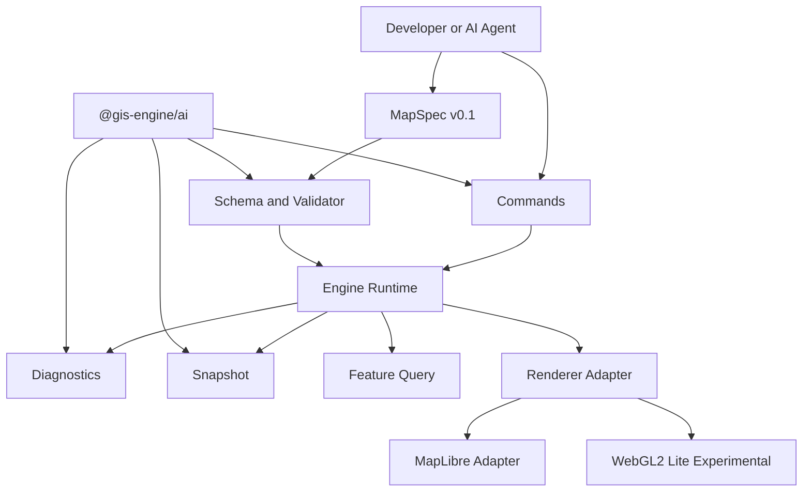

# AI 原生地图引擎核心框架

## 定位

GIS Engine 是一个 Web TypeScript first 的 AI 原生地图运行时。它的核心资产不是另一个大而全的地图 SDK，而是一个稳定、可验证、可回放、可由 AI 操作的声明式地图协议。

2D/3D 架构边界、竞品软件工程对比和 AI 原生标准见 [../research/competitive-analysis-ai-native-2d-3d.md](../research/competitive-analysis-ai-native-2d-3d.md)。

v0.1 的可验收范围见 [../engineering/v0.1-mvp-acceptance.md](../engineering/v0.1-mvp-acceptance.md)，具体接口契约见 [../spec/contracts-and-interfaces.md](../spec/contracts-and-interfaces.md)。

首版目标：

- 支持 AI Agent 可靠创建、修改、验证和导出 Web 地图应用。
- 用 `MapSpec` 统一 AI、代码、测试、文档和示例。
- 用 command 系统约束所有增量修改。
- 用 validation、diagnostics 和 snapshot 降低 AI 生成空白地图或错误地图的概率。
- 用 MapLibre adapter 先交付可用渲染能力，同时保留轻量自研 WebGL2 后端实验空间。

非目标：

- v0 不替代 Cesium。
- v0 不自研完整 MapLibre 级别渲染内核。
- v0 不承诺完整 3D、完整 expression、完整文字碰撞和排版。
- v0 不把 AI/MCP 放进渲染核心生命周期。

## v0 包结构

首版包拆分必须克制。成熟后的 `scene3d`、`analysis`、`devtools`、`tiles`、`sources`、`layers` 暂时都作为内部目录或后续包处理。

```txt
packages/
  engine/
    src/
      core/
      spec/
      commands/
      diagnostics/
      renderer/
      sources/
      layers/
      interactions/
      snapshot/
  ai/
    src/
      tools/
      mcp/
      prompts/
  examples/
  docs/
```

公开包：

- `@gis-engine/engine`：地图运行时、`MapSpec` 类型、schema、validator、command apply、snapshot、query、MapLibre adapter、实验 WebGL2 lite renderer。
- `@gis-engine/ai`：MCP tools、AI 友好命令 schema、诊断解释、导出示例应用。
- `examples`：可运行样例，不作为 npm 包发布。
- `docs`：架构、指南、研究和评审文档。

暂缓独立发布：

- `@gis-engine/scene3d`
- `@gis-engine/analysis`
- `@gis-engine/devtools`
- `@gis-engine/tiles`
- `@gis-engine/sources`
- `@gis-engine/layers`

这些边界在 v0.1 先以内部模块存在，等 API 和使用场景稳定后再拆包。

## 架构分层



分层原则：

- `spec` 是最稳定的层，独立于 renderer、AI 和 MCP。
- `core` 管理生命周期、状态树、命令调度、事件系统、插件注册和能力协商。
- `renderer` 只负责把规范化后的 source/layer/view 渲染出来，不拥有 `MapSpec` 业务规则。
- `ai` 是 adapter 和工具层，可调用 validator、command、snapshot、diagnostics，但不是 runtime 的必选依赖。

## 核心 API

```ts
import { createMap } from "@gis-engine/engine";

const map = await createMap(container, spec, {
  renderer: "maplibre",
});

await map.apply([
  {
    id: "cmd-style-districts",
    version: "0.1",
    type: "setPaint",
    baseRevision: spec.revision,
    layerId: "district-fill",
    paint: {
      "fill-color": ["interpolate", ["linear"], ["get", "score"], 0, "#dbeafe", 100, "#1d4ed8"],
    },
  },
]);

const exported = map.exportSpec();
const report = await map.validate();
const features = await map.queryFeatures({ point: [120, 30], layers: ["district-fill"] });
const snapshot = await map.snapshot({ format: "png" });

map.destroy();
```

API 定义：

```ts
export function createMap(
  container: HTMLElement,
  spec: MapSpec,
  options?: CreateMapOptions,
): Promise<GisMap>;

export interface GisMap {
  apply(commands: MapCommand | MapCommand[]): Promise<CommandResult[]>;
  exportSpec(): MapSpec;
  validate(options?: ValidateOptions): Promise<ValidationReport>;
  queryFeatures(options: QueryFeaturesOptions): Promise<FeatureQueryResult>;
  snapshot(options?: SnapshotOptions): Promise<SnapshotResult>;
  destroy(): void;
}
```

## MapSpec v0.1

`MapSpec` 是稳定协议。它必须能被 AI 生成、被开发者手写、被 JSON Schema 校验、被 TypeScript 类型提示、被测试回放。

```ts
export interface MapSpec {
  version: "0.1";
  capabilities?: CapabilityRequest;
  view: ViewSpec;
  sources: Record<string, SourceSpec>;
  layers: LayerSpec[];
  interactions?: InteractionSpec;
  metadata?: Record<string, unknown>;
  extensions?: Record<string, unknown>;
}
```

固定字段：

- `version`：schema 版本，v0.1 必填。
- `capabilities`：声明需要的 renderer、source、layer、snapshot、query 能力。
- `view`：center、zoom、bearing、pitch、bounds、constraints。
- `sources`：GeoJSON、raster、PMTiles 等数据源定义。
- `layers`：有序图层列表，图层顺序即渲染顺序。
- `interactions`：pan、zoom、hover、click、select、popup 等交互配置。
- `metadata`：项目、作者、数据出处、示例说明等非运行时信息。
- `extensions`：terrain、scene、aiHints、实验字段和第三方插件字段。

不进入 v0 核心字段：

- `terrain`
- `scene`
- `aiHints`
- `globe`
- `analysis`

这些能力必须通过 `extensions` 和 capability gate 进入，避免早期 schema 被未来 3D 或分析能力锁死。

## 命令系统

命令系统是 AI 能可靠修改地图的关键。所有命令必须幂等、可校验、可回放，并返回结构化结果。

### 命令分类

| 分类 | 责任 | 示例 |
| --- | --- | --- |
| `SpecCommand` | 修改声明式地图状态 | `addSource`、`addLayer`、`setPaint`、`setLayout`、`removeLayer`、`reorderLayer` |
| `ViewCommand` | 修改视图和交互状态 | `setView`、`fitBounds`、`setPitch`、`setBearing` |
| `RuntimeQuery` | 查询运行时状态，不改变 spec | `queryFeatures`、`snapshot`、`inspectLayers` |
| `AITool` | AI 编排和开发工具能力 | `validate_spec`、`apply_commands`、`explain_spec`、`snapshot_spec`、`export_example_app` |

### 命令结果

完整命令 contract 使用 RFC 6902 JSON Patch，见 [../spec/contracts-and-interfaces.md](../spec/contracts-and-interfaces.md)。

```ts
export interface CommandResult {
  commandId: string;
  status: "applied" | "skipped" | "failed";
  baseRevision?: string;
  nextRevision?: string;
  changedPaths: string[];
  patch?: JsonPatchOperation[];
  inversePatch?: JsonPatchOperation[];
  diagnostics: Diagnostic[];
  traceId?: string;
}
```

结果必须回答：

- 是否应用成功。
- 为什么失败或跳过。
- 修改了哪些 `MapSpec` 路径。
- 是否产生 warning。
- AI 可以如何修复。

## 诊断模型

诊断是 AI 原生能力的核心，不只是错误文本。

```ts
export interface Diagnostic {
  severity: "error" | "warning" | "info";
  code: string;
  message: string;
  path?: string;
  fix?: SuggestedFix;
}
```

诊断 code 必须使用命名空间，例如 `SPEC.UNKNOWN_FIELD`、`SRC.NOT_FOUND`、`LAYER.DUPLICATE_ID`、`EXPR.TYPE_MISMATCH`、`SNAPSHOT.BLANK_CANVAS`。机器可执行修复必须使用 `SuggestedFix`，禁止只返回自然语言修复建议。

v0 必须覆盖：

- source id 不存在。
- layer id 重复。
- source/layer 类型不匹配。
- paint/layout 类型错误。
- 图层不可见。
- 图层顺序异常。
- view 不在数据范围附近。
- 瓦片或数据加载失败。
- snapshot 检测到空白画布。

## 渲染策略

### v0.1 默认：MapLibre adapter

默认后端使用 MapLibre adapter，原因：

- 快速获得稳定 2D 地图能力。
- 避免 v0 从零实现矢量瓦片、symbol、collision、expression 和 tile cache。
- 把首版差异化集中在 `MapSpec`、commands、diagnostics、snapshot 和 AI tools。

MapLibre adapter 责任：

- 将 `MapSpec` 子集转换成 MapLibre style。
- 接收 command 后进行最小增量更新。
- 把 MapLibre 的事件、错误和图层状态转成本项目诊断模型。
- 支持 snapshot 和 feature query。

### 同步实验：renderer-webgl2-lite

实验后端用于验证长期自研方向，不阻塞 v0.1 发布。

覆盖范围：

- GeoJSON source。
- raster source。
- background、raster、fill、line、circle。
- 基础 pan/zoom。
- 基础 picking。

不覆盖：

- 完整 vector tile。
- symbol collision。
- 高级 expression。
- terrain。
- 3D Tiles。

## 数据流

```txt
MapSpec
  -> validateSpec
  -> normalizeSpec
  -> capability negotiation
  -> renderer adapter
  -> source loading
  -> layer compilation
  -> render
  -> diagnostics + snapshot + query
```

命令流：

```txt
Command
  -> command schema validation
  -> dry-run against current MapSpec
  -> apply patch
  -> renderer incremental update
  -> collect diagnostics
  -> return CommandResult
```

## 扩展策略

扩展必须遵守三条规则：

- 不污染 v0 核心 schema。
- 通过 `capabilities` 声明需求。
- 通过 `extensions` 携带实验配置。

示例：

```json
{
  "version": "0.1",
  "capabilities": {
    "renderer": "maplibre",
    "experimental": ["fill-extrusion-lite"]
  },
  "extensions": {
    "scene3d": {
      "enabled": false
    }
  }
}
```

## 架构决策

- `MapSpec` 是主协议，不把 AI prompt 作为主协议。
- `@gis-engine/ai` 依赖 `@gis-engine/engine`，`@gis-engine/engine` 不依赖 `@gis-engine/ai`。
- v0.1 以 adapter 交付，v0.x 逐步验证自研 WebGL2 lite。
- 3D、terrain、3D Tiles、GeoParquet、WebGPU 均后置。
- 示例必须同时展示自然语言目标、`MapSpec`、TypeScript 代码和 command 修改流程。
