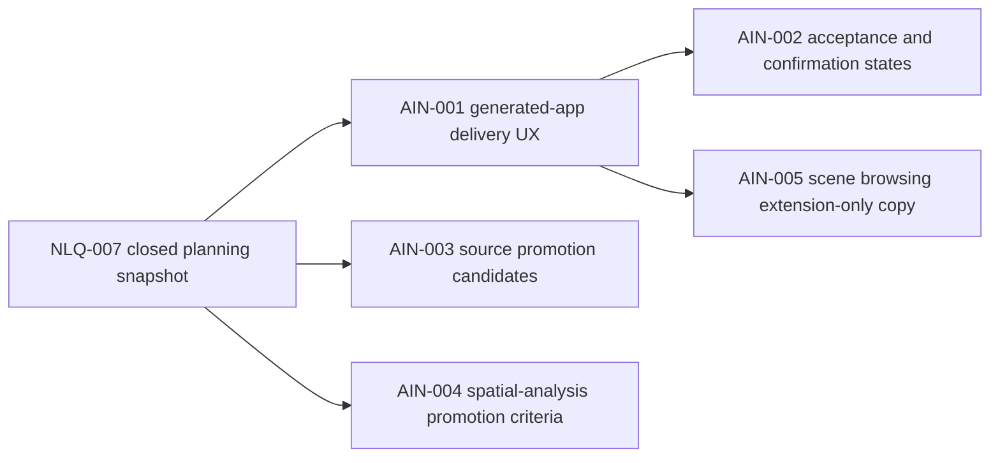

# Sprint Handoff: AI-Native Next Loop

## Sprint Goal

Start the next iteration after the NLA and NLQ batches closed. The sprint should
turn the generated-app evidence spine into a product delivery experience while
keeping unsupported data, geoprocessing, and stable 3D runtime claims blocked.

## Task DAG

| id | title | priority | complexity | owner | status | depends on | acceptance | finish gates |
| --- | --- | --- | --- | --- | --- | --- | --- | --- |
| TASK-2026W22-AIN-001 | Design generated-app delivery UX contract | P0 | M | `@product-strategist`, `@ai-agent`, `@docs-agent` | done | NLQ-007 | `generationEvidence.delivery.sections` maps readiness, files, map edits, data/analysis, and scene browsing to structured blocker/confirmation/follow-up fields | docs review; `pnpm test:ai`; `pnpm check` |
| TASK-2026W22-AIN-002 | Define generated-app acceptance and confirmation states | P0 | M | `@ai-agent`, `@qa-agent` | done | AIN-001 | `delivery.status` and `delivery.acceptance.state` cover ready, blocked, needs-confirmation, and follow-up-required without MCP aliases | AI contract tests; schema-sync; `pnpm check` |
| TASK-2026W22-AIN-003 | Split cloud-native source promotion candidates | P1 | M | `@engine-agent`, `@docs-agent` | done | NLQ-005 | PMTiles, GeoParquet, FlatGeobuf, GeoTIFF, and GeoZarr are split into schema/resource-policy/query/export promotion gates before implementation | resource-policy doc audit; `pnpm check` |
| TASK-2026W22-AIN-004 | Draft spatial-analysis promotion criteria | P1 | S | `@engine-agent`, `@ai-agent`, `@qa-agent` | done | NLQ-003 | point/bbox hardening plus buffer, intersection, overlay, routing, and aggregation name schema, command/read-only semantics, diagnostics, fixtures, and MCP exposure assessment | planning diff review; `pnpm check` |
| TASK-2026W22-AIN-005 | Keep scene browsing copy extension-only | P1 | S | `@adapter-agent`, `@qa-agent`, `@docs-agent` | done | NLQ-006 | user-facing delivery copy preserves `extensions.scene3d` context and stable-runtime blocker codes without stable renderer claims | `pnpm test:ai`; `pnpm test:release:scene3d`; docs review; `pnpm check` |

## Guardrails

- Public tool names stay frozen: `validate_spec`, `apply_commands`,
  `export_spec`, `get_context_summary`, `snapshot_spec`, `explain_spec`, and
  `export_example_app`.
- Runtime mutation remains command-only through `MapCommand` and
  `applyCommands`.
- Stable `view.mode: "scene3d"` remains blocked until a future coordinator and
  quality-guardian Go decision.
- Cloud-native source implementation cannot start until schema, diagnostics,
  resource-policy paths, and tests are scoped.
- Visual snapshot gates are required only when a task changes rendering,
  renderer adapters, visual fixtures, examples, URLs, tiles, workers, or
  resource policy.

## 2026-05-30 Execution Update

`TASK-2026W22-AIN-001` and `TASK-2026W22-AIN-002` landed as a generated-app
delivery contract slice. Evidence is recorded in
`docs/reviews/ain-001-002-generated-app-delivery-acceptance-2026-05-30.md`.
The implementation keeps the existing MCP tool surface and adds
`generationEvidence.delivery` to compact manifests and
`GenerationEvidenceBundle.delivery` to full evidence bundles.

2026-05-30 follow-up update: `AIN-003` and `AIN-004` are now captured as
promotion gate specs:
`docs/planning/feature-specs/cloud-native-source-promotion-candidates.md` and
`docs/planning/feature-specs/spatial-analysis-promotion-criteria.md`.
`AIN-005` is closed by
`docs/reviews/ain-005-scene-browsing-delivery-copy-2026-05-30.md`, which keeps
scene browsing delivery copy extension-only. The AIN batch is now closed;
stable `view.mode: "scene3d"` remains blocked.
