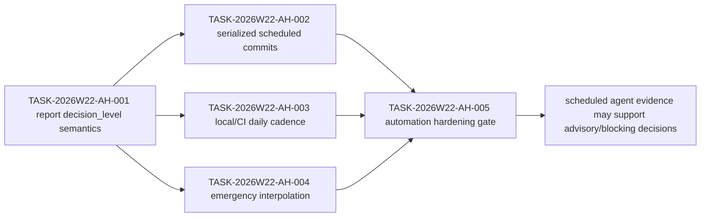

# Sprint Plan: Automation Hardening

## Objective

Close the required follow-up from the 2026-05-24 quality gate before scheduled
agent evidence is trusted as blocking-quality input. Current HEAD received a
conditional pass, but generated reports, scheduled commits, local/CI daily
cadence, and emergency alert interpolation need focused hardening.

## Owner Model

| Owner | Responsibility | Write Scope |
| --- | --- | --- |
| `@engine-agent` | Runner contract and generated report semantics | `scripts/agent-runner.mjs`, runner tests or script checks |
| `@docs-agent` | Template wording and cadence documentation | `.github/agent-templates/*`, docs, package script docs |
| `@coordinator` | Scheduled artifact serialization and emergency alert ownership | workflow design proposal or workflow implementation |
| `@task-distributor` | Task ledger and dependency serialization | planning docs only |
| `@quality-guardian` | Final gate semantics and acceptance review | gate report only |

## Tasks

| id | title | priority | complexity | owner | status | deps | acceptance | finish gates |
| --- | --- | --- | --- | --- | --- | --- | --- | --- |
| TASK-2026W22-AH-001 | Align generated report decision levels | P1 | M | `@engine-agent`, `@docs-agent` | done | quality-gate-2026-05-24 | Generated runner and workflow template outputs use `decision_level: info` unless a real blocking gate failure is recorded, and the body states that machine templates are not completed specialist reviews. | `node --check scripts/agent-runner.mjs`; `rg -n "decision_level: info|automation-generated" scripts .github docs` |
| TASK-2026W22-AH-002 | Serialize scheduled artifact commits | P1 | L | `@coordinator`, `@task-distributor` | done | AH-001 | Daily/weekly scheduled workflows no longer have multiple independent jobs committing planning or review artifacts to the same branch; generated artifacts are uploaded first, then committed by one coordinator-owned writer or left for manual serialization. | workflow syntax review; `rg -n "git-auto-commit-action|upload-artifact|download-artifact" .github/workflows/agent-*.yml` |
| TASK-2026W22-AH-003 | Align local and CI daily cadence | P2 | S | `@docs-agent` | done | AH-001 | `pnpm agent:daily` and `.github/workflows/agent-daily.yml` either run the same daily agent set or explicitly document why docs-agent differs between local and CI cadence. | `pnpm agent:daily -- --dry-run` or `node scripts/agent-runner.mjs all --daily --dry-run`; `rg -n "docs-agent|agent:daily|--daily" package.json scripts/agent-runner.mjs .github/workflows/agent-daily.yml` |
| TASK-2026W22-AH-004 | Fix emergency alert variable interpolation | P2 | S | `@coordinator` | done | AH-001 | Emergency alert artifacts expand trusted local shell variables such as `DATE` and `NOW` while preserving safe handling of GitHub event inputs; generated front matter contains real timestamps. | workflow syntax review; `rg -n "\\$\\{DATE\\}|\\$\\{NOW\\}|<<'EOF'|decision_level: emergency" .github/workflows/emergency-response.yml` |
| TASK-2026W22-AH-005 | Re-run automation hardening quality gate | P1 | S | `@quality-guardian` | done | AH-001, AH-002, AH-003, AH-004 | A gate report records whether scheduled agent evidence can be used as advisory/blocking input after the hardening slice. | `pnpm -s build:schema`; `pnpm -s check`; `node --check scripts/agent-runner.mjs`; `node --check scripts/doc-generator.mjs` |

## Dependency Path

## Recommendations

### Harden Report Semantics Before Blocking Use

- Evidence: `docs/reviews/daily-audit-2026-05-24.md` reports generated template
  risks; `docs/reviews/quality-gate-2026-05-24.md` makes this the required
  follow-up.
- Impact: AI safety and release governance are at risk if placeholder reports
  are mistaken for completed specialist decisions.
- Action: `@engine-agent` and `@docs-agent` close `TASK-2026W22-AH-001` before
  scheduled reports can be promoted beyond `info`.
- Confidence: high.

### Serialize Scheduled Planning Writes

- Evidence: daily and weekly workflow jobs currently own separate artifact
  commits, while `AGENTS.md` requires a single writer for planning state.
- Impact: stale refs and conflicting markdown state can corrupt the planning
  ledger used by coordinator and task-distributor.
- Action: `@coordinator` chooses upload-then-single-commit or manual
  serialization, and `@task-distributor` records the resulting dependency.
- Confidence: high.

## Non-Goals

- Do not modify runtime logic, command semantics, schema contracts, MCP tool
  contracts, visual baselines, or SceneView3D promotion state in this slice.
- Do not treat this sprint as approval for stable `view.mode: "scene3d"`.
