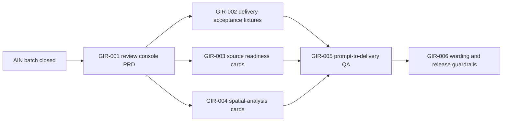

# Sprint Handoff: Generated App Review Console

## Sprint Goal

Turn the completed generated-app delivery contract into an inspectable review
handoff for natural-language map app generation. The sprint should make
readiness, blockers, confirmation boundaries, source states, spatial-analysis
states, and extension-only scene browsing visible from structured evidence.

This sprint starts after the AIN batch closed. It does not reopen AIN-001
through AIN-005, and it does not add runtime support for currently blocked
capabilities.

## Task DAG

| id | title | priority | complexity | owner | status | depends on | acceptance | finish gates |
| --- | --- | --- | --- | --- | --- | --- | --- | --- |
| TASK-2026W22-GIR-001 | Freeze generated-app review console PRD | P0 | S | `@product-strategist`, `@docs-agent` | done | AIN-005 | Feature spec maps review sections to `generationEvidence.delivery`, diagnostics, command trace, source readiness, spatial readiness, and scene browsing blockers | docs review; `pnpm check`; `git diff --check` |
| TASK-2026W22-GIR-002 | Add delivery-review acceptance fixtures | P0 | M | `@ai-agent`, `@qa-agent` | done | GIR-001 | Ready, blocked, needs-confirmation, and follow-up-required scenarios are schema-testable without new MCP tool names | `pnpm vitest run tests/ai/generation-evidence.test.ts`; `pnpm check`; `pnpm test:schema-sync` |
| TASK-2026W22-GIR-003 | Map source readiness into review sections | P1 | M | `@engine-agent`, `@docs-agent` | done | GIR-001 | PMTiles, GeoParquet, FlatGeobuf, GeoTIFF, and GeoZarr review states use existing readiness/promotion gates and do not claim new runtime loaders | docs audit; `pnpm check`; `git diff --check` |
| TASK-2026W22-GIR-004 | Map spatial-analysis readiness into review sections | P1 | M | `@engine-agent`, `@ai-agent`, `@qa-agent` | todo | GIR-001 | Point/bbox remain read-only evidence; buffer, intersection, overlay, routing, and aggregation stay blocked with stable diagnostics | `pnpm test:commands`; `pnpm test:ai`; `pnpm build:schema` when schemas change; `pnpm check` |
| TASK-2026W22-GIR-005 | Add prompt-to-delivery QA scenarios | P1 | M | `@qa-agent` | todo | GIR-002, GIR-003, GIR-004 | End-to-end fixtures cover successful 2D app, external resource confirmation, spatial blocked, and scene3d extension-only delivery | `pnpm test:ai`; `pnpm test:examples`; `pnpm check`; visual gate only for rendering changes |
| TASK-2026W22-GIR-006 | Audit public wording and release guardrails | P2 | S | `@docs-agent`, `@quality-guardian` | todo | GIR-002, GIR-005 | README, AI docs, changelog, and release wording do not claim stable scene3d, side-effect export writes, unsupported sources, or advanced spatial analysis | docs audit; `pnpm check`; `pnpm test:release:scene3d` only if scene wording/evidence changes |

## Guardrails

- Public tool names stay frozen: `validate_spec`, `apply_commands`,
  `export_spec`, `get_context_summary`, `snapshot_spec`, `explain_spec`, and
  `export_example_app`.
- `export_example_app` remains a manifest/evidence handoff and must not write
  files.
- Runtime mutation remains command-only through `MapCommand` and
  `applyCommands`.
- Stable `view.mode: "scene3d"` and `snapshot.renderer: "scene3d"` remain
  blocked.
- Cloud-native source work stays readiness or promotion-gated until schema,
  diagnostics, resource-policy paths, fixtures, and tests are accepted.
- Spatial-analysis work stays read-only for point/bbox readiness and blocked
  for geoprocessing operations until future promotion tasks land.
- Rendering, visual fixture, URL, tile, worker, or resource-policy changes
  trigger the appropriate snapshot/resource gates.

## Execution Update

`TASK-2026W22-GIR-002` landed with a new delivery-review acceptance fixture
test in `tests/ai/generation-evidence.test.ts`. The test covers ready,
blocked, needs-confirmation, and follow-up-required outcomes from structured
evidence only.

`TASK-2026W22-GIR-003` landed as a docs-only source-readiness review-card
mapping in `generated-app-review-console.md` and
`cloud-native-source-readiness.md`. The next queued implementation task is
`GIR-004`.
