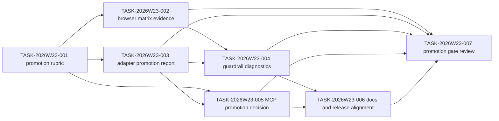

# Sprint Plan: SceneView3D Promotion Readiness

## Objective

Turn the completed W22 SceneView3D renderer evidence into a promotion-ready
package that can decide whether stable runtime work may start. This sprint does
not enable stable `view.mode: "scene3d"` and does not move renderer
dependencies into core packages.

## Owner Model

| Owner | Responsibility | Write Scope |
| --- | --- | --- |
| `product-strategist` | Promotion criteria, risk envelope, and release positioning | roadmap, debt report, feature-spec recommendations |
| `adapter-agent` | Adapter-side evidence summaries and promotion report packaging | `packages/scene3d-three-adapter/*`, adapter tests, adapter README |
| `qa-agent` | Browser matrix evidence and promotion-ready visual capture reports | snapshot tests, visual fixtures, evidence reports |
| `engine-agent` | Guardrail diagnostics and stable-runtime promotion contract boundaries | `packages/engine/src/*`, schema/resource tests |
| `ai-agent` | MCP exposure decision for promotion evidence summaries | `packages/ai/src/*`, AI/MCP tests |
| `docs-agent` | Public status alignment and release notes | README, CHANGELOG, docs |
| `quality-guardian` | Final promotion gate review and go/no-go decision | gate report only |

## Tasks

| id | title | priority | complexity | owner | status | deps | hours |
| --- | --- | --- | --- | --- | --- | --- | ---: |
| TASK-2026W23-001 | Publish SceneView3D promotion readiness rubric | P0 | S | `@product-strategist` | done | W22-005, W22-003 | 8 |
| TASK-2026W23-002 | Expand browser runner with promotion matrix evidence | P1 | M | `@qa-agent` | done | W22-002, W22-005 | 20 |
| TASK-2026W23-003 | Add adapter-side promotion evidence summary report | P1 | M | `@adapter-agent` | done | W22-001, W22-003 | 16 |
| TASK-2026W23-004 | Define stable-runtime guardrail diagnostics and blocker codes | P1 | M | `@engine-agent` | done | W22-003, W22-005 | 16 |
| TASK-2026W23-005 | Decide whether promotion evidence summaries enter MCP context | P2 | S | `@ai-agent` | done | W23-001, W23-003 | 8 |
| TASK-2026W23-006 | Update roadmap, debt report, and release checklist with the promotion decision | P2 | S | `@docs-agent` | done | W23-001, W23-005 | 8 |
| TASK-2026W23-007 | Run promotion gate review and issue go/no-go decision | P1 | S | `@quality-guardian` | done | W23-002, W23-003, W23-004, W23-005 | 8 |

## Dependency Path

## Acceptance Criteria

- The promotion rubric names the required evidence, owners, and explicit
  blockers before any stable runtime discussion.
- Browser matrix evidence covers the release-capable runner and records the
  frame, console, and renderer diagnostics needed for a promotion decision.
- The adapter summary report consolidates load-plan, resource-report, runtime,
  snapshot, query, and release evidence without enabling stable runtime.
- Stable-runtime guardrails define explicit blocker diagnostics and keep the
  spike boundary intact.
- The MCP decision records whether promotion evidence summaries stay out of the
  public context or are exposed behind a new contract.
- Docs and release notes reflect the promotion decision and residual risk, with promotion evidence summaries kept out of public MCP context for W23.
- The final gate produces an explicit go/no-go decision and does not promote
  stable `view.mode: "scene3d"` unless all blockers are closed.

## Finish Gates

- `pnpm -s test:release:scene3d`
- `pnpm -s test:snapshot:visual`
- `pnpm -s check`
- `pnpm -s test:adapter -- tests/adapter/scene3d-three-adapter.test.ts`
- `pnpm -s build:schema` if a promotion contract or diagnostic schema changes

## Non-Goals

- Do not enable stable `view.mode: "scene3d"`.
- Do not add renderer dependencies to `@gis-engine/engine`.
- Do not bypass resource policy, snapshot, or release visual gates.
- Do not present promotion evidence summaries as a stable runtime claim.
