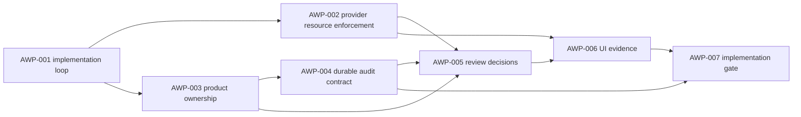

# Sprint Handoff: AI Map Workbench Product Implementation

## Sprint Goal

Convert the AMW-010 No-go blockers into implementation-ready tasks while
keeping the workbench local and provider-gated. The sprint starts with provider
resource enforcement because it is useful inside the example boundary and is a
prerequisite for any later hosted or product claim.

## Owner Split

| Owner | Scope | May Write | Handoff Artifact |
| --- | --- | --- | --- |
| `@coordinator` | Serialized planning state and promotion boundaries | planning ledgers, decision notes | planning closure and gate decision |
| `@product-strategist` | Product app ownership, project model, review workflow priority | feature specs, roadmap sections | product contract update |
| `@ai-agent` | Provider adapter behavior, provider diagnostics, AI-facing leak hardening | `examples/ai-map-workbench/*`, `packages/ai/src/*` when relevant, AI tests | provider enforcement report |
| `@engine-agent` | Public schema, command, audit, and diagnostic contracts | `packages/engine/src/*`, schema/tests if public contracts change | contract delta report |
| `@qa-agent` | Provider regression tests, browser smoke, visual workflow evidence | tests, smoke/visual reports | QA evidence report |
| `@docs-agent` | README, product boundary wording, release note alignment | docs and example README | docs audit report |
| `@quality-guardian` | Product implementation Go/No-go gate | gate report | blocking or advisory gate decision |

## Task DAG

| id | title | priority | complexity | owner | status | depends on | acceptance | finish gates |
| --- | --- | --- | --- | --- | --- | --- | --- | --- |
| TASK-2026W23-AWP-001 | Freeze AI Map Workbench product implementation loop | P0 | S | `@coordinator`, `@product-strategist`, `@task-distributor` | done | AMW-010 | `docs/archive/2026-06-10/feature-specs/ai-map-workbench-product-implementation.md`, this sprint DAG, and `docs/archive/2026-06-10/reviews/awp-001-product-implementation-planning-2026-06-02.md` define implementation order without product promotion. | planning review; `pnpm test:docs`; `pnpm check`; `git diff --check` |
| TASK-2026W23-AWP-002 | Implement provider resource enforcement | P0 | M | `@ai-agent`, `@engine-agent`, `@qa-agent` | done | AWP-001, AMW-007 | `docs/archive/2026-06-10/reviews/awp-002-provider-resource-enforcement-2026-06-02.md` records server-side base URL policy, timeout/abort, response byte cap, stable diagnostics, and browser-safe provider metadata enforcement without moving the workbench out of `examples/`. | provider/workbench tests; leak regression tests; `pnpm test:examples`; `pnpm check`; `git diff --check` |
| TASK-2026W23-AWP-003 | Define product app ownership and project model | P0 | S | `@coordinator`, `@product-strategist`, `@docs-agent` | done | AWP-001 | `docs/archive/2026-06-10/reviews/awp-003-product-ownership-project-model-2026-06-02.md` documents product owner, route/module boundary, project identity model, and non-go boundaries before any file movement or hosted app claim. | planning review; `pnpm test:docs`; `git diff --check` |
| TASK-2026W23-AWP-004 | Add authorized durable audit contract | P1 | L | `@engine-agent`, `@ai-agent`, `@docs-agent` | done | AWP-003, AMW-008 | `docs/archive/2026-06-10/reviews/awp-004-authorized-durable-audit-contract-2026-06-02.md` records access-controlled, retention-bound, payload-capped, deletion-aware durable audit/export contract helpers without adding storage or endpoints. | schema/design review; focused audit tests; `pnpm check`; `git diff --check` |
| TASK-2026W23-AWP-005 | Implement command-safe review decisions | P1 | L | `@engine-agent`, `@ai-agent`, `@qa-agent` | done | AWP-002, AWP-003, AWP-004, AMW-009 | `docs/archive/2026-06-10/reviews/awp-005-command-safe-review-decisions-2026-06-02.md` records accept, block, and follow-up-required decisions as append-only evidence linked to existing audit/provider/command diagnostics without mutating `MapSpec` directly. | schema/contract tests; workbench UI tests; `pnpm check`; `git diff --check` |
| TASK-2026W23-AWP-006 | Add repeatable workbench UI evidence | P1 | M | `@qa-agent`, `@docs-agent` | done | AWP-002, AWP-005 | `docs/archive/2026-06-10/reviews/awp-006-repeatable-workbench-ui-evidence-2026-06-02.md` records deterministic smoke evidence for provider selector, evidence rails, diagnostics, audit, and review-action states. | browser smoke or visual evidence; `pnpm test:examples`; `pnpm check`; `git diff --check` |
| TASK-2026W23-AWP-007 | Run product implementation Go-No-go gate | P1 | S | `@quality-guardian`, `@coordinator` | done / no-go | AWP-002, AWP-003, AWP-004, AWP-005, AWP-006 | `docs/archive/2026-06-10/reviews/awp-007-product-implementation-go-no-go-2026-06-02.md` closes the implementation batch as local hardening Go and product/hosted promotion No-go. | `pnpm test:docs`; `pnpm check`; browser smoke or visual evidence; release visual waiver or evidence; `git diff --check` |

## Current Handoff

`TASK-2026W23-AWP-007` is complete as the product implementation Go-No-go gate.
This AWP batch is closed: the local example hardening is Go, while product app
movement and hosted promotion remain No-go. Any future product movement needs a
new explicit promotion task or planning loop.

## Finish Gate Rules

- Provider enforcement must keep credentials, base URLs, raw prompts, raw
  bodies, provider error bodies, and credential variable names out of
  browser-visible state and audit output.
- Runtime map mutation must still go through `MapCommand` and `applyCommands`.
- Public schema or review-action contract changes require `pnpm build:schema`
  and schema-sync coverage.
- MCP tool names remain frozen.
- Product movement remains No-go until a later quality-guardian/coordinator
  gate accepts the full implementation evidence.
