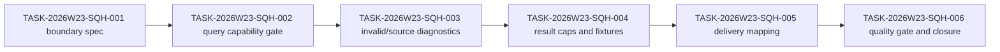

# Sprint Handoff: Spatial Query Evidence Hardening

## Goal

Harden point/bbox spatial query evidence after the Generated App Review Console
batch. The sprint keeps spatial analysis in the evidence lane: no new MCP tool,
no geoprocessing execution, no hidden IO, and no stable SceneView3D promotion.

## Task DAG

| id | title | priority | complexity | owner | status | depends on | acceptance | finish gates |
| --- | --- | --- | --- | --- | --- | --- | --- | --- |
| TASK-2026W23-SQH-001 | Freeze spatial query hardening boundary | P0 | S | `@product-strategist`, `@task-distributor` | done | GIR batch closed | Boundary states point/bbox only, no MCP alias, no geoprocessing, no new source loader, and no stable SceneView3D promotion. | planning review; `pnpm test:docs`; `pnpm check`; `git diff --check` |
| TASK-2026W23-SQH-002 | Add explicit query capability gate | P0 | M | `@engine-agent`, `@ai-agent` | done | SQH-001 | Generation/query evidence names adapter query capability or an explicit waiver before ready state. | `pnpm build:schema`; `pnpm test:schema-sync`; `pnpm test:commands`; `pnpm test:ai`; `pnpm check`; `git diff --check` |
| TASK-2026W23-SQH-003 | Harden invalid point/bbox/source diagnostics | P1 | M | `@engine-agent`, `@qa-agent` | done | SQH-002 | Non-finite point, reversed bbox, missing layer/source, hidden layer, URL GeoJSON, PMTiles/vector unsupported source, and empty result cases have stable codes and paths. | `pnpm test:commands`; `pnpm test:ai`; `pnpm test:adapter`; `pnpm check`; `git diff --check` |
| TASK-2026W23-SQH-004 | Add result caps and deterministic fixture evidence | P1 | M | `@qa-agent` | done | SQH-003 | Query evidence records result cap, feature count, layer/source ids, fixture hash, and diagnostic counts without unbounded payloads. | `pnpm build:schema`; `pnpm test:schema-sync`; `pnpm test:ai`; `pnpm test:commands`; `pnpm check`; `git diff --check` |
| TASK-2026W23-SQH-005 | Map hardened query evidence into generated-app delivery | P1 | M | `@ai-agent`, `@docs-agent` | done | SQH-004 | `generationEvidence.delivery` shows query ready/follow-up/blocked states without parsing prose or adding MCP aliases. | `pnpm build:schema`; `pnpm test:schema-sync`; `pnpm test:ai`; `pnpm test:docs`; `pnpm check`; `git diff --check` |
| TASK-2026W23-SQH-006 | Run quality gate and serialized planning closure | P1 | S | `@quality-guardian`, `@coordinator` | done | SQH-005 | Gate report confirms schema-first, command-only mutation, structured diagnostics, adapter boundary, resource policy, and frozen MCP tool names remain intact. | `pnpm build:schema`; `pnpm test:schema-sync`; `pnpm test:ai`; `pnpm test:docs`; `pnpm check`; visual gate waived as non-rendering |

## Owner Boundaries

- `engine-agent`: public schemas, command diagnostics, and query runtime
  contracts when behavior changes.
- `ai-agent`: generation evidence bundle and MCP-facing output schemas.
- `qa-agent`: deterministic query fixtures, invalid cases, result caps, and
  regression evidence.
- `docs-agent`: user-facing delivery/status wording.
- `quality-guardian`: final gate and visual waiver decision when the slice is
  non-rendering.

## Next Execution Task

The Spatial Query Evidence Hardening sprint is closed by
`docs/reviews/sqh-006-quality-gate-closure-2026-05-31.md`. The orchestrator
should return to planning state and refresh competitive, product, and task
inputs before opening the next implementation slice.
