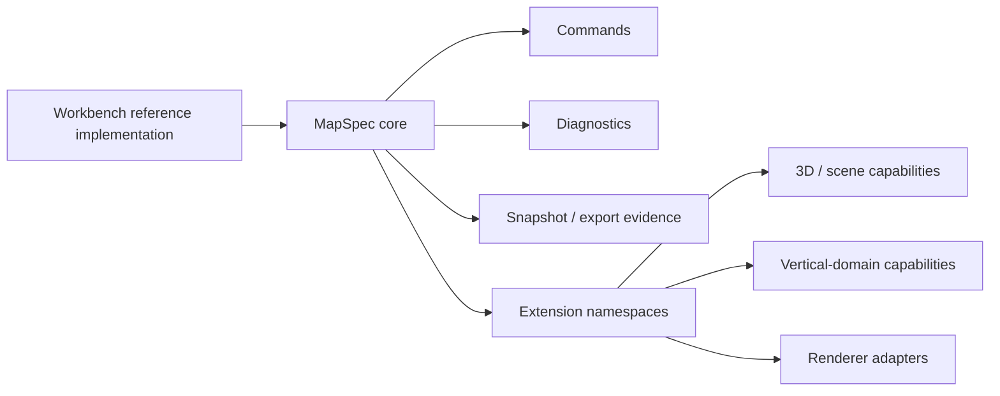

# Design Limits and Generalization Boundaries

## Purpose

This note records the current boundary judgment for GIS Engine design.
It is not a product spec. It is a guardrail against accidentally freezing the
core around one demo, one domain, or one workflow.

## Bottom Line

The current direction is sound only if the core stays small and generic:

- `MapSpec` should be a **core + extensions** base model, not a map model frozen
  around the current 2D path.
- `examples/ai-map-workbench` is a **reference implementation**, not the product shape.
- `validate -> apply -> snapshot -> export` is a **composable minimum closed loop**,
  not the one required workflow for every consumer.
- 3D, scene, and vertical-domain capability should live behind **extension namespaces**
  and **adapter boundaries**.

## What Is Safe To Generalize

These parts already look like reusable infrastructure:

- schema-first public contracts
- command-only mutation
- structured diagnostics
- MCP tool exposure with input/output schemas
- snapshot and export evidence
- audit-friendly command replay

These are generic control-plane primitives. They can support WebGIS today and
other scene or domain editors later.

## What Would Narrow The Design Too Much

Avoid these moves:

- treating 2D layers and sources as the only valid `MapSpec` shape
- using workbench-specific fields or demo copy as core protocol requirements
- encoding `validate -> apply -> snapshot -> export` as the only legal order
- promoting scene/3D/vertical features into the core instead of an extension lane
- letting example UX decide the public abstraction boundary

These choices make the first release easier to explain, but they reduce the
chance that the core can grow into other map or scene authoring domains.

## Recommended Principle

Keep the core to the smallest set of primitives that every authoring system
needs:

- spec identity and versioning
- command application and replay
- validation and diagnostics
- exportable artifacts
- evidence capture

Everything domain-specific should move into:

- extension namespaces for optional capabilities
- adapter contracts for renderer-specific behavior
- example/reference apps for workflow proof

## Design Boundary

Think of the system like this:

The core should define the stable language. Extensions should carry
capabilities that are useful but not universal.

## Implications For Phase 1

Phase 1 should continue to prove the smallest useful authoring loop for 2D
WebGIS, but it should not freeze the core around the current 2D path.

That means:

- keep the 2D path stable first
- keep 3D as extension-only evidence until promoted separately
- keep the workbench as the clearest runnable reference, not as a product claim
- keep the evidence chain composable so other workflows can reuse it later

## Non-Goals

- Do not turn this note into a new product roadmap.
- Do not freeze the current demo workflow as a permanent protocol.
- Do not move 3D or vertical features into the core just because they are useful.
- Do not interpret the reference implementation as the full system boundary.
