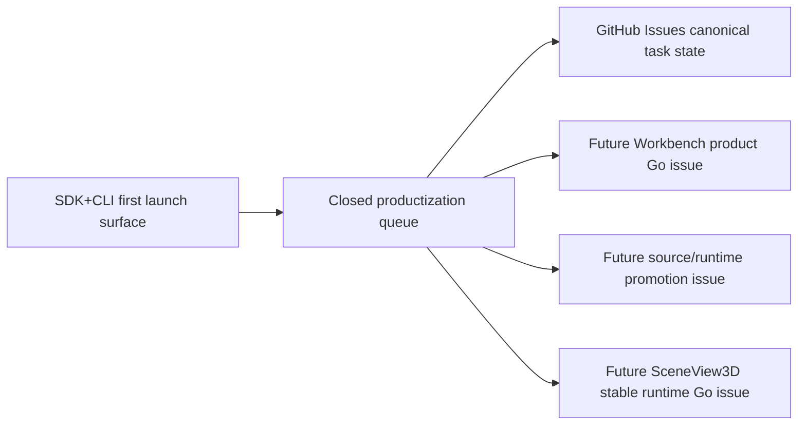

# Dependency Graph

This file now keeps only the current dependency stance. The full historical
graph was archived to
[archive/2026-06-10/planning/dependency-graph.md](../archive/2026-06-10/planning/dependency-graph.md).

## Current Boundaries

| Boundary | Current Decision | Evidence |
| --- | --- | --- |
| SDK+CLI first | Stands | [active queue](./active-execution-queue-2026-06-09.md) |
| AI Map Workbench | Product/hosted movement remains No-go until a future Go issue passes owner/auth/storage/export/resource/MCP/visual gates | [promotion scope](./feature-specs/ai-map-workbench-promotion-scope.md) |
| PMTiles/source runtime | Fixture/display/load-plan evidence is accepted; archive parsing, hidden IO, workers, and runtime cloud-native queries remain separate | [active queue](./active-execution-queue-2026-06-09.md) |
| SceneView3D | Stable `view.mode: "scene3d"` remains blocked | [stable renderer contract](./feature-specs/sceneview3d-stable-renderer-contract.md) |

## Maintenance

Keep this path because agent framework scripts read it. If GitHub Issues gain a
machine dependency graph, regenerate this file as a pointer instead of growing a
new manual ledger.
