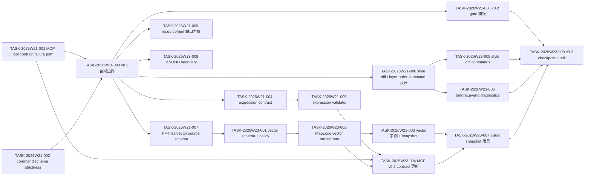

# Dependency Graph

## 关键路径

1. MCP / command schema P1 修复 -> v0.2 合同边界 -> expression / command / vector source spec。
2. vector source schema -> MapLibre transformer -> vector 示例与 snapshot -> MCP v0.2 contract。
3. style diff/layer order command 设计 -> command 实现 -> diagnostics -> checkpoint audit。

## 阻断规则

- `TASK-2026W21-001` 和 `TASK-2026W21-002` 未完成前，不允许新增 public AI tool 或 public command surface。
- `TASK-2026W21-003` 未完成前，不允许合入 v0.2 public schema 扩展。
- `TASK-2026W21-004` 未完成前，不允许把新 expression operator 标记为 supported。
- `TASK-2026W23-004` 未完成前，不允许宣称 MCP 支持 v0.2 新能力。
- `TASK-2026W23-007` 未完成或明确 waiver 前，不允许进入 v0.2 release candidate。
