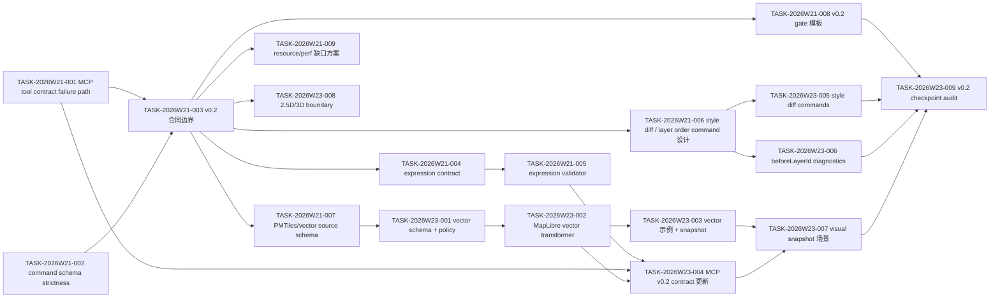

# Dependency Graph

## 当前状态

截至 `acdf28e`，图中 W21/W23 的 v0.2 checkpoint 关键链路已完成：

| Chain | Status | Evidence |
| --- | --- | --- |
| MCP / command schema P1 修复 -> v0.2 合同边界 | done | strict command schema、Diagnostic failure path、MCP output schema |
| expression contract -> validator -> MCP v0.2 coverage | done | `expression-v0.2.md`、schema tests、MCP vector/expression tests |
| vector source schema -> transformer -> example/snapshot -> MCP coverage | done | vector source schema、MapLibre transformer、`examples/vector-tile-url`、snapshot smoke/visual |
| style diff/layer order -> diagnostics -> checkpoint audit | done | command tests、missing `beforeLayerId` diagnostic、checkpoint audit |
| 2.5D/3D boundary | done as boundary | `fill-extrusion-lite` gate、`scene3d` unsupported diagnostics |

## 关键路径

1. Formal release runner evidence -> `pnpm test:release:strict` -> release evidence archive。
2. Resource/perf deterministic evidence -> create/query/snapshot/destroy tests -> CI 策略更新。
3. Command conflict/replay/audit product spec -> fixtures/examples -> coordinator monthly planning。

## 阻断规则

- public AI tool 或 public command surface 变更仍必须先通过 schema-sync、MCP contract tests 和 command replay tests。
- release candidate 必须在正式 runner 执行 strict visual snapshot，或由 coordinator 明确 waiver 并创建 follow-up。
- resource/perf 文档中声明的 PR 阻断项必须有 deterministic Node-level evidence；nightly/release 大场景不得默认为 PR blocker。
- `fill-extrusion-lite` 不得声明为 MapLibre MVP 支持，除非 adapter capability report 明确包含该 experimental 能力并补 visual evidence。
