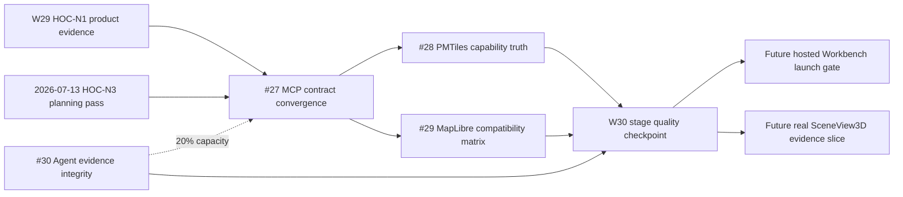

# Dependency Graph

## Execution Rules

| Dependency | Rule | Evidence |
| --- | --- | --- |
| HOC inputs -> #27 | Product evidence is current and quality permits planning; public AI contract is first | [W29 research](../research/competitor-updates-2026-W29.md), [quality input](../reviews/quality-gate-planning-input-2026-07-13.md) |
| #27 -> #28/#29 | Freeze AI-facing public tool/result behavior before capability claims use it | [next-stage plan](./next-step-plan.md) |
| #28 and #29 | May run in parallel after #27; neither supplies evidence for the other | [issues snapshot](./issues-snapshot.md) |
| #30 | Runs independently within 20% infrastructure capacity; blocks planning only if evidence becomes untrustworthy | [#30](https://github.com/HYNCM/gis-engine/issues/30) |
| stage exit -> hosted/3D | New product/renderer promotion needs fresh product and quality gates | [roadmap](./monthly-roadmap.md) |

## Boundaries

- SDK + CLI remains the primary stable adoption surface.
- PMTiles display, load, and query are separate promotion decisions.
- MapLibre v6 matrix evidence is not an upgrade approval.
- Hosted Workbench GA and stable SceneView3D remain outside this milestone.

## Maintenance

GitHub Issues and milestone 1 are canonical execution state. This file records
dependency policy only.
