# Dependency Graph

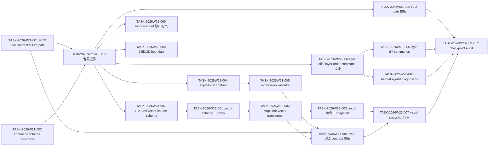

## 当前状态

截至 `60d5d52`，图中 W21/W23 的 v0.2 checkpoint 关键链路已完成；原
W21 sprint 计划已归档，当前活跃关键路径从 W23 promotion readiness 与 W25 SceneView3D v1 DAG 继续：

| Chain | Status | Evidence |
| --- | --- | --- |
| MCP / command schema P1 修复 -> v0.2 合同边界 | done | strict command schema、Diagnostic failure path、MCP output schema |
| expression contract -> validator -> MCP v0.2 coverage | done | `expression-v0.2.md`、schema tests、MCP vector/expression tests |
| vector source schema -> transformer -> example/snapshot -> MCP coverage | done | vector source schema、MapLibre transformer、`examples/vector-tile-url`、snapshot smoke/visual |
| style diff/layer order -> diagnostics -> checkpoint audit | done | command tests、missing `beforeLayerId` diagnostic、checkpoint audit |
| command conflict/replay/audit | done | `collectTrace` API、MCP trace output、conflict audit fixture、AI edit audit example |
| 2.5D/3D boundary | done as boundary | `fill-extrusion-lite` gate、`scene3d` unsupported diagnostics、`extensions.scene3d` fixture |
| fill-extrusion-lite beta adapter | done | MapLibre `fill-extrusion` mapping、capability report、example/schema fixture、snapshot smoke |
| release strict visual runner | done | `pnpm -s test:release:strict` passed in release-capable local runner with 3 visual scenes |
| large-data perf/nightly evidence | done | `pnpm -s test:perf:nightly` covers 1k/10k/100k inline GeoJSON lifecycle |
| v1 SceneView3D RFC | drafted | camera/source/layer/snapshot/query/resource policy contract |
| v1 SceneView3D sprint split | done | `sprint-2026-W25-sceneview3d-v1.md` defines schema/resource/snapshot/MCP/package DAG |
| v1 SceneView3D schema foundation | done | `SceneView3DExtensionSchema`, generated schema, public type assertions, schema-sync validation |
| v1 SceneView3D resource gate | done | scene URL policy plus `validateSceneResourceLoadPlan` for 3D Tiles JSON/model/texture/worker/timeout diagnostics |
| v1 SceneView3D scene commands | done | command schemas, deterministic JSON Patch, inverse patch, dry-run, replay, rollback, and target diagnostics |
| v1 SceneView3D mock snapshot/query | done | `snapshotScene3DMock` and `queryScene3DMock` cover pending resources, blank scenes, missing layers, hidden layers, and deterministic picks |
| v1 SceneView3D MCP context | done | `get_context_summary` and `explain_spec` output schemas include extension-only 3D source/layer/resource/snapshot/query summaries |
| v1 SceneView3D release visual gate | done | `evaluateScene3DReleaseVisualGate` defines release-mode renderer evidence, coordinator waiver, and deterministic no-bypass rules |
| v1 SceneView3D adapter feasibility | done | official CesiumJS / Three.js / 3DTilesRendererJS evidence recommends a narrow Three.js adapter spike while keeping CesiumJS as high-fidelity reference |
| v1 SceneView3D alpha audit | done | conditional alpha pass for contract/resource/command/snapshot/query/MCP/release-gate readiness; stable runtime remains blocked |
| v1 SceneView3D Three.js adapter spike | done | `@gis-engine/scene3d-three-adapter` generates deterministic load-plan/resource-policy evidence without real renderer dependencies |
| SceneView3D renderer evidence handoff | done | `createScene3DThreeAdapterRendererEvidence` converts future nonblank browser capture metrics into `Scene3DRendererVisualEvidence` and keeps missing/blank/resource-policy-failing captures blocked |
| SceneView3D adapter runtime shim | done | `createScene3DThreeAdapterRuntime` keeps load, snapshot, query, and destroy adapter-local while reusing mock SceneView3D evidence |
| SceneView3D browser visual runner | done | `runScene3DThreeAdapterBrowserRunner` renders a local fixture in Chromium, records frame metrics, and produces release-capable renderer evidence |
| SceneView3D MCP evidence summary decision | done | renderer evidence summaries stay out of MCP for now; `scene3d` context remains extension-only |
| SceneView3D beta readiness gate | done | `pnpm test:release:scene3d` now exercises the browser runner and accepts release visual evidence |
| SceneView3D promotion readiness | done | W23 rubric, browser matrix evidence, adapter promotion report, guardrail diagnostics, MCP decision, docs alignment, and go/no-go review completed; package accepted, stable runtime still blocked |
| automation hardening | done | 2026-05-24 quality gate required report `decision_level` alignment, serialized scheduled commits, local/CI daily cadence alignment, and emergency interpolation fix before scheduled agent evidence is trusted |
| AI natural-language orchestration summary | done | `capabilitySummary` in `get_context_summary` / `explain_spec` names feature-display, spatial-analysis, and scene-browsing tool/evidence boundaries without adding tool aliases |
| SceneView3D stable renderer contract | done / stable no-go | `SRC-001` through `SRC-005` have accepted prerequisite evidence; `SRC-006` has a quality-guardian/coordinator No-go decision, so stable `view.mode: "scene3d"` remains blocked |
| AI natural-language map app generation planning | done / handoff-ready | W23 product spec, spatial-analysis readiness spec, and sprint DAG define prompt -> capabilitySummary -> MapGenerationCommandSkeleton -> commands -> diagnostics -> snapshot/export evidence |
| NLA-002 generation command contract | done | `docs/reviews/nla-002-generation-command-contract-2026-05-29.md`; `MapGenerationRequestSchema`, `MapGenerationCommandSkeletonSchema`, `setCapabilities`, `setInteractions`, and command skeleton tests keep generation schema-first and command-only |
| NLA-003 MCP orchestration evidence | done | `docs/reviews/nla-003-mcp-orchestration-evidence-2026-05-29.md`; `GenerationEvidenceBundleSchema` composes the existing seven MCP tool contracts without adding `generate_map_app` or other aliases |
| NLA-004 generation scenarios | done | `docs/reviews/nla-004-generation-scenarios-2026-05-29.md`; feature-display and spatial-analysis scenarios cover style edits, query readiness, dry-run/replay/rollback, and blocked analysis diagnostics |
| NLA-005 scene browsing boundary | done | `docs/reviews/nla-005-scene-browsing-extension-boundary-2026-05-29.md`; generation evidence keeps scene browsing under `extensions.scene3d`, stable 3D runtime blocked, and renderer dependencies adapter-local |
| NLA-006 prompt evidence scenarios | done | `docs/reviews/nla-006-prompt-evidence-scenarios-2026-05-29.md`; QA matrix covers prompt-to-command/snapshot/export evidence for feature display, spatial-analysis readiness, scene browsing extension-only, and stable scene3d blocked prompts |
| NLA-007 docs and release wording | done | `docs/reviews/nla-007-docs-release-wording-2026-05-29.md`; README, AI package docs, contracts, feature matrix, changelog, and ai-map-edit example docs describe evidence-first generation without stable 3D overclaim |
| NLA-008 serialized planning handoff | done | `docs/reviews/nla-008-serialized-planning-handoff-2026-05-29.md`; sprint, burndown, and dependency graph now agree that the W23 NLA slice is complete and ready for the next planning cycle |
| Generation quality hardening | done | `docs/reviews/nlq-007-serialized-quality-hardening-planning-2026-05-29.md`; NLQ-001 through NLQ-007 are serialized as a closed W23 batch |
| AI-native next loop | done | `TASK-2026W22-AIN-001` through `TASK-2026W22-AIN-005` are done via `docs/reviews/ain-001-002-generated-app-delivery-acceptance-2026-05-30.md`, `docs/reviews/ain-003-004-promotion-criteria-2026-05-30.md`, and `docs/reviews/ain-005-scene-browsing-delivery-copy-2026-05-30.md`; next loop should refresh competitive/product/task planning |
| NLQ-001 typed prompt planner boundary | done | `docs/reviews/nlq-001-prompt-planner-boundary-2026-05-29.md`; `planMapGenerationRequest()` accepts prompt hash plus structured intent, emits `MapGenerationRequest`-compatible handoff data, and rejects raw prompt retention by default |
| NLQ-002 planner provenance evidence | done | `docs/reviews/nlq-002-planner-provenance-evidence-2026-05-29.md`; `GenerationEvidenceBundleSchema` now exposes planner confidence, trace provenance, source prompt hashes, unsupported intent fields, and planner diagnostics |
| NLQ-003 spatial query evidence | done | `docs/reviews/nlq-003-spatial-query-evidence-2026-05-29.md`; `analysisEvidence` and `spatialQueryEvidence` expose deterministic point/bbox query readiness while keeping geoprocessing operations blocked |
| NLQ-004 export manifest evidence | done | `docs/reviews/nlq-004-export-manifest-evidence-2026-05-29.md`; `export_example_app` can carry compact generation evidence summaries without side-effect file writes |
| NLQ-005 cloud-native source readiness | done | `docs/planning/feature-specs/cloud-native-source-readiness.md`; support states and blocked diagnostics are documented before PMTiles, GeoParquet, FlatGeobuf, GeoTIFF, or GeoZarr implementation claims |
| NLQ-006 scene browsing blocker visibility | done | `docs/reviews/nlq-006-scene-browsing-blocker-visibility-2026-05-29.md`; generated-app manifests expose extension-only scene browsing metadata and stable-runtime blocker codes without enabling `snapshot.renderer: "scene3d"` |
| NLQ-007 serialized quality-hardening planning | done | `docs/reviews/nlq-007-serialized-quality-hardening-planning-2026-05-29.md`; sprint, burndown, dependency graph, roadmap, digest, and debt ledger now agree that the W23 generation quality hardening batch is closed |

## 2026-W24 Next-Stage DAG

The W24 queue starts from
[next-stage-goals-2026-06-05.md](./next-stage-goals-2026-06-05.md). It does
not reopen completed `GIR-*` or `AWP-*` tasks. The new critical path turns
accepted delivery evidence into a productized review surface, then promotes
cloud-native source contracts one gate at a time.

2026-06-05 reconciliation at `4012f51`: implementation artifacts now exist for
`RCU-*`, `CNS-*`, `VPE-001`, and `VPE-003`. These tasks move from `queued` to
`implemented / pending quality acceptance`. `VPE-002` has a perf trend harness
but remains backlog for repeated trend accumulation.

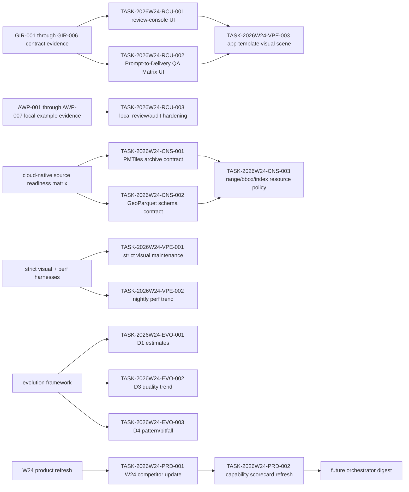

| Task | Depends On | Evidence Target | Required Finish Gate | Status Rule |
| --- | --- | --- | --- | --- |
| TASK-2026W24-RCU-001 | GIR-006 | `examples/ai-map-workbench/review-console.mjs`; review-console tests | focused UI tests; browser smoke; `pnpm check`; docs link audit | implemented / pending quality acceptance |
| TASK-2026W24-RCU-002 | GIR-002, GIR-005 | `tests/examples/qa-matrix.test.ts`; review-console fixtures | example/app tests; browser smoke; `pnpm check` | implemented / pending quality acceptance |
| TASK-2026W24-RCU-003 | AWP-007 | `examples/ai-map-workbench/server.mjs`; workbench-hardening tests | focused workbench tests; leak regression; browser smoke; `pnpm check` | implemented / pending quality acceptance |
| TASK-2026W24-CNS-001 | cloud-native source promotion candidates | PMTiles archive metadata/range contract | `pnpm build:schema`; resource-policy tests; smoke tests; docs update | implemented / pending quality acceptance |
| TASK-2026W24-CNS-002 | cloud-native source promotion candidates | GeoParquet schema and blocked-runtime diagnostics | `pnpm build:schema`; schema/resource tests; docs update | implemented / pending quality acceptance |
| TASK-2026W24-CNS-003 | CNS-001, CNS-002 | PMTiles range, GeoParquet bbox/range, FlatGeobuf index policy | `pnpm test:resources`; resource-policy schema tests; `pnpm check` | implemented / pending quality acceptance |
| TASK-2026W24-VPE-001 | release strict visual runner | `tests/snapshot/strict-visual-maintenance.test.ts` | `pnpm test:release:strict`; visual snapshot gate or waiver | implemented / pending quality acceptance |
| TASK-2026W24-VPE-002 | perf nightly harness | `tests/perf/perf-trend-ledger.test.ts`; two-week trend evidence pending | repeated nightly trend artifacts; quality review | harness implemented / trend backlog |
| TASK-2026W24-VPE-003 | RCU-001, RCU-002 | `tests/snapshot/app-template-visual.test.ts` | visual smoke/snapshot; docs update; `pnpm check` | implemented / pending quality acceptance |
| TASK-2026W24-EVO-001 | evolution framework | D1 estimate/actual entries in `evolution-ledger.md` | evolution collector or ledger update | ledger populated / pending evidence audit |
| TASK-2026W24-EVO-002 | quality gate reports | D3 first-pass/rework entries in `evolution-ledger.md` | quality evidence; evolution ledger update | ledger populated / pending evidence audit |
| TASK-2026W24-EVO-003 | sprint closure evidence | D4 pattern/pitfall entries in `evolution-ledger.md` | pattern/pitfall generator or manual ledger review | ledger populated / pending evidence audit |
| TASK-2026W24-PRD-001 | W24 product refresh | `docs/research/competitor-updates-2026-W24.md` | current source URLs and checked dates recorded | done / consumed |
| TASK-2026W24-PRD-002 | PRD-001 | `docs/research/capability-scorecard.md`; W24 refresh file | scorecard diff review; planning digest update | done / consumed |

## 关键路径

1. W24 review-console productization -> six-section delivery UI -> prompt-to-delivery QA cards -> app-template visual evidence. This is now implemented and pending quality acceptance; it consumes completed GIR evidence without reopening the closed contract batch.
2. Natural-language app generation -> AI capability summary -> `MapGenerationCommandSkeleton` -> command-only edits -> snapshot/export evidence. This is the completed W23 product spine for feature display, spatial analysis readiness, and scene browsing boundaries.
3. Generation quality hardening -> typed prompt planner boundary -> planner provenance evidence -> spatial query evidence -> export manifest -> cloud-native readiness -> SceneView3D blocker transparency -> serialized closure -> generated-app delivery UX -> acceptance and confirmation states -> source promotion split -> spatial-analysis promotion criteria -> scene browsing extension-only delivery copy. NLQ-001 through NLQ-007 and AIN-001 through AIN-005 are done; future work should start from a fresh competitive/product/task-planning loop.
4. v1 SceneView3D RFC -> W25/W28 sprint DAG -> TypeBox schema -> fixtures + URL resource policy + loader resource gate + package boundary + scene commands -> mock snapshot/query contracts -> MCP context -> release visual gate -> alpha audit + adapter feasibility -> Three.js adapter spike -> renderer evidence handoff -> adapter runtime shim -> browser visual runner -> beta readiness gate -> promotion readiness -> stable renderer contract handoff -> stable runtime decision; W23 promotion-readiness package is Go, SRC-001 through SRC-005 prerequisite evidence is done, and SRC-006 records a No-go decision that keeps stable runtime blocked.
5. 2026-05-24 automation hardening blocks scheduled agent evidence from being used as advisory/blocking input: generated report semantics -> serialized scheduled commits -> local/CI daily cadence + emergency interpolation -> automation hardening gate -> scheduled evidence may feed future coordinator/quality-guardian decisions.

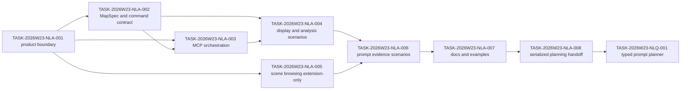

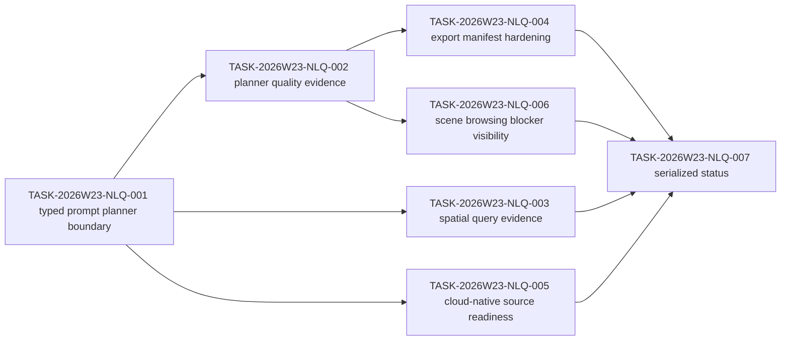

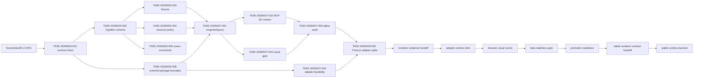

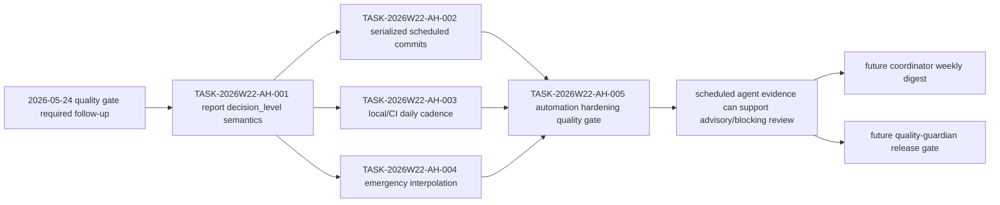

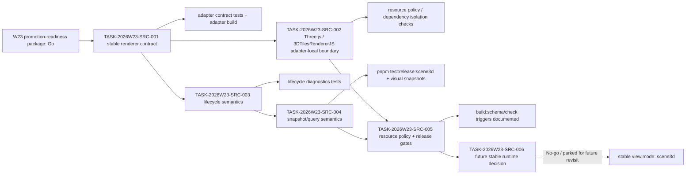

## SceneView3D SRC Gate Matrix

| Task | Depends On | Evidence Target | Required Finish Gate | Status Rule |
| --- | --- | --- | --- | --- |
| TASK-2026W23-SRC-001 | W23 promotion-readiness package Go | adapter contract delta report and focused adapter contract tests | `pnpm test:adapter -- tests/adapter/scene3d-three-adapter.test.ts`; `pnpm --filter @gis-engine/scene3d-three-adapter build` | done as contract evidence only |
| TASK-2026W23-SRC-002 | SRC-001 | dependency-boundary audit for Three.js and 3DTilesRendererJS | adapter build; dependency isolation check or audit; `pnpm check` when package metadata/imports change | done as dependency-boundary prerequisite evidence |
| TASK-2026W23-SRC-003 | SRC-001 | lifecycle matrix with structured diagnostics | adapter lifecycle contract tests; `pnpm check` when runtime behavior or diagnostics change | done as lifecycle/failure semantics evidence |
| TASK-2026W23-SRC-004 | SRC-001, SRC-003 | snapshot/query evidence report with browser metrics and pick cases | `pnpm test:release:scene3d`; `pnpm test:snapshot:visual`; strict visual snapshot before beta/stable renderer claim | done as deterministic snapshot/query semantics; visual evidence acceptance still requires release-capable browser rerun |
| TASK-2026W23-SRC-005 | SRC-002, SRC-004 | resource-policy test output, release-gate matrix, docs alignment note | `pnpm test:resources`; resource-policy schema tests when policy schemas change; `pnpm test:release:scene3d`; visual snapshot or coordinator waiver for non-rendering changes | done as resource-policy/release-gate prerequisite evidence |
| TASK-2026W23-SRC-006 | SRC-001 through SRC-005 | quality-guardian gate report and coordinator decision note | `pnpm build:schema`; `pnpm check`; `pnpm test:release:scene3d`; visual snapshot evidence; strict visual snapshot before future beta/stable claims | done as No-go stable runtime decision |

## Generated App Review Console DAG

2026-05-30 planning update: the AIN batch is closed and the Generated App
Review Console sprint is complete. `GIR-001` through `GIR-006` are done; the
orchestrator should return to planning state for the next competitor/product
task loop.

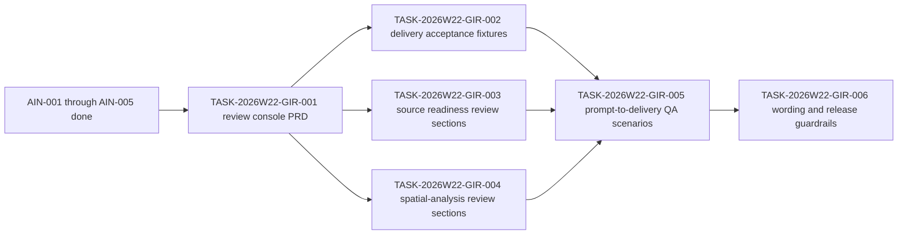

| Task | Depends On | Evidence Target | Required Finish Gate | Status Rule |
| --- | --- | --- | --- | --- |
| TASK-2026W22-GIR-001 | AIN-005 | product feature spec and sprint DAG | docs review; `pnpm check`; `git diff --check` | done as PRD/planning evidence |
| TASK-2026W22-GIR-002 | GIR-001 | delivery review acceptance fixtures | `pnpm vitest run tests/ai/generation-evidence.test.ts`; `pnpm check`; `pnpm test:schema-sync` | done |
| TASK-2026W22-GIR-003 | GIR-001 | source readiness review mapping | docs audit; `pnpm check`; `git diff --check` | done |
| TASK-2026W22-GIR-004 | GIR-001 | spatial-analysis review mapping | `pnpm test:commands`; `pnpm test:ai`; `pnpm build:schema` when schemas change; `pnpm check` | done |
| TASK-2026W22-GIR-005 | GIR-002, GIR-003, GIR-004 | prompt-to-delivery QA matrix | `pnpm test:ai`; `pnpm test:examples`; `pnpm check`; visual gate only for rendering changes | done |
| TASK-2026W22-GIR-006 | GIR-002, GIR-005 | docs and release wording audit | docs audit; `pnpm test:docs`; `pnpm check`; `pnpm test:release:scene3d` only if scene evidence changes | done |

## Spatial Query Evidence Hardening DAG

2026-05-30 planning update: after the Generated App Review Console batch
closed, the orchestrator opened the Spatial Query Evidence Hardening sprint.
`SQH-001` is complete as a boundary/spec task; `SQH-002` is complete as the
explicit capability gate; `SQH-003` is complete as the invalid/source
diagnostic matrix; `SQH-004` is complete as result-cap fixture evidence;
`SQH-005` is complete as generated-app delivery mapping; `SQH-006` is complete
as the quality gate and serialized closure. The next edge returns to planning
state before any new implementation task is opened.

2026-05-31 planning update: the next edge is MapLibre Source Drift Audit.
`MLD-001` is complete as boundary/spec/DAG planning.

2026-06-01 closure update: `MLD-002` is accepted as adapter/source drift
evidence, `MLD-003` closes resource/delivery evidence, and `MLD-004` records a
package-movement no-go. The next edge returns to planning state before any
future dependency movement task is opened.

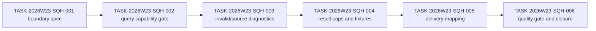

| Task | Depends On | Evidence Target | Required Finish Gate | Status Rule |
| --- | --- | --- | --- | --- |
| TASK-2026W23-SQH-001 | GIR-006 | boundary spec and sprint DAG | planning review; `pnpm test:docs`; `pnpm check`; `git diff --check` | done |
| TASK-2026W23-SQH-002 | SQH-001 | query capability gate | `pnpm build:schema`; `pnpm test:schema-sync`; `pnpm test:commands`; `pnpm test:ai`; `pnpm check`; `git diff --check` | done |
| TASK-2026W23-SQH-003 | SQH-002 | invalid/source diagnostics | `pnpm test:commands`; `pnpm test:ai`; `pnpm test:adapter`; `pnpm check`; `git diff --check` | done |
| TASK-2026W23-SQH-004 | SQH-003 | result caps and fixtures | `pnpm build:schema`; `pnpm test:schema-sync`; `pnpm test:ai`; `pnpm test:commands`; `pnpm check`; `git diff --check` | done |
| TASK-2026W23-SQH-005 | SQH-004 | generated-app delivery mapping | `pnpm build:schema`; `pnpm test:schema-sync`; `pnpm test:ai`; `pnpm test:docs`; `pnpm check`; `git diff --check` | done |
| TASK-2026W23-SQH-006 | SQH-005 | quality gate and closure | `pnpm build:schema`; `pnpm test:schema-sync`; `pnpm test:ai`; `pnpm test:docs`; `pnpm check`; visual waiver rationale if non-rendering | done |

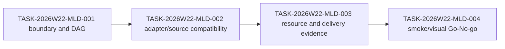

| Task | Depends On | Evidence Target | Required Finish Gate | Status Rule |
| --- | --- | --- | --- | --- |
| TASK-2026W22-MLD-001 | SQH-006 | boundary spec and sprint DAG | planning review; `pnpm test:docs`; `pnpm check`; `git diff --check` | done |
| TASK-2026W22-MLD-002 | MLD-001 | adapter/source compatibility report | `pnpm test:adapter`; `pnpm test:resources`; `pnpm test:snapshot:smoke`; `pnpm check` | done |
| TASK-2026W22-MLD-003 | MLD-002 | resource and delivery evidence | `pnpm test:resources`; `pnpm test:ai`; `pnpm test:docs`; `pnpm check` | done |
| TASK-2026W22-MLD-004 | MLD-003 | package movement Go-No-go | `pnpm build:schema`; `pnpm check`; visual gate or waiver rationale | done / no-go |

2026-06-02 planning update: after MLD closure and AMW-005 provider-profile
evidence, the next edge is AI Map Workbench Product Boundary. `AMW-006` is
complete as product boundary/spec/DAG planning, `AMW-007` is complete as
provider credential/resource administration design, and `AMW-008` is complete
as durable audit retention/export design. `AMW-009` is complete as
command-safe review action design, and `AMW-010` is complete as a
product-promotion No-go gate. This path does not move MapLibre packages or
promote the workbench out of `examples/`; future product work must start from a
fresh planning loop.

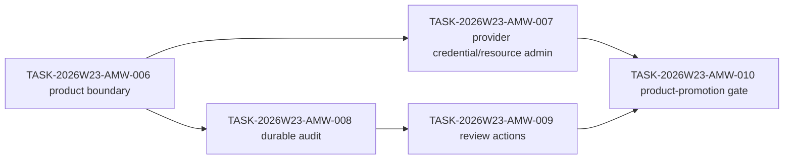

| Task | Depends On | Evidence Target | Required Finish Gate | Status Rule |
| --- | --- | --- | --- | --- |
| TASK-2026W23-AMW-006 | AMW-005, MLD-004 | product boundary spec and sprint DAG | planning review; `pnpm test:docs`; `pnpm check`; `git diff --check` | done |
| TASK-2026W23-AMW-007 | AMW-006 | provider credential/resource administration design | provider/workbench tests or design review; `pnpm test:examples`; `pnpm test:docs`; `pnpm check` | done |
| TASK-2026W23-AMW-008 | AMW-006 | durable audit retention/export design | schema/design review if public; `pnpm test:docs`; `pnpm check`; `git diff --check` | done |
| TASK-2026W23-AMW-009 | AMW-006, AMW-008 | command-safe review action contract | design review; `pnpm test:docs`; `pnpm check`; `git diff --check` | done |
| TASK-2026W23-AMW-010 | AMW-007, AMW-008, AMW-009 | product-promotion gate report | `pnpm test:docs`; `pnpm check`; browser smoke; `git diff --check` | done / no-go |

2026-06-02 planning update: after AMW-010 returned the workstream to fresh
planning state, the next edge is AI Map Workbench Product Implementation.
`AWP-001` is complete as the new product implementation boundary and sprint
DAG. `AWP-002` is complete as provider resource enforcement inside the
local/example boundary, `AWP-003` is complete as product ownership/project model
decision evidence, `AWP-004` is complete as authorized durable audit contract
evidence, `AWP-005` is complete as command-safe review decision evidence,
`AWP-006` is complete as repeatable UI evidence, and `AWP-007` is complete as
the product implementation Go-No-go gate. The AWP implementation batch is
closed with local example hardening Go and product/hosted promotion No-go.

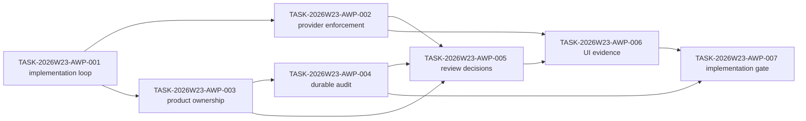

| Task | Depends On | Evidence Target | Required Finish Gate | Status Rule |
| --- | --- | --- | --- | --- |
| TASK-2026W23-AWP-001 | AMW-010 | product implementation spec and sprint DAG | planning review; `pnpm test:docs`; `pnpm check`; `git diff --check` | done |
| TASK-2026W23-AWP-002 | AWP-001, AMW-007 | provider enforcement implementation report | provider/workbench tests; leak regression tests; `pnpm test:examples`; `pnpm check`; `git diff --check` | done |
| TASK-2026W23-AWP-003 | AWP-001 | product ownership decision note | planning review; `pnpm test:docs`; `git diff --check` | done |
| TASK-2026W23-AWP-004 | AWP-003, AMW-008 | durable audit contract delta report | schema/design review; focused audit tests; `pnpm check`; `git diff --check` | done |
| TASK-2026W23-AWP-005 | AWP-002, AWP-003, AWP-004, AMW-009 | review decision implementation report | schema/contract tests; workbench UI tests; `pnpm check`; `git diff --check` | done |
| TASK-2026W23-AWP-006 | AWP-002, AWP-005 | browser smoke or visual evidence report | browser smoke or visual evidence; `pnpm test:examples`; `pnpm check`; `git diff --check` | done |
| TASK-2026W23-AWP-007 | AWP-002 through AWP-006 | product implementation gate report | `pnpm test:docs`; `pnpm check`; browser smoke or visual evidence; release visual waiver or evidence; `git diff --check` | done / no-go |

2026-06-03 planning update: after Studio returned to fresh planning state, the
next bounded slice is a direct capability-command closure for the public
MapLibre editing loop. `MLC-001` is tracked as a new mini-slice instead of an
extension of the earlier MLD/AWP chains, and it keeps the work inside
Studio/provider/product UX territory without reopening package drift, MCP
tooling, terrain/projection, or stable SceneView3D promotion.

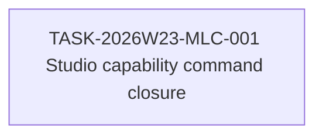

| Task | Depends On | Evidence Target | Required Finish Gate | Status Rule |
| --- | --- | --- | --- | --- |
| TASK-2026W23-MLC-001 | fresh planning state after 2026-06-03 gate review | capability-command spec and implementation review | `pnpm build:schema`; `pnpm test:commands`; `pnpm test:adapter`; `pnpm test:studio`; `pnpm test:snapshot:visual`; `pnpm check`; `git diff --check` | done |

2026-06-03 planning update: after `MLC-001` closed the command loop, the next
bounded Studio slice stayed inside local product UX and targeted saved
workspace continuity. `SLW-001` is tracked as a second Studio mini-slice
instead of reopening AWP durable audit, hosted promotion, or MapLibre package
movement.

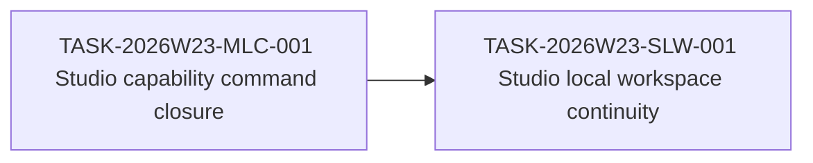

| Task | Depends On | Evidence Target | Required Finish Gate | Status Rule |
| --- | --- | --- | --- | --- |
| TASK-2026W23-SLW-001 | TASK-2026W23-MLC-001 | saved-workspace spec and implementation review | `pnpm test:studio`; `pnpm studio:build`; `pnpm test:docs`; `pnpm check`; `git diff --check` | done |

2026-06-03 planning update: after `SLW-001`, the next bounded Studio slice
stayed local and added an inspectable handoff envelope instead of a download or
file-output path. `SLH-001` reuses the saved-workspace state, keeps the product
surface side-effect-free, and leaves saved handoff evidence stable even when
the current workspace is reset before a later reload.

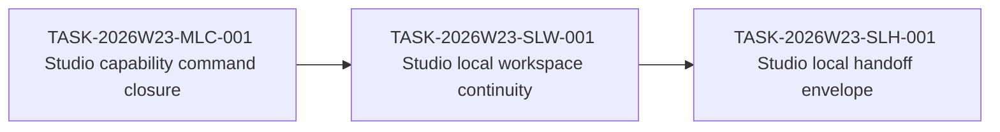

| Task | Depends On | Evidence Target | Required Finish Gate | Status Rule |
| --- | --- | --- | --- | --- |
| TASK-2026W23-SLH-001 | TASK-2026W23-SLW-001 | local handoff spec and implementation review | `pnpm test:studio`; `pnpm studio:build`; `pnpm test:docs`; `pnpm check`; `git diff --check` | done |

2026-06-03 planning update: after `SLH-001`, the next bounded Studio slice
stayed local and split compact review evidence into its own read surface.
`SLR-001` keeps handoff and ledger semantics distinct: handoff still carries
saved workspace state, while the review ledger focuses on compact audit/review
history only.

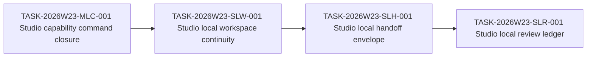

| Task | Depends On | Evidence Target | Required Finish Gate | Status Rule |
| --- | --- | --- | --- | --- |
| TASK-2026W23-SLR-001 | TASK-2026W23-SLH-001 | local review-ledger spec and implementation review | `pnpm test:studio`; `pnpm studio:build`; `pnpm test:docs`; `pnpm check`; `git diff --check` | done |

2026-06-03 planning update: after `SLR-001`, the next bounded Studio slice
stayed local and turned the saved review ledger into a paginated export
envelope. `SLX-001` keeps the export path side-effect-free and evidence-only
while moving the saved review trail closer to a durable handoff shape.

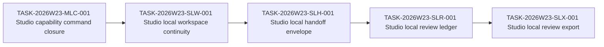

| Task | Depends On | Evidence Target | Required Finish Gate | Status Rule |
| --- | --- | --- | --- | --- |
| TASK-2026W23-SLX-001 | TASK-2026W23-SLR-001 | local review-export spec and implementation review | `pnpm test:studio`; `pnpm studio:build`; `pnpm test:docs`; `pnpm check`; `git diff --check` | done |

2026-06-03 planning update: after `SLX-001`, the next bounded Studio slice
stayed local and added stable filter semantics to the review export envelope.
`SLX-002` keeps pagination and export inspection side-effect-free while making
saved audit/review timelines queryable by kind and status inside the same local
surface.

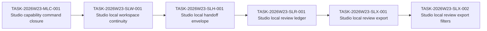

| Task | Depends On | Evidence Target | Required Finish Gate | Status Rule |
| --- | --- | --- | --- | --- |
| TASK-2026W23-SLX-002 | TASK-2026W23-SLX-001 | local filtered review-export spec and implementation review | `pnpm test:studio`; `pnpm studio:build`; `pnpm test:docs`; `pnpm check`; `git diff --check` | done |

2026-06-03 planning update: after `SLX-002`, the next bounded Studio slice
stayed local and turned review export inspection into a more readable timeline
surface. `SLX-003` keeps the export envelope side-effect-free while moving the
left rail from JSON-first inspection to event-first product UX.

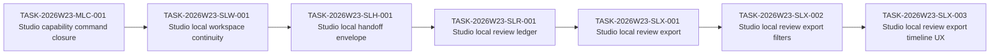

| Task | Depends On | Evidence Target | Required Finish Gate | Status Rule |
| --- | --- | --- | --- | --- |
| TASK-2026W23-SLX-003 | TASK-2026W23-SLX-002 | local review-export timeline UX spec and implementation review | `pnpm test:studio`; `pnpm studio:build`; `pnpm test:docs`; `pnpm check`; `git diff --check` | done |

## 阻断规则

- public AI tool 或 public command surface 变更仍必须先通过 schema-sync、MCP contract tests 和 command replay tests。
- release candidate 必须在正式 runner 执行 strict visual snapshot，或由 coordinator 明确 waiver 并创建 follow-up。
- resource/perf 文档中声明的 PR 阻断项已有 deterministic Node-level evidence；nightly/release 大场景不得默认为 PR blocker。
- `fill-extrusion-lite` 只作为 experimental beta 暴露；即使已有 release visual evidence，也不得绕过 explicit capability gate 升格为稳定图层。
- scheduled agent evidence 在 `TASK-2026W22-AH-005` 通过前不得作为 advisory/blocking 决策输入；只能作为 machine-generated `info` evidence/template。
- stable `view.mode: "scene3d"` 在 `TASK-2026W23-SRC-006` No-go 后仍保持 blocked；promotion-readiness package Go 不等于 stable runtime Go。
- SRC execution owners must not write shared planning markdown directly. They
  hand off code, tests, reports, or review findings; `@coordinator` serializes
  accepted status updates into this graph and the burndown.
