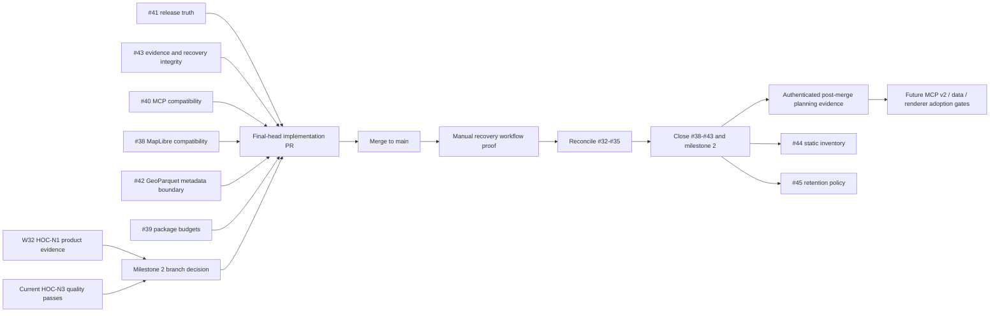

# Dependency Graph

```mermaid
flowchart LR
  H1["W32 HOC-N1 product evidence"] --> PLAN["Milestone 2 branch decision"]
  H3["Current HOC-N3 quality passes"] --> PLAN
  R["#41 release truth"] --> PR["Final-head implementation PR"]
  E["#43 evidence and recovery integrity"] --> PR
  M["#40 MCP compatibility"] --> PR
  L["#38 MapLibre compatibility"] --> PR
  G["#42 GeoParquet metadata boundary"] --> PR
  S["#39 package budgets"] --> PR
  PLAN --> PR
  PR --> MERGE["Merge to main"]
  MERGE --> RECOVERY["Manual recovery workflow proof"]
  RECOVERY --> INCIDENTS["Reconcile #32-#35"]
  INCIDENTS --> CLOSE["Close #38-#43 and milestone 2"]
  CLOSE --> SNAPSHOT["Authenticated post-merge planning evidence"]
  CLOSE --> K["#44 static inventory"]
  CLOSE --> T["#45 retention policy"]
  SNAPSHOT --> FUTURE["Future MCP v2 / data / renderer adoption gates"]
```

## Execution Rules

| Dependency | Rule | Evidence |
| --- | --- | --- |
| HOC-N1 + HOC-N3 -> plan | Product priorities are advisory and must be merged with current quality decisions | [W32 research](../research/competitor-updates-2026-W32.md), [package-size HOC-N3](../reviews/package-size-budget-quality-decision-2026-08-05.md) |
| #38-#43 -> PR | All six bounded slices travel together only after their independent quality decisions pass | [next-stage plan](./next-step-plan.md) |
| PR -> merge | Final-head remote checks must pass; local gates cannot substitute | [implementation plan](../superpowers/plans/2026-08-03-w32-w34-completion.md) |
| merge -> recovery | Deduplication must execute from default-branch workflow code | [#43 quality](../reviews/evidence-integrity-quality-decision-2026-08-03.md) |
| recovery -> incident closure | Close #32-#35 only from deterministic marker/readback evidence | [incident triage](../reviews/agent-recovery-incident-triage-2026-08-03.md) |
| milestone close -> snapshot | Planning artifacts must consume canonical post-merge Issue state together | [planning evidence script](../../scripts/planning-evidence.mjs) |
| #44/#45 | Follow-ups do not weaken current gates or authorize deletion | [weekly digest](./weekly-digest.md) |

## Boundaries

- MapLibre 6.1.0 and MCP 2026-07-28 compatibility are not default adoption.
- GeoParquet version evidence is not parser, IO, renderer, or query support.
- Hosted Workbench GA and stable SceneView3D remain outside this milestone.
- A pending major changeset records release intent but does not publish a
  package or authorize a major release.
