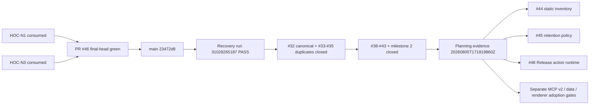

# Dependency Graph

```mermaid
flowchart LR
  H1["HOC-N1 consumed"] --> PR["PR #46 final-head green"]
  H3["HOC-N3 consumed"] --> PR
  PR --> MERGE["main 23472d8"]
  MERGE --> RECOVERY["Recovery run 31028265187 PASS"]
  RECOVERY --> INCIDENTS["#32 canonical + #33-#35 duplicates closed"]
  INCIDENTS --> CLOSE["#38-#43 + milestone 2 closed"]
  CLOSE --> SNAPSHOT["Planning evidence 20260805T171819860Z"]
  SNAPSHOT --> K["#44 static inventory"]
  SNAPSHOT --> T["#45 retention policy"]
  SNAPSHOT --> A["#48 Release action runtime"]
  SNAPSHOT --> FUTURE["Separate MCP v2 / data / renderer adoption gates"]
```

## Execution Rules

| Dependency | Rule | Evidence |
| --- | --- | --- |
| HOC-N1 + HOC-N3 -> plan | Product priorities are advisory and must be merged with current quality decisions | [W32 research](../research/competitor-updates-2026-W32.md), [package-size HOC-N3](../reviews/package-size-budget-quality-decision-2026-08-05.md) |
| #38-#43 -> PR | Six independently reviewed slices landed through PR #46 | [next-stage plan](./next-step-plan.md) |
| PR -> merge | Final-head remote checks passed before merge `23472d8` | [closeout](../reviews/w32-w34-compatibility-evidence-closeout-2026-08-06.md) |
| merge -> recovery | Default-branch workflow run 31028265187 passed | [#43 quality](../reviews/evidence-integrity-quality-decision-2026-08-03.md) |
| recovery -> incident closure | #32 retained as canonical history; #33-#35 closed as duplicates | [incident triage](../reviews/agent-recovery-incident-triage-2026-08-03.md) |
| milestone close -> snapshot | One authenticated run refreshed issue, HOC, and dashboard state | [planning evidence script](../../scripts/planning-evidence.mjs) |
| #44/#45/#48 | Follow-ups do not weaken current gates or authorize deletion, versioning, or publication | [weekly digest](./weekly-digest.md) |

## Boundaries

- MapLibre 6.1.0 and MCP 2026-07-28 compatibility are not default adoption.
- GeoParquet version evidence is not parser, IO, renderer, or query support.
- Hosted Workbench GA and stable SceneView3D remain outside this milestone.
- A pending major changeset records release intent but does not publish a
  package or authorize a major release.
