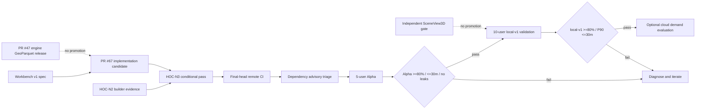

# Dependency Graph

```mermaid
flowchart LR
  SPEC["Workbench v1 spec"] --> IMPL["PR #67 implementation candidate"]
  N2["HOC-N2 builder evidence"] --> N3["HOC-N3 conditional pass"]
  IMPL --> N3
  N3 --> CI["Final-head remote CI"]
  CI --> AUDIT["Dependency advisory triage"]
  AUDIT --> ALPHA["5-user Alpha"]
  ALPHA --> AGATE{"Alpha >=80% / <=30m / no leaks"}
  AGATE -->|pass| V1["10-user local-v1 validation"]
  AGATE -->|fail| FIX["Diagnose and iterate"]
  V1 --> VGATE{"local-v1 >=80% / P90 <=30m"}
  VGATE -->|pass| FUTURE["Optional cloud demand evaluation"]
  VGATE -->|fail| FIX
  PR47["PR #47 engine GeoParquet release"] -. no promotion .-> IMPL
  D3["Independent SceneView3D gate"] -. no promotion .-> V1
```

## Rules

| Dependency | Rule | Evidence |
| --- | --- | --- |
| Spec -> implementation | Public contracts, file authority, preview/apply, export, privacy, and boundaries must converge | [v1 spec](./feature-specs/gis-engine-workbench-v1.md) |
| HOC-N2 -> HOC-N3 | Builder evidence must use valid front matter and quality must cite it | [builder](../reviews/workbench-v1-builder-evidence-2026-08-19.md), [quality](../reviews/workbench-v1-quality-decision-2026-08-19.md) |
| Candidate -> Alpha | Final-head CI and dependency triage precede target-user claims | [next step](./next-step-plan.md) |
| Alpha -> local v1 | Five-user threshold must pass before ten-user release validation | [Issue #66](https://github.com/HYNCM/gis-engine/issues/66) |
| Local v1 -> cloud | Cloud planning requires local-v1 success plus explicit collaboration demand | [roadmap](./monthly-roadmap.md) |

PR #47, stable SceneView3D, and stale external research cannot shortcut any
Workbench product gate.
