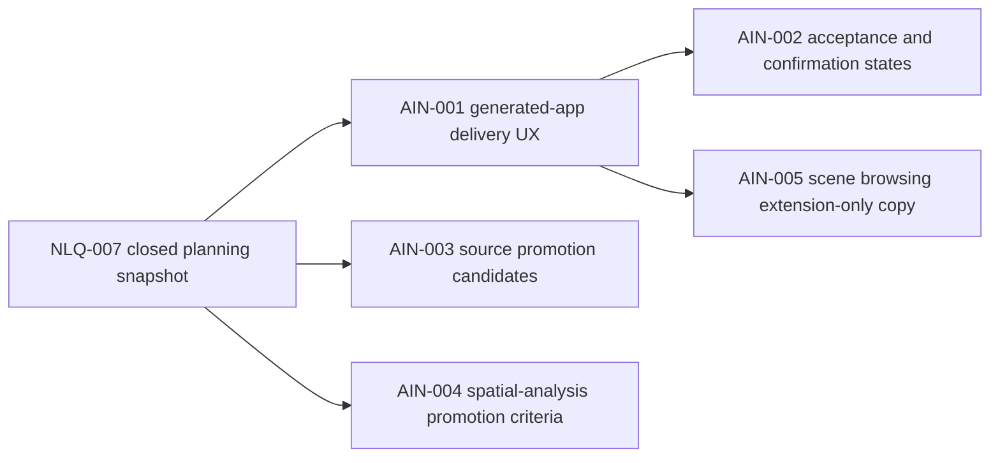

# Sprint Handoff: AI-Native Next Loop

## Sprint Goal

Start the next iteration after the NLA and NLQ batches closed. The sprint should
turn the generated-app evidence spine into a product delivery experience while
keeping unsupported data, geoprocessing, and stable 3D runtime claims blocked.

## Task DAG

| id | title | priority | complexity | owner | status | depends on | acceptance | finish gates |
| --- | --- | --- | --- | --- | --- | --- | --- | --- |
| TASK-2026W22-AIN-001 | Design generated-app delivery UX contract | P0 | M | `@product-strategist`, `@ai-agent`, `@docs-agent` | todo | NLQ-007 | `docs/planning/feature-specs/generated-app-delivery-ux.md` is accepted; manifest sections map directly to evidence fields and blocker diagnostics | docs review; `pnpm test:ai` if schemas change; `pnpm check` |
| TASK-2026W22-AIN-002 | Define generated-app acceptance and confirmation states | P0 | M | `@ai-agent`, `@qa-agent` | todo | AIN-001 | readiness, blocked, needs-confirmation, and follow-up states are schema-testable without adding MCP tool names | AI contract tests; schema-sync when public schema changes; `pnpm check` |
| TASK-2026W22-AIN-003 | Split cloud-native source promotion candidates | P1 | M | `@engine-agent`, `@docs-agent` | todo | NLQ-005 | future PMTiles, GeoParquet, FlatGeobuf, GeoTIFF, and GeoZarr tasks are separated into schema/resource-policy/query/export gates before implementation | resource-policy doc audit; schema tests only if fixtures change |
| TASK-2026W22-AIN-004 | Draft spatial-analysis promotion criteria | P1 | S | `@engine-agent`, `@ai-agent`, `@qa-agent` | todo | NLQ-003 | each future operation names schema, command semantics, diagnostics, deterministic fixtures, and MCP exposure assessment | planning diff review; command/AI tests when implemented |
| TASK-2026W22-AIN-005 | Keep scene browsing copy extension-only | P1 | S | `@adapter-agent`, `@qa-agent`, `@docs-agent` | todo | NLQ-006 | user-facing delivery copy preserves `extensions.scene3d` context and stable-runtime blocker codes without stable renderer claims | `pnpm test:ai`; `pnpm test:release:scene3d`; docs review |

## Guardrails

- Public tool names stay frozen: `validate_spec`, `apply_commands`,
  `export_spec`, `get_context_summary`, `snapshot_spec`, `explain_spec`, and
  `export_example_app`.
- Runtime mutation remains command-only through `MapCommand` and
  `applyCommands`.
- Stable `view.mode: "scene3d"` remains blocked until a future coordinator and
  quality-guardian Go decision.
- Cloud-native source implementation cannot start until schema, diagnostics,
  resource-policy paths, and tests are scoped.
- Visual snapshot gates are required only when a task changes rendering,
  renderer adapters, visual fixtures, examples, URLs, tiles, workers, or
  resource policy.
