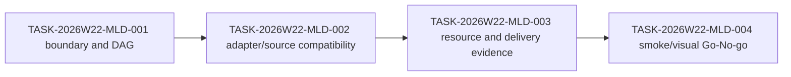

# Sprint 2026-W22: MapLibre Source Drift Audit

## Dependency Graph

## Task Batch

| id | title | priority | complexity | owner | status | depends on | acceptance | finish gates |
| --- | --- | --- | --- | --- | --- | --- | --- | --- |
| TASK-2026W22-MLD-001 | Freeze MapLibre source drift audit boundary | P0 | S | `@product-strategist`, `@task-distributor` | done | SQH-006 | Audit is scoped to package/source drift and explicitly excludes package upgrades, MCP aliases, PMTiles archive parsing, vector decoding, and stable SceneView3D promotion. | planning review; `pnpm test:docs`; `pnpm check`; `git diff --check` |
| TASK-2026W22-MLD-002 | Audit adapter and source compatibility against drift signals | P0 | M | `@engine-agent`, `@qa-agent` | todo | MLD-001 | Current transformer, MapLibre adapter, query, vector, PMTiles, and fill-extrusion fixtures are compared against current package metadata and documented drift assumptions. | `pnpm test:adapter`; `pnpm test:resources`; `pnpm test:snapshot:smoke`; `pnpm check` |
| TASK-2026W22-MLD-003 | Map resource policy and delivery evidence for source drift | P1 | M | `@engine-agent`, `@ai-agent`, `@docs-agent` | todo | MLD-002 | Generated-app delivery and resource-policy docs name the exact PMTiles/vector boundaries without adding archive parsing or hidden fetches. | `pnpm test:resources`; `pnpm test:ai`; `pnpm test:docs`; `pnpm check` |
| TASK-2026W22-MLD-004 | Publish MapLibre drift Go-No-go gate | P1 | S | `@quality-guardian`, `@coordinator` | todo | MLD-003 | Gate report decides no-go, conditional, or go-candidate and names visual snapshot requirements before any dependency movement. | `pnpm build:schema`; `pnpm check`; visual gate or explicit non-rendering waiver |

## Owner Boundaries

- `engine-agent`: adapter, transformer, source schema, and resource-policy
  evidence.
- `qa-agent`: deterministic smoke, adapter, resource, and snapshot evidence.
- `ai-agent`: generated-app delivery/source readiness alignment only.
- `docs-agent`: human-facing audit report and checklist alignment.
- `quality-guardian`: final Go/No-go decision for future package movement.

## Next Execution Task

`TASK-2026W22-MLD-002` should enter execution state next. It must audit current
adapter/source compatibility without upgrading packages or adding new runtime
source behavior.
