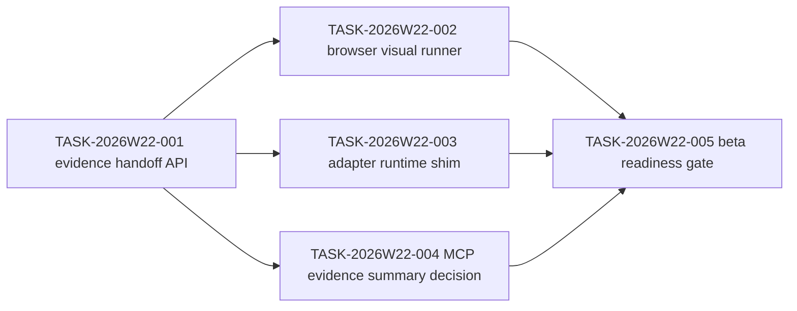

# Sprint Plan: SceneView3D Renderer Evidence

## Objective

Move SceneView3D from waiver-only alpha evidence toward real renderer evidence,
without enabling stable `view.mode: "scene3d"` and without adding Three.js,
3DTilesRendererJS, CesiumJS, worker, loader, or network dependencies to core
packages.

## Owner Model

| Owner | Responsibility | Write Scope |
| --- | --- | --- |
| `adapter-agent` | Adapter-local load/evidence APIs and dependency isolation | `packages/scene3d-three-adapter/*`, `tests/adapter/scene3d-three-adapter.test.ts` |
| `qa-agent` | Browser visual capture runner, fixtures, and evidence report | future 3D visual tests and release-runner evidence |
| `engine-agent` | Shared schema/resource-policy changes only if adapter evidence requires public contract changes | `packages/engine/src/*`, schema/resource tests |
| `ai-agent` | MCP exposure only if renderer evidence becomes part of AI context | `packages/ai/src/*`, AI/MCP tests |
| `docs-agent` | Documentation ledger and release notes | README, CHANGELOG, docs |
| `quality-guardian` | Final gate and beta/stable promotion decision | gate report only |

## Tasks

| id | title | priority | owner | status | acceptance |
| --- | --- | --- | --- | --- | --- |
| TASK-2026W22-001 | Add adapter renderer evidence handoff API | P1 | `adapter-agent` | done | `createScene3DThreeAdapterRendererEvidence` converts future capture metrics into `Scene3DRendererVisualEvidence`, fails closed on missing/blank capture, and remains release-gate compatible |
| TASK-2026W22-002 | Add release-capable browser visual runner | P1 | `qa-agent` | todo | local fixture renders through the adapter package, records frame metrics, and feeds real renderer evidence to `pnpm test:release:scene3d` |
| TASK-2026W22-003 | Add adapter query/snapshot runtime shim behind spike boundary | P1 | `adapter-agent` | todo | `load`, `snapshot`, `query`, and `destroy` stay adapter-local and keep `stableViewMode: false` |
| TASK-2026W22-004 | Review whether MCP should expose renderer evidence summaries | P2 | `ai-agent` | todo | decision recorded; if implemented, output schemas and MCP tests are updated |
| TASK-2026W22-005 | Run SceneView3D beta readiness gate | P1 | `quality-guardian` | todo | resource, adapter, smoke, release scene3d, and visual evidence commands are recorded |

## Dependency Path

## Gates

- `pnpm --filter @gis-engine/scene3d-three-adapter build`
- `pnpm test:adapter -- tests/adapter/scene3d-three-adapter.test.ts`
- `pnpm test:release:scene3d`
- `pnpm build:schema`
- `pnpm check`

## Non-Goals

- Do not enable stable `view.mode: "scene3d"`.
- Do not add renderer dependencies to `@gis-engine/engine` or
  `@gis-engine/scene3d`.
- Do not treat waiver-only visual evidence as beta readiness.
