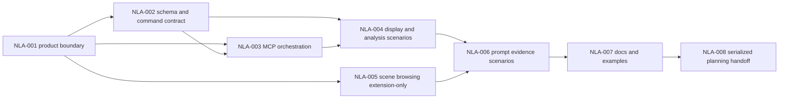

# Sprint Handoff: AI Map App Generation

## Sprint Goal

Turn the product direction "natural language generates a map application" into
a bounded W23 execution DAG. The product spine is:

```txt
prompt -> capabilitySummary -> MapSpec -> apply_commands -> diagnostics -> snapshot/export evidence
```

This sprint does not enable stable `view.mode: "scene3d"`. Scene browsing
continues to use `extensions.scene3d` and adapter-local evidence only.

## Owner Split

| Owner | Scope | May Write | Handoff Artifact |
| --- | --- | --- | --- |
| `@coordinator` | Product boundary, Go/No-go alignment, planning state serialization | planning decision notes and accepted ledger updates | product boundary decision |
| `@engine-agent` | `MapSpec`, command, diagnostics, and read-only analysis contracts | `packages/engine/src/*`, schema/tests | contract delta report |
| `@ai-agent` | MCP orchestration, capability summary, generation evidence output schemas | `packages/ai/src/*`, AI tests | MCP contract report |
| `@adapter-agent` | Scene browsing remains extension-only and adapter-local | scene3d adapter package/tests | adapter boundary report |
| `@qa-agent` | Prompt-to-evidence test scenarios and snapshot/export checks | tests and evidence reports | QA evidence report |
| `@docs-agent` | User-facing capability, examples, and release wording | README, docs, examples | docs audit report |
| `@task-distributor` | Sprint DAG and dependency snapshots | planning state only after evidence exists | serialized planning update |

## Task DAG

| id | title | priority | complexity | owner | status | depends on | acceptance | finish gates |
| --- | --- | --- | --- | --- | --- | --- | --- | --- |
| TASK-2026W23-NLA-001 | Freeze natural-language map app product boundary | P0 | S | `@coordinator`, `@product-strategist` | done | SRC-006 No-go | feature display, spatial analysis, and scene browsing boundaries are documented without stable 3D promotion | product spec and scorecard update |
| TASK-2026W23-NLA-002 | Define generation `MapSpec` and command skeleton contract | P0 | M | `@engine-agent` | done | NLA-001 | `docs/reviews/nla-002-generation-command-contract-2026-05-29.md`; generation request/result schemas and command skeleton keep TypeBox/Ajv and `applyCommands` on the path | `pnpm build:schema`; `pnpm test:commands`; `pnpm test:schema-sync`; `pnpm check` |
| TASK-2026W23-NLA-003 | Design MCP orchestration without new tool aliases | P0 | M | `@ai-agent` | done | NLA-001, NLA-002 | `docs/reviews/nla-003-mcp-orchestration-evidence-2026-05-29.md`; generation evidence bundle composes existing tools without registering aliases and keeps schema coverage | `pnpm test:ai`; `pnpm test:schema-sync`; `pnpm build:schema`; `pnpm check` |
| TASK-2026W23-NLA-004 | Define feature-display and spatial-analysis minimum generated scenarios | P1 | M | `@engine-agent`, `@ai-agent` | done | NLA-002, NLA-003 | `docs/reviews/nla-004-generation-scenarios-2026-05-29.md`; covers source/layer/style edits, query readiness, dry-run/replay/rollback, and blocked analysis diagnostics | `pnpm test:commands`; `pnpm test:ai`; `pnpm build:schema`; `pnpm test:schema-sync`; `pnpm check` |
| TASK-2026W23-NLA-005 | Keep scene browsing extension-only in generation flow | P1 | S | `@adapter-agent` | done | NLA-001 | `docs/reviews/nla-005-scene-browsing-extension-boundary-2026-05-29.md`; scene browsing uses `extensions.scene3d`, stable `view.mode: "scene3d"` remains blocked, and renderer deps stay adapter-local | `pnpm test:ai`; `pnpm --filter @gis-engine/scene3d-three-adapter build`; `pnpm test:adapter`; `pnpm test:release:scene3d`; `pnpm check` |
| TASK-2026W23-NLA-006 | Add end-to-end prompt evidence scenarios | P1 | L | `@qa-agent` | done | NLA-003, NLA-004, NLA-005 | `docs/reviews/nla-006-prompt-evidence-scenarios-2026-05-29.md`; prompt-to-MapSpec/commands/snapshot/export evidence covers feature display, spatial analysis readiness, and scene browsing blocked/extension-only behavior | `pnpm test:ai`; `pnpm check` |
| TASK-2026W23-NLA-007 | Align docs, examples, and release wording | P2 | M | `@docs-agent` | todo | NLA-004, NLA-005, NLA-006 | docs explain generation flow, supported boundaries, diagnostics, and export evidence without stable 3D overclaim | docs audit; link check when available |
| TASK-2026W23-NLA-008 | Serialize planning status and next handoff | P1 | S | `@task-distributor` | todo | NLA-006, NLA-007 | burndown and dependency graph update only after owner reports or gate evidence exist | planning diff review; `pnpm check` for final handoff |



## Finish Gate Rules

- Public schema, diagnostics, command, or MCP schema changes require
  `pnpm build:schema`.
- Final handoff requires `pnpm check`.
- Runtime mutation must stay command-only and include replay, dry-run,
  rollback, or conflict evidence when behavior changes.
- MCP changes must keep the documented tool names:
  `validate_spec`, `apply_commands`, `export_spec`, `get_context_summary`,
  `snapshot_spec`, `explain_spec`, and `export_example_app`.
- Resource, URL, tile, worker, or example asset changes require resource-policy
  tests and documentation alignment.
- SceneView3D rendering or evidence changes require adapter-local gates and
  `pnpm test:release:scene3d`; beta/stable renderer claims still require strict
  visual evidence or a coordinator release waiver.
