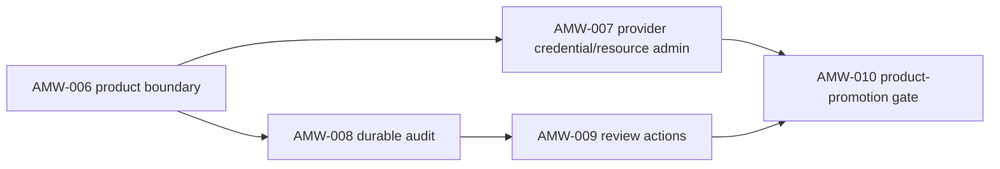

# Sprint Handoff: AI Map Workbench Product Boundary

## Sprint Goal

Turn the provider-gated AI Map Workbench example into an implementation-ready
product-boundary plan. This sprint does not move files out of `examples/`,
deploy a hosted app, add auth or persistence, add MCP aliases, move MapLibre
packages, or promote stable SceneView3D. It creates the evidence sequence that
must precede those decisions.

## Owner Split

| Owner | Scope | May Write | Handoff Artifact |
| --- | --- | --- | --- |
| `@coordinator` | Promotion decision boundaries and serialized planning state | planning decision notes and accepted ledger updates | boundary decision |
| `@product-strategist` | Product ownership, app boundary, review workflow, and scoring | feature specs and roadmap sections | product boundary update |
| `@ai-agent` | Provider profile safety, normalization, review-action evidence | `packages/ai/src/*`, workbench server/tests when implementation begins | AI/provider contract report |
| `@engine-agent` | Review action schemas, audit record contracts, diagnostics | `packages/engine/src/*`, schema/tests if public contracts change | contract delta report |
| `@qa-agent` | Browser smoke, visual evidence, and workflow fixtures | tests and evidence reports | QA evidence report |
| `@docs-agent` | Public wording, provider/resource policy docs, review handoff docs | README, docs, examples | docs audit report |
| `@quality-guardian` | Product-promotion Go/No-go gate | gate report | product-promotion decision |

## Task DAG

| id | title | priority | complexity | owner | status | depends on | acceptance | finish gates |
| --- | --- | --- | --- | --- | --- | --- | --- | --- |
| TASK-2026W23-AMW-006 | Freeze AI Map Workbench product boundary | P0 | S | `@coordinator`, `@product-strategist`, `@task-distributor` | done | AMW-005, MLD-004 | `docs/planning/feature-specs/ai-map-workbench-product-boundary.md` and this sprint DAG define app ownership, provider administration, durable audit, review actions, visual evidence, and promotion gates without implementation creep. | planning review; `pnpm test:docs`; `pnpm check`; `git diff --check` |
| TASK-2026W23-AMW-007 | Design provider credential and resource administration | P0 | M | `@ai-agent`, `@engine-agent`, `@docs-agent` | done | AMW-006 | `docs/planning/feature-specs/ai-map-workbench-provider-administration.md` and `docs/reviews/amw-007-provider-resource-admin-2026-06-01.md` specify provider lifecycle, browser-safe metadata, resource policy, timeout/size follow-ups, leak-hardening, and diagnostic paths before hosted or product use. | provider/workbench tests or design review; `pnpm test:examples`; `pnpm test:docs`; `pnpm check` |
| TASK-2026W23-AMW-008 | Design durable audit retention and export | P1 | M | `@engine-agent`, `@ai-agent`, `@docs-agent` | done | AMW-006 | `docs/planning/feature-specs/ai-map-workbench-durable-audit.md` and `docs/reviews/amw-008-durable-audit-retention-export-2026-06-01.md` specify retention, privacy, access control, export shape, payload caps, deletion behavior, and no-raw-payload persistence rules before storage implementation. | schema/design review if public; `pnpm test:docs`; `pnpm check`; `git diff --check` |
| TASK-2026W23-AMW-009 | Define command-safe review actions | P1 | M | `@engine-agent`, `@ai-agent`, `@qa-agent` | queued | AMW-006, AMW-008 | Accept, block, and follow-up-required actions produce structured review decisions without direct `MapSpec` mutation, browser file writes, or raw provider payload retention. | command/evidence tests when implemented; `pnpm test:ai`; `pnpm test:examples`; `pnpm check` |
| TASK-2026W23-AMW-010 | Run product-promotion Go-No-go gate | P1 | S | `@quality-guardian`, `@coordinator`, `@qa-agent` | todo | AMW-007, AMW-008, AMW-009 | Gate decides whether AI Map Workbench stays in `examples/` or can move to a product app boundary, and records required visual/resource/audit evidence. | `pnpm test:docs`; `pnpm check`; browser smoke or visual evidence; `git diff --check` |

## Current Handoff

`TASK-2026W23-AMW-008` is complete as a durable audit retention/export design
handoff. The next queued task is `TASK-2026W23-AMW-009`. It must stay in
command-safe review action design scope unless a later owner report explicitly
opens implementation files.

## Finish Gate Rules

- Public schema or review-action contract changes require `pnpm build:schema`
  and schema-sync coverage.
- Provider work must keep credentials, base URLs, raw prompts, raw bodies, and
  provider failures out of browser-visible state and audit output.
- Runtime map mutation must still go through `MapCommand` and `applyCommands`.
- MCP tool names remain frozen.
- Product promotion requires a quality-guardian/coordinator Go/No-go decision.
- Visual or layout claims require browser smoke or visual evidence.
