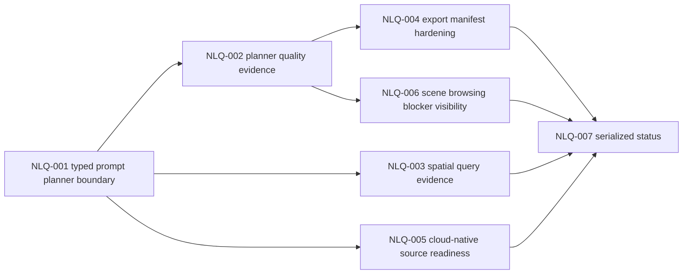

# Sprint Handoff: Generation Quality Hardening

## Sprint Goal

The previous W23 NLA slice closed the evidence-first generation skeleton:

```txt
prompt -> capabilitySummary -> MapGenerationCommandSkeleton -> apply_commands -> diagnostics -> snapshot/export/example evidence
```

This follow-up sprint turns that skeleton into a tighter product contract. It
does not reopen NLA-001 through NLA-008, does not introduce a new MCP tool name,
and does not promote stable `view.mode: "scene3d"`.

## Owner Split

| Owner | Scope | May Write | Handoff Artifact |
| --- | --- | --- | --- |
| `@product-strategist` | Prompt planner/product boundary, generated-app UX limits, priority scoring | feature specs and roadmap sections | product boundary update |
| `@engine-agent` | Planner output schemas, data/source readiness diagnostics, command and analysis contracts | `packages/engine/src/*`, schema/tests | contract delta report |
| `@ai-agent` | Prompt planner helper, generation evidence quality, MCP descriptor compatibility | `packages/ai/src/*`, AI tests | MCP/evidence contract report |
| `@qa-agent` | Prompt quality scenarios, snapshot/export evidence checks, generated-app gates | tests and evidence reports | QA evidence report |
| `@docs-agent` | Export package docs, source readiness matrix, public capability wording | README, docs, examples | documentation audit report |
| `@adapter-agent` | Scene browsing blocker transparency and adapter-local evidence boundaries | scene3d adapter package/tests | adapter boundary report |
| `@task-distributor` | Serialized planning state after owner evidence exists | planning state | burndown and dependency update |

## Task DAG

| id | title | priority | complexity | owner | status | depends on | acceptance | finish gates |
| --- | --- | --- | --- | --- | --- | --- | --- | --- |
| TASK-2026W23-NLQ-001 | Define typed prompt planner boundary | P0 | M | `@product-strategist`, `@ai-agent`, `@engine-agent` | done | NLA-008 | `docs/reviews/nlq-001-prompt-planner-boundary-2026-05-29.md`; planner input/output schema returns `MapGenerationRequest`-compatible intent, diagnostics, prompt hash, and trace metadata; no free-form mutation or new MCP tool name | `pnpm build:schema`; `pnpm test:commands`; `pnpm test:schema-sync`; `pnpm --filter @gis-engine/engine build` |
| TASK-2026W23-NLQ-002 | Add planner quality and provenance evidence | P0 | M | `@ai-agent`, `@qa-agent` | todo | NLQ-001 | generation evidence exposes planner confidence, source prompt hash, unsupported-intent diagnostics, and command trace provenance without storing raw prompt text by default | `pnpm test:ai`; `pnpm test:schema-sync`; `pnpm check` |
| TASK-2026W23-NLQ-003 | Design spatial query evidence bundle | P0 | M | `@engine-agent`, `@ai-agent` | todo | NLA-004, NLQ-001 | point/bbox query readiness has structured evidence; buffer, overlay, routing, and aggregation remain blocked with stable diagnostic paths | `pnpm test:commands`; `pnpm test:ai`; `pnpm build:schema` if public schema changes; `pnpm check` |
| TASK-2026W23-NLQ-004 | Harden generated-app export manifest | P1 | M | `@ai-agent`, `@docs-agent`, `@qa-agent` | todo | NLQ-002 | `export_example_app` output can carry generation evidence summary, diagnostic counts, snapshot/export status, and asset/resource policy notes without side-effect file writes | `pnpm test:ai`; `pnpm test:examples`; `pnpm check` |
| TASK-2026W23-NLQ-005 | Create cloud-native source readiness matrix | P1 | S | `@engine-agent`, `@docs-agent` | todo | NLQ-001 | PMTiles, GeoParquet, FlatGeobuf, GeoTIFF/GeoZarr support states and blocked diagnostics are documented before implementation claims | resource-policy doc audit; schema tests if fixtures change; `pnpm check` |
| TASK-2026W23-NLQ-006 | Keep scene browsing blockers visible in generated apps | P1 | S | `@adapter-agent`, `@qa-agent` | todo | NLA-005, NLA-006 | generated-app evidence preserves `extensions.scene3d` context and stable-runtime blocker codes; no `snapshot.renderer: "scene3d"` support is introduced | `pnpm test:ai`; `pnpm test:adapter`; `pnpm test:release:scene3d`; `pnpm check` |
| TASK-2026W23-NLQ-007 | Serialize quality-hardening planning status | P1 | S | `@task-distributor` | todo | NLQ-002, NLQ-003, NLQ-004, NLQ-005, NLQ-006 | burndown and dependency graph update only after owner evidence or gate reports exist | planning diff review; `pnpm check`; `git diff --check` |



## Finish Gate Rules

- Public planner, generation, diagnostics, or evidence schema changes require
  `pnpm build:schema` and schema-sync coverage.
- MCP integration must keep the documented tool names:
  `validate_spec`, `apply_commands`, `export_spec`, `get_context_summary`,
  `snapshot_spec`, `explain_spec`, and `export_example_app`.
- Prompt content should flow through hash/trace metadata by default; raw prompt
  retention needs an explicit privacy/product decision.
- Runtime mutation must stay command-only via `MapCommand` and `applyCommands`.
- Cloud-native source work must go through resource-policy diagnostics before
  implementation claims.
- Scene browsing remains extension-only. Stable `view.mode: "scene3d"` is still
  blocked after SRC-006 No-go.
