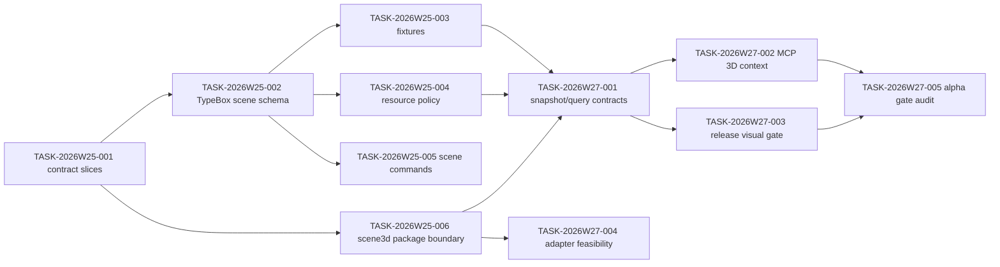

# Sprint Plan: SceneView3D v1 Preparation

## Scope

This sprint turns the SceneView3D v1 RFC into executable engineering work. It
does not implement a production 3D renderer. The goal is to make the first 3D
implementation schema-first, resource-policy gated, snapshot-testable, and
isolated from the current 2D core package.

## Sprint 1: 2026-W25~W26

Period: 2026-06-15 to 2026-06-26

| id | title | priority | complexity | owner | deps | hours |
| --- | --- | --- | --- | --- | --- | ---: |
| TASK-2026W25-001 | Freeze SceneView3D v1 contract slices | P0 | S | @product-strategist | RFC | 8 |
| TASK-2026W25-002 | Add TypeBox `SceneView3DExtension` schema | P0 | L | @schema-agent | 001 | 32 |
| TASK-2026W25-003 | Add SceneView3D valid/invalid fixtures | P0 | M | @qa-agent | 002 | 20 |
| TASK-2026W25-004 | Extend resource policy for 3D assets | P0 | L | @engine-agent | 002 | 28 |
| TASK-2026W25-005 | Define scene command schemas and patches | P1 | L | @engine-agent | 002,003 | 32 |
| TASK-2026W25-006 | Add `@gis-engine/scene3d` package boundary scaffold | P0 | M | @adapter-agent | 001 | 20 |

## Sprint 2: 2026-W27~W28

Period: 2026-06-29 to 2026-07-10

| id | title | priority | complexity | owner | deps | hours |
| --- | --- | --- | --- | --- | --- | ---: |
| TASK-2026W27-001 | Implement mock-level 3D snapshot and query contracts | P1 | L | @qa-agent | W25-003,W25-004,W25-006 | 32 |
| TASK-2026W27-002 | Expose gated 3D context through MCP output schemas | P1 | M | @ai-agent | W25-002,W27-001 | 20 |
| TASK-2026W27-003 | Define release-runner 3D visual smoke gate | P1 | M | @quality-guardian | W27-001 | 18 |
| TASK-2026W27-004 | Compare CesiumJS and Three.js adapter feasibility | P2 | M | @competitive-intel | W25-006 | 18 |
| TASK-2026W27-005 | Run v1 alpha gate audit and release-note draft | P1 | S | @quality-guardian | W27-002,W27-003 | 12 |

## DAG

## Acceptance Criteria

- `SceneView3DExtension` has a formal TypeBox schema and generated JSON schema.
- Fixtures cover camera bounds, terrain DEM, 3D Tiles, glTF, layer-source
  references, query identity, blocked URL, oversize asset, timeout, and worker
  cap cases.
- 3D commands produce deterministic JSON Patch and inverse patches, and reject
  stale `baseRevision` values.
- 3D resource policy failures return structured diagnostics instead of partial
  rendering.
- `@gis-engine/engine` does not import Cesium, Three.js, glTF loaders, 3D Tiles
  parsers, or WebGPU-only dependencies.
- MCP tools expose 3D context only after schema-sync and output-schema tests
  pass.
- Snapshot smoke can run without a GPU; strict visual evidence runs only in a
  release-capable browser/WebGL runner.

## Finish Gates

- `pnpm -s build:schema`
- `pnpm -s check`
- `pnpm -s test:schema-sync`
- `pnpm -s test:commands`
- `pnpm -s test:snapshot`
- `pnpm -s test:release:strict` for release candidates or an explicit
  coordinator waiver with follow-up evidence.

## Execution Snapshot

| id | status | evidence |
| --- | --- | --- |
| TASK-2026W25-001 | done | RFC slices frozen into camera, lights, depth, terrain, sources, layers, snapshot, and resource policy schema modules |
| TASK-2026W25-002 | done | `SceneView3DExtensionSchema`, generated JSON schema, public type assertions, and schema-sync validation against `scene3d-extension.map.json` |
| TASK-2026W25-003 | done | valid `scene3d-extension.map.json` plus invalid blocked URL and unknown field fixtures with expected diagnostics |
| TASK-2026W25-004 | partial | `validateSpec` applies scene source URL policy under `/extensions/scene3d/sources/*/url`; loader-level byte, texture, worker, and timeout enforcement remains with the renderer package |

## Non-Goals

- No production CesiumJS or Three.js runtime import in the current 2D core.
- No stable `view.mode: "scene3d"` acceptance before the v1 schema gate passes.
- No unrestricted remote 3D Tiles, glTF, worker, or texture loading.
