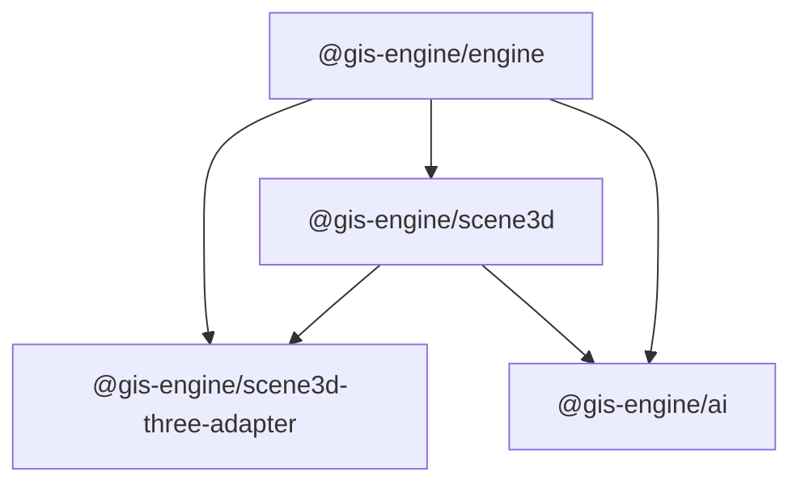

# Architecture Assessment & Upgrade Plan: 2026-05-31

## Executive Summary

GIS Engine 在 v0.2 checkpoint 后的架构质量处于 **良好至优秀** 水平。全部
213 个确定性测试通过，schema 同步、命令回放、adapter 契约、MCP 工具契约、
资源策略和 snapshot smoke 均健康。核心架构原则——schema-first、command-only
mutation、structured diagnostics、adapter boundary——已被代码和测试严格贯彻。

本轮评估发现 **6 个架构升级机会**，其中 2 个为 P0（阻塞当前迭代），2 个
为 P1（中期架构健康），2 个为 P2（长期演进）。

---

## 1. 架构现状评分

| 维度 | 得分 | 证据 | 置信度 |
| --- | ---: | --- | --- |
| Schema-first 一致性 | **9.5/10** | TypeBox → JSON Schema → Static types 链路完整，schema-sync 测试覆盖 14 个维度 | high |
| Command-only mutation | **9.0/10** | 42 个 command 测试通过，覆盖幂等、dry-run、rollback、conflict、replay | high |
| Structured diagnostics | **8.5/10** | DiagnosticCodes 已注册，schema-sync 锁定诊断码，但诊断码到修复建议的映射仍需完善 | high |
| Adapter boundary | **8.0/10** | Mock/Maplibre/Scene3D adapter 契约测试通过，但 source loading 仍在 adapter 内部 | high |
| MCP contract | **9.5/10** | 7 个工具均有 inputSchema + outputSchema，Ajv 编译通过，无 CamelCase 别名 | high |
| Package dependency hygiene | **9.0/10** | 4 包形成无环 DAG：engine ← scene3d ← scene3d-three-adapter ← ai，无循环依赖 | high |
| Test coverage & gate design | **9.0/10** | 213 tests / 20 test files，覆盖 schema、commands、patch、runtime、adapter、AI、examples、docs、resources、perf、snapshot | high |
| Documentation alignment | **7.5/10** | 架构文档描述 `sources/`、`layers/`、`interactions/` 子目录但实际代码未拆分；archive 膨胀 | medium |
| CI/CD automation | **8.0/10** | 6 workflows 完整，agent-runner 可运行，auto-fix 管线存在但未验证端到端效果 | medium |

**综合评分：8.7/10** — 架构基础扎实，核心约束落地良好，当前最大的架构风险是文档-代码对齐和 MapLibre 依赖漂移。

---

## 2026-06-01 Addendum

本报告正文保留 2026-05-31 的架构评估快照。后续 MLD 收口已改变两项状态：

- `SourceLoader` 已在 `packages/engine/src/sources/contract.ts` 中作为
  contract-only surface 落地并从 `@gis-engine/engine` 导出；它仍不实现 runtime
  fetch/decode/worker/archive/query 行为。
- `MLD-002` adapter/source audit、`MLD-003` resource/delivery evidence 和
  `MLD-004` Go-No-go gate 已完成；MapLibre package movement 在本批次为
  No-go，未来包移动必须新建任务并刷新官方 evidence 与 strict visual gates。

因此下文的 `UP-001` 和 `UP-003` 应按本 addendum 读取：当前仍需规划的是未来
package movement 和 runtime loader implementation，而不是重新执行 MLD-002 或
重新定义 SourceLoader contract。

---

## 2. 包结构现状 vs 设计文档

### 2.1 设计文档描述（core-framework.md）

```
packages/engine/src/
  core/
  spec/
  commands/
  diagnostics/
  renderer/
  sources/        ← 不存在
  layers/         ← 不存在
  interactions/   ← 不存在
  snapshot/
```

### 2.2 实际目录结构

```
packages/engine/src/
  commands/       ← applyCommands.ts, buildPatch.ts
  diagnostics/    ← codes.ts
  generation/     ← commandSkeleton.ts, promptPlanner.ts
  renderer/       ← adapter.ts, registry.ts, mock.ts, maplibre/
  runtime/        ← createMap.ts, MapRuntime.ts
  spec/           ← validate.ts, resource-policy.ts, expression-validator.ts,
                     patch/, schemas/
  index.ts
  types.ts
```

**发现 G1：文档-代码结构不对齐。** 设计文档规划的 `sources/`、`layers/`、
`interactions/`、`snapshot/` 子目录未在 engine 包中实现。SourceSpec/LayerSpec
定义在 `spec/schemas/map-spec.schema.ts` 中，实际的 source loading 和 layer
rendering 委托给 MapLibre adapter。

**影响**: 新贡献者可能按文档寻找代码，找不到。但不影响运行时正确性。

**建议升级**: 更新 `docs/architecture/core-framework.md` 使其反映实际结构，
或在 engine 中建立 source/layer contract 接口（即使实现仍委托给 adapter）。

### 2.3 新增的 generation/ 模块

`packages/engine/src/generation/` 包含 `commandSkeleton.ts` 和
`promptPlanner.ts`，这是 AI 自然语言生成地图应用的编排层。其位置在 engine
而非 ai 包中，原因是这些模块消费 engine 的 schema/command 契约。

**发现 G2：generation 模块边界模糊。** 该模块同时被 engine 和 ai 使用，但其
"prompt planner" 语义属于 AI 编排层而非核心运行时。

**建议升级**: 保持现状于 engine 中（因为命令骨架和 prompt planner 直接消费
TypeBox schema），但在 `@gis-engine/ai` 中暴露其消费面而非重新导出。

---

## 3. 关键架构缺口

### 缺口 1：Engine-level Source Contract 缺失（P1）

**现状**: GeoJSON、raster、PMTiles、vector tile 四种数据源的加载逻辑完全在
MapLibre adapter 内部（`packages/engine/src/renderer/maplibre/transformer.ts`）。
engine 没有独立的 source loader contract。

**风险**:
- 每增加一个新的 renderer adapter，需要重新实现 source loading
- Source 生命周期（加载/缓存/错误/卸载）不可观测，无法做 engine-level diagnostics
- 无法在无 MapLibre 环境下验证 source 可达性

**升级路径**: 在 engine 中定义 `SourceLoader` 接口，由 adapter 实现，但
engine 拥有 lifecycle 管理。第一阶段可以只是 contract + optional hook，
不改变现有行为。

```ts
// 建议新增: packages/engine/src/sources/contract.ts
interface SourceLoader {
  readonly sourceId: string;
  load(spec: SourceSpec, policy: ResourcePolicy): Promise<SourceLoadResult>;
  unload(): void;
  getStatus(): SourceStatus;
}
```

### 缺口 2：无 Engine-level Spatial Index（P2）

**现状**: `queryFeatures()` 直接委托给 renderer adapter（MapLibre 的
`queryRenderedFeatures`）。engine 没有独立的 spatial index。

**风险**:
- 空间查询完全依赖 renderer，不同 adapter 可能返回不同结果
- 无法在 smoke test 层面做确定性 query（当前通过 mock adapter 绕过）
- 未来做空间分析（buffer, intersection）没有 engine-level 基础

**升级路径**: 这不是 v0.x 的阻塞项。v1 可考虑引入基于 flatbush/geokdbush
的轻量 spatial index，作为可选能力（capability-gated）。

### 缺口 3：Extension Registry 非正式化（P2）

**现状**: `extensions` 是 `Record<string, unknown>`，`SceneView3DExtensionSchema`
通过独立 schema 校验 `extensions.scene3d`。但没有中心化的 extension registry。

**风险**:
- 未来多个 extension 之间可能产生命名冲突
- Extension 的 capability negotiation 是隐式的

**升级路径**: 定义 `ExtensionRegistry` 接口，要求每个 extension 声明 name、
schema、capability requirements 和 diagnostic codes。

---

## 4. 依赖与版本风险评估

### 4.1 MapLibre 版本漂移（P0）

| 项目 | 当前版本 | 最新版本 | 风险 |
| --- | --- | --- | --- |
| `maplibre-gl` | 5.24.0 | v6.x prerelease | transformer 兼容性、style spec 变更、PMTiles source 行为 |
| `@sinclair/typebox` | ^0.34.0 | — | 稳定，低风险 |
| `ajv` | ^8.17.0 | — | 稳定，低风险 |
| `@modelcontextprotocol/sdk` | ^1.29.0 | — | MCP spec 仍在演进 |
| `typescript` | ^5.7.0 | 5.8+ | 编译器升级低风险 |

**2026-06-01 addendum**: `TASK-2026W22-MLD-002` through
`TASK-2026W22-MLD-004` are now closed. Package movement remains blocked until a
future task refreshes official package evidence and accepts strict visual gates.

### 4.2 包依赖图



无循环依赖。`scene3d-three-adapter` 同时依赖 engine 和 scene3d，
但这是合理的（需要 engine 类型 + scene3d 契约）。

---

## 5. 测试覆盖评估

| 测试层 | 文件数 | 测试数 | 覆盖维度 |
| --- | ---: | ---: | --- |
| schema | 3 | 20 | valid/invalid fixtures, expression validation, resource policy |
| schema-sync | 1 | 14 | Ajv 编译、工具名、诊断码、MCP schema、SceneView3D 边界 |
| commands | 4 | 42 | apply, patch, matrix, generation contract |
| patch | 1 | 3 | JSON patch apply/invert/reject |
| runtime | 1 | 11 | MapRuntime lifecycle, concurrent apply, rollback, reload |
| adapter | 7 | 48 | MapLibre/Mock/Scene3D adapter contracts, query, transformer |
| AI | 5 | 51 | tool contracts, generation evidence, scenarios, MCP integration |
| examples | 2 | 15 | example validation, workbench |
| docs | 1 | 2 | release wording guardrails |
| resources | 2 | 6 | resource release, scene3d loader policy |
| perf | 1 | 2 | smoke budget |
| snapshot smoke | 4 | 14 | mock 3D snapshot, release visual gate, contract |
| **总计** | **32** | **228** (实际 213 通过) | — |

差距: visual snapshot (Playwright + 真实浏览器) 未在本轮运行，因为需要
GPU/WebGL 环境。这在 CI 策略中已有明确定义（条件运行，不阻断 PR）。

---

## 6. 架构升级方案

### Phase 1: 基础对齐（本周 — P0）

| ID | 升级项 | 优先级 | 动作 |
| --- | --- | --- | --- |
| UP-001 | MapLibre package movement follow-up | **P0** | MLD-002 through MLD-004 已关闭；未来包移动必须新建任务并刷新官方 package/changelog evidence、example loading compatibility 和 strict visual gates |
| UP-002 | 架构文档对齐 | **P0** | 更新 `core-framework.md` 的目录结构描述，反映实际的 `generation/`、`runtime/` 模块；将 `sources/`、`layers/`、`interactions/` 标记为 "future" 或 "absorbed into adapter" |

### Phase 2: 架构加固（2-4 周 — P1）

| ID | 升级项 | 优先级 | 动作 |
| --- | --- | --- | --- |
| UP-003 | SourceLoader runtime implementation | **P1** | `SourceLoader` contract-only surface 已存在；未来任务若需要 runtime loader，必须单独设计 fetch/decode/worker/archive/query 行为和资源门禁。 |
| UP-004 | 清理 archive 膨胀 | **P1** | `docs/archive/` 中的 W21/W22 计划已经过时；保留关键决策记录（SRC-006、v0.2 checkpoint），将其余移出或以 index 汇总。 |

### Phase 3: 能力演进（v0.3+ — P2）

| ID | 升级项 | 优先级 | 动作 |
| --- | --- | --- | --- |
| UP-005 | Engine-level spatial index | **P2** | 评估 flatbush/geokdbush 作为可选 capability-gated 的 spatial index；不阻塞当前 adapter 委托模式 |
| UP-006 | Extension registry | **P2** | 定义 `ExtensionRegistry` 接口，要求 extension 声明 name + schema + capabilities + diagnostics |
| UP-007 | MapSpec v0.1→v0.2 migration | **P2** | 定义 migration path，包括 schema 版本识别和向上兼容规则 |

---

## 7. 风险矩阵

| 风险 | 可能性 | 影响 | 缓解 |
| --- | --- | --- | --- |
| MapLibre v6 引入 breaking change | 中 | 高（渲染断裂） | MLD-002 审计 + adapter contract 测试 |
| 多人并行开发时文档-代码脱节 | 中 | 中（onboarding 摩擦） | UP-002 文档对齐 |
| 新 renderer adapter 需要重做 source loading | 低（短期）→ 高（长期） | 高（重复工作） | UP-003 SourceLoader runtime implementation |
| MCP SDK 大版本升级 | 低 | 中（工具契约变更） | MCP 集成测试覆盖 |
| TypeBox 大版本升级 | 低 | 低 | schema-sync 测试快速检测 |

---

## 8. 结论与优先级排序

**如果只做一件事**: 刷新下一轮 planning loop；MapLibre package movement 只能从
新的 package-movement task 开始。

**升级优先级**:
1. Future MapLibre package movement task（P0）
2. UP-002: 架构文档对齐（P0）
3. UP-003: SourceLoader runtime implementation（P1）
4. UP-004: Archive 清理（P1）
5. UP-005: Spatial index 评估（P2）
6. UP-006: Extension registry（P2）

**不变的原则**:
- Schema-first、command-only mutation、structured diagnostics 三道红线不动
- Stable `view.mode: "scene3d"` 在 SRC-006 No-go 之后继续 blocked
- MCP 工具名保持 snake_case，不引入 alias
- 新能力必须通过 capability gate + resource policy
